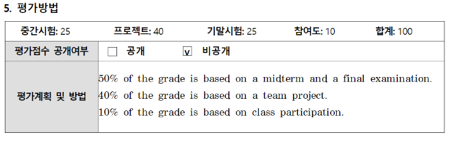
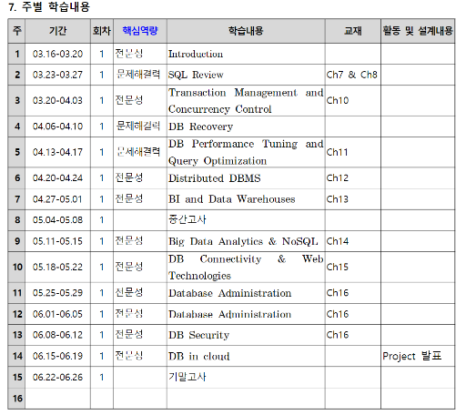

# 200317_W1D1_데이터베이스관리

1-2 주차는 선행과목 복습

3주차부터 본격적으로 진도 나감.

팀프로젝트는 있지만 큰 규모는 아님.

## 평가

##### 중간 기말 합쳐서 50%

##### 팀 프로젝트 40%

##### 출석이 10%

##### 학기말에 팀 프로젝트 발표

2인1조, 3인1조로 구성

온라인 강의 2주 지나고 난 뒤 팀 편성

## 학습계획

주 4시간 강의, 

주 2시간은 강의

주 2시간은 실습으로 운영됨.

트랜잭션 : 하나의 완벽한 DBMS 쿼리를 수행한 결과를 저장

Concurrency : 데이터 베이스에 동시 접근하는 엑세스를 어떻게 관리하는가?

BI : 데이터를 기반으로 의사결정 하는 것

BI와 빅데이터는 범위 자체가 광범위 하기 때문에 간략하게만 다룸.