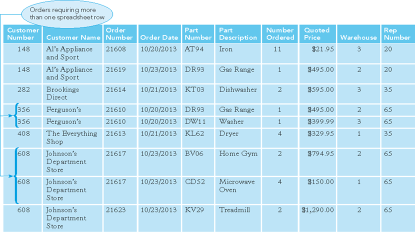
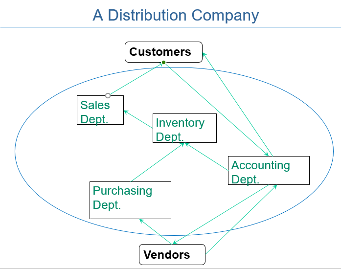
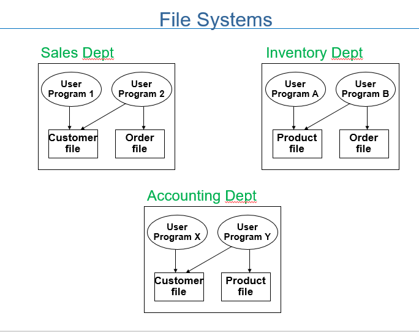
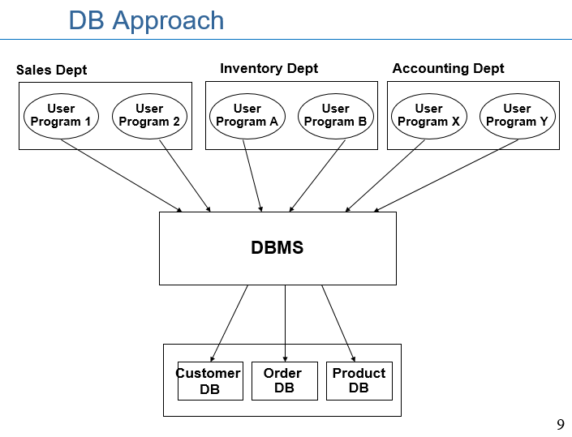
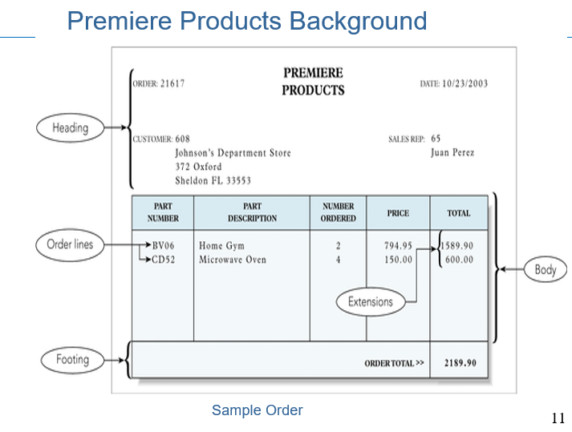

# 200319_W1D2_데이터베이스용어정리

처음 1-2주차는 예전(데이터베이스 설계) 과목의 리뷰임.

DB의 기술이 총집합 되어있는 소프트웨어가 **DBMS(Data-Base Management Systems)**

## 예시 1. 유통회사의 데이터 관리 - 엑셀

이런 엑셀로 데이터를 관리할 시 문제점이 발생할 수 있다.

Redundancy 

- Duplication of data or the storing of the same data in more than one place

데이터 중복 ex) 고객의 정보가 담겨있는 엑셀파일을 여러 부서에서 따로 관리할 경우 정보가 업데이트 될 경우 일일히 다 바꿔주어야한다.

Difficulty accessing data

데이터양이 많아지면 원하는 데이터에 접근이 어렵다

Limited security

보안이 제한됨. -> 중요한 개인 정보에 대한 접근 권한 등을 설정하기 힘듬 

Size limitations 

크기에 한계가 있음.

#### 데이터 무결성이란?

**데이터 무결성**(영어: **data integrity**)은 데이터의 정확성과 일관성을 유지하고 보증하는 것

## 유통 회사의 구조

구매, 회계,재고,판매 부서가 있음

Vendors 는 공급업체.

각 부서마다 요구하는 데이터가 다름.

## 파일 시스템의 기본 구조

Basic constructs:

- A collection of application programs that perform services for the end users (e.g. reports).

최종 유저에게 필요한 기능들의 집합이어야함.

- Each system defines and manages its own data.

각 시스템은 고유의 데이터를 소유하고 운영할 수 있어야함.

- Data file
  - File used to store data
  - Computer counterpart to ordinary paper file

  데이터는 파일 시스템에 저장된 내부 데이터를 사용한다. 

## 파일 시스템의 단점

##### Uncontrolled data redundancy - 통제되지 않는 파일 중복의 문제가 생기는 경우.

##### Data inconsistency - 데이터 불일치의 문제가 생기는 경우.

♥Provides inconsistent information depending on the data sources

##### Poor data sharing - 파일 공유 기능의 부적합이 생기는 경우.

♥Incompatible file formats

♥Difficulty of getting quick answers

##### Lack of security - 보안성이 부족한 경우

##### High maintenance cost - 유지 보수 비용이 매우 커지는 경우

​	♥Difficult to keep up with changes

​			♣Data dependence -File structure is defined in the program code.

​			♣Fixed Queries/Proliferation of application programs

​			♣Programs are written to satisfy particular functions. 

​						♠Any new requirement needs a new program.

## DBMS의 등장

각각 부서의 파일 시스템에서 관리하던 것을 DB라는 이름으로 모아서 한꺼번에 관리하는 소프트 웨어 

## DBMS의 정의

Database 

- an organized collection of related data - 조직화되고, 관계가 있는 데이터들의 집합.

Database management system (DBMS)

- Program, or collection of programs, through which users interact with a database

  유저와 상호 작용하는 데이터베이스 프로그램 or 프로그램의 집합

  

- Popular DBMSs: Access, Oracle, DB2, MySQL, and SQL Server

  주로 위에 있는 종류의 DBMS가 사용된다 (RDBMS - 관계형 데이터베이스)

Database design

- Determining the structure of the required database

  데이터에 필요한 구조를 결정하는 것을 **데이터베이스 설계**라고 한다.

## 주문 데이터 예시

#### 각각의 테이블에 필요한 항목들

Sales Reps

- Sales rep number, last name, first name, address, total commission, commission rate

Customers

- Customer number, name, address, current balance, credit limit, customer sales rep

Parts Inventory

- Part number, description, number units on hand, item class, warehouse number, unit price

Items for each customer’s order

- Order
  - Order number, order date, customer number

- Order line
  - Order number, part number, number of units ordered, quoted price

- Overall order total
  - Not stored because it can be calculated

## 데이터 베이스 용어

#### Database 

- Structure that can store information about: 
  - Different categories of information
  - Relationships between those categories of information

#### Entity 

-자료를 저장할 대상(테이블)

- Person, place, object, event, or idea

- Entities for Premiere Products: sales reps, customers, orders, and parts

#### Attribute

-Entity의 특징을 나타내는 자료 항목들. - field 나 column이라고도 부른다.

- Characteristic or property of an entity

- Example: Customer has name, street, city, etc.
  - May also be called a **field** or **column**

#### Relationship 

-Entity 간의 관계. 1:1 1:다 등이 있다.

- Association between entities

- One-to-many relationship 
  - Each rep is associated with many customers
  - Each customer is associated with a single rep

## 