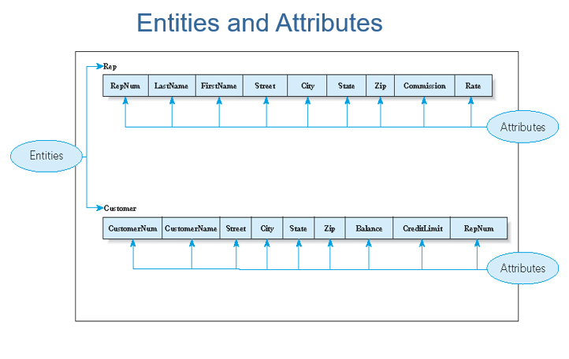

# 200324_W2D1_DBMS 관련 정리

#### Relationship 

-Entity 간의 관계. 1:1 / 1:다 / 다:다등이 있다.

- Association between entities
- One-to-many relationship 
  - Each rep is associated with many customers
  - Each customer is associated with a single rep

두 종류 이상의 entity 들 사이에서의 관계가 있을 수 있다.

### 1:다 관계 예시 =  판매원(1) : 고객(다) 

직원 한명이 고객 여러명을 담당할 수 있다.

직원이나 고객 entity를 구성하는 요소들을 Attributes라고 한다.

RepNum을 고객 entity가 Foriegin key로 가져오면서 1:다 관계가 생성된다.

balance는 외상으로 구매한 금액

Credit Limit은 한계

842번 같은 경우에는 한도를 초과하였기 때문에 20번 사원이 잘 관리 해줘야한다.

### 예시2 - 주문, 주문품목표 

##### 주문(1): 주문품목(다) 의 관계이다.

21610의 주문을 보면 주문은 1번이지만 주문품목이 2번인걸 볼 수 있다. (1:다)

위의 데이터베이스를 엑셀로 만들면?

이런 식으로 만들어진다.

## E-R Diagram

entity 와 Relationship을 나타내는 다이어그램

RepNum이나 CustomerNum 등 값들을 구분하는데 주로 사용되는 Attribute를 Key Attribute 라고 한다.

해당 Entity 만의 고유 식별 키는 Primary key

다른 Entity에서 가져온 식별 키는 Foregin key 라고 하며, Foregin key는 1:다의 관계일 경우 중복이 될 수 있다. (Primary key는 절대 중복 불가)

### 데이터베이스 접근법

사용자가 DBMS(DataBase Management System를 통해 직접 데이터베이스에 접근하거나

특정 프로그램을 통해 DBMS -> DB에 접근할 수 있다. (유저가 SQL을 모를 경우)

1-8의 경우는 데이터베이스를 설계, 관리 하는 사람들이고

1-9는 데이터베이스를 사용하는 유저,관리자 등이 이용을 한다.

즉 DB 설계자와 관리자가 따로 존재하는 경우도 있다.

### Forms , Reports

DBMS는 Forms(양식) 통해 데이터 베이스에 입력하는 양식을 만들거나

Reports(보고서) 등을 통해서 아웃풋을 쉽게 만들어낼 수 있다.

주문 폼 예시

## DB접근

각 부서에서 DBMS를 이용해서 DB에 직접 접근하거나 Meta Data에 접근할 수 있다.

Meta Data는 DB의 저장공간, 속성 등을 설명하는 데이터다.

- 데이터에 대한 데이터로써 하위레벨의 데이터를 설명/기술하려는 것
  -  상위레벨에서 하위레벨 데이터에 대한 각종 정보(자원의 속성)를 담고있는 데이터
  - 설명/기술 例) 문서 유형, 문서 구조, 문서 길이, 문서 작성자, 문서 작성일 등

-  즉, 자료 그 자체가 아닌 자료의 속성 등을 설명하는 데이터
  - 속성 例) 데이터에 관한 정보의 기술, 데이터 구성의 정의, 데이터의 분류 등을 위한 데이터 등

#### DBA?

DB의 Administrator 즉, 관리자를 뜻한다.

## DBMS의 기능들

- ##### Data dictionary management - 데이터 사전 관리
  - Data dictionary: stores definitions of data elements and their relationships

- ##### Data storage management - 데이터 저장소 관리 

  - Performance tuning ensures efficient performance 

- ##### Data transformation and presentation - 데이터 전환 및 표현
  - Data is formatted to conform to logical expectations

- ##### Security management - 보안관리
  - Enforces user security and data privacy 

- ##### Multiuser access control - 다중 접속 관리
  - Sophisticated algorithms ensure that multiple users can access the database concurrently without compromising its integrity

- ##### Backup and recovery management - 백업, 복원 관리
  - Enables recovery of the database after a failure

- ##### Data integrity management - 데이터 진실성 관리
  - Minimizes redundancy and maximizes consistency

- ##### Database access languages and application programming interfaces 

  ##### -데이터 베이스 관리를 위한 언어와 프로그래밍 인터페이스

  - Query language: lets the user specify what must be done without having to specify how 
  - Structured Query Language (SQL): de facto query language and data access standard supported by the majority of DBMS vendors

- ##### Database communication interfaces - 커뮤니케이션이 가능한 인터페이스 
  - Accept end-user requests via multiple, different network environments 

## 데이터 베이스의 장 단점

### 장점 

#### 1.Getting more information from the same amount of data - 같은 양의 데이터라도 얻게되는 정보의 양이 많아짐

#### 2.Sharing data - 데이터를 공유할 수 있게됨

#### 3.Balancing conflicting requirements - DB 유저간의 요구사항 충돌을 줄여줌.

- **Database administrator** or **database administration (DBA**): person or group in charge of the database

#### 4.Controlling redundancy - 중복을 관리할 수 있게 됨

#### 5.Facilitating consistency - 효율 일관성

#### 6.Improving integrity - 데이터 무결성을 향상시켜줌

- **Integrity constraint**: a rule that data must follow in the database

#### 7.Expanding security - 보안 확장

- **Security**: prevention of unauthorized access

#### 8.Increasing productivity - 생산성 향상

#### 9.Providing data independence - 데이터 독립성을 제공.

- **Data independence**: can change structure of a database without changing the programs that access the database

### 단점

#### 1.Increased costs - 비용이 증가

- DBMS, training, professional

#### 2.Greater impact of failure - 실패의 영향이 커짐

#### 3.Management complexity - 복잡성을 관리해야함

#### 4.Maintaining currency - 유지 하는데 힘이 든다.

#### 5.Vendor dependence - 공급자 의존적이게 된다.

#### 6.Frequent upgrade/replacement cycles -빈번한업그레이드를 할 때 마다 비용이 든다.

## 요약

- Problems with nondatabase approaches: redundancy, difficulties accessing related data, limited security features, limited data sharing features, and potential size limitations

데이터 베이스가 없을때의 문제점 : 중복문제 발생, 보안을 관리하는 시스템이 없음, 데이터사이즈가 제한되어있음, 데이터 공유가 힘듬

- Entity: person, place, object, event, or idea for which you want to store and process data

  =자료를 저장하는 대상, 테이블과 같은 개념

- Attribute, field, or column: characteristic or property of an entity

  =Entity의 특징들, 컬럼,필드 라고도 불림

- Relationship: an association between entities

  =관계, Entity들 사이의 연관성, 1:1이나 1:다, 다:다 같은 형식들이 있다.

- One-to-many relationship: 

  - each occurrence of first entity is related to many occurrences of the second entity and 
  - each occurrence of the second entity is related to only one occurrence of the first entity

=1:다 관계 , 하나의 Entity는 여러가지 2번째 entity을 가질 수 있다. 

=하지만 2번째 entity는 반드시 하나의 entity를 상위 entity로 가진다.

- Database: structure that can store information about multiple types of entities, attributes of entities, and relationships among entities

  =데이터베이스 : 정보를 다양한 구조(entites, attributes,relationships 등) 으로 저장할 수 있는 구조.

- Premiere Products requires information about reps, customers, parts, orders, and order lines

  =주요 제품은 고객, 재료, 주문, 생산라인 등등의  정보가 필요하다.

- Entity-relationship (E-R) diagram: represents a database visually by using various symbols

  = 실체 관계도, Entity와 Entity들 사이의 관계를 나타내는 관계도이다.

- Database management system (DBMS): 

  - program through which users interact with a database; 
  - lets you create forms and reports quickly and easily and obtain answers to questions about the data

  =데이터베이스 관리 시스템 : 크게 4개가 있음 - 오라클,mysql 등등

  ==사용자가 데이터베이스에 상호작용할 수 있는 프로그램이다.

  ==다양한 입력양식이나 보고서 등을 쉽게 만들 수 있는 기능들을 가지고 있다.

- Advantages of database processing: DB 의 장점

  - getting more information from the same amount of data, 

    =같은 양의 데이터라도 더 많은 정보를 얻을 수 있다.

  - sharing data, 

    = 정보의 공유가 가능해진다.

  - balancing conflicting requirements, 

    =자료에 대한 요구가 충돌하는 경우가 발생할 수 있을 경우 DB 설계자가 미리 사전에 방지핟록 설계할 수 있다.

  - controlling redundancy, 

    = 데이터 중복을 관리할 수 있다.

  - facilitating consistency, 

    = 일관성을 유지함.

  - improving integrity, 

    = 데이터무결성, 

  - expanding security, 

    =보안을 강화함

  - increasing productivity, 

    =생산성을 증가시킴

  - providing data independence

    =데이터 독립성을 제공, 프로그램과 데이터베이스 간에 독립성이 유지된다.

  

- Disadvantages of database processing: 

  - larger file size,

    = 파일의 크기가 커진다.

  -  increased complexity,

    =복잡성이  증가한다.

  -  greater impact of failure,

    =실패의 영향이 커진다. 

  - and more difficult recovery 

    =복구에 어려움을 겪는다.

