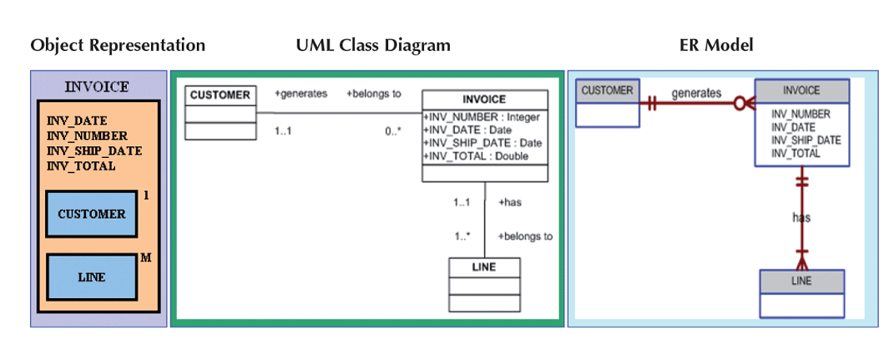

# 200326_W2D2_데이터 모델

## 전 시간 요약

- Problems with nondatabase approaches: redundancy, difficulties accessing related data, limited security features, limited data sharing features, and potential size limitations

데이터 베이스가 없을때의 문제점 : 중복문제 발생, 보안을 관리하는 시스템이 없음, 데이터사이즈가 제한되어있음, 데이터 공유가 힘듬

- Entity: person, place, object, event, or idea for which you want to store and process data

  =자료를 저장하는 대상, 테이블과 같은 개념

- Attribute, field, or column: characteristic or property of an entity

  =Entity의 특징들, 컬럼,필드 라고도 불림

- Relationship: an association between entities

  =관계, Entity들 사이의 연관성, 1:1이나 1:다, 다:다 같은 형식들이 있다.

- One-to-many relationship: 

  - each occurrence of first entity is related to many occurrences of the second entity and 
  - each occurrence of the second entity is related to only one occurrence of the first entity

=1:다 관계 , 하나의 Entity는 여러가지 2번째 entity을 가질 수 있다. 

=하지만 2번째 entity는 반드시 하나의 entity를 상위 entity로 가진다.

- Database: structure that can store information about multiple types of entities, attributes of entities, and relationships among entities

  =데이터베이스 : 정보를 다양한 구조(entites, attributes,relationships 등) 으로 저장할 수 있는 구조.

- Premiere Products requires information about reps, customers, parts, orders, and order lines

  =주요 제품은 고객, 재료, 주문, 생산라인 등등의  정보가 필요하다.

- Entity-relationship (E-R) diagram: represents a database visually by using various symbols

  = 실체 관계도, Entity와 Entity들 사이의 관계를 나타내는 관계도이다.

- Database management system (DBMS): 

  - program through which users interact with a database; 
  - lets you create forms and reports quickly and easily and obtain answers to questions about the data

  =데이터베이스 관리 시스템 : 크게 4개가 있음 - 오라클,mysql 등등

  ==사용자가 데이터베이스에 상호작용할 수 있는 프로그램이다.

  ==다양한 입력양식이나 보고서 등을 쉽게 만들 수 있는 기능들을 가지고 있다.

- Advantages of database processing: DB 의 장점

  - getting more information from the same amount of data, 

    =같은 양의 데이터라도 더 많은 정보를 얻을 수 있다.

  - sharing data, 

    = 정보의 공유가 가능해진다.

  - balancing conflicting requirements, 

    =자료에 대한 요구가 충돌하는 경우가 발생할 수 있을 경우 DB 설계자가 미리 사전에 방지핟록 설계할 수 있다.

  - controlling redundancy, 

    = 데이터 중복을 관리할 수 있다.

  - facilitating consistency, 

    = 일관성을 유지함.

  - improving integrity, 

    = 데이터무결성, 

  - expanding security, 

    =보안을 강화함

  - increasing productivity, 

    =생산성을 증가시킴

  - providing data independence

    =데이터 독립성을 제공, 프로그램과 데이터베이스 간에 독립성이 유지된다.

  

- Disadvantages of database processing: 

  - larger file size,

    = 파일의 크기가 커진다.

  -  increased complexity,

    =복잡성이  증가한다.

  -  greater impact of failure,

    =실패의 영향이 커진다. 

  - and more difficult recovery 

    =복구에 어려움을 겪는다.

## Data Models

DB에 관련된 기술적 용어들 

비즈니스 룰 - 업무 규칙

비즈니스 룰을 DB에 적용시켜서 만들어야 한다. (ex 입학년도는 졸업년도보다 빠를 수 없다.)

##### 위의 그림 중요

디비 시스템을 구성하는 사람,요소들

End User = 최종 사용자, 각 업무의 담당자

Application programs = 업무용 프로그램 

-> DB에 데이터를 요청, 프로그래머와 분석가들이 프로그램을 만든다.

시스템 관리, DB 관리자(DBA)가 따로 있고 데이터베이스를 만들때 디자이너가 디자인을 한다.

디자이너가 디자인을 할때 분석가의 도움을 받는다.

DB설계자(디자이너)는 비즈니스룰이나 업무에 대한 이해가 있어야함.

### 데이터 모델의 중요성

- Diverse user groups - DB 유저의 다양성
  - Facilitates communication  

  - Gives various views of the database

  - Organizes data for various users 

  - Provides an abstraction for the creation of good a database

    -데이터베이스를 만들때 각각의 유저들의 추상적인 내용이 전달되어야 좋은 데이터베이스가된다.

    

  다양한 end user에 맞는 DB를 만드는 것이 중요하다.

  

- Data Model Basic Building Blocks - 데이터 베이스를 설계하기 위해선 아래 것들을 기본적으로 알아야 한다.
  - Entity
  - Attribute
  - Relationship: association among entities
    - One-to-many (1:M OR 1..*)
    - Many-to-many (M:N or *..*)
    - One-to-one (1:1 OR 1..1)
  - Constraint: restriction placed on data - 제약조건, 데이터 무결성을 확실히 해준다.
    - Ensures data integrity

### 데이터 구분 

#### 첸 노테이션

 사각형 엔터티, 마름모 릴레이션쉽, 마름모 왼,아래에 관계의 특징이 나와있음.

#### 크로우 풋 (까마귀 발) 노테이션 

1쪽은 ㅣㅣ같이 작대기 두개, M(다) 쪽은 ㅣ<  (삼지창)모양

선 위에  관계의 이름을 명시한다.

삼지창 모양이 새 발바닥 같다고 해서 크로우 풋노테이션임

##### I< 은 미니멈1, 맥시멈 many의 의미이다.

##### 0< 은 미니멈0, 맥시멈many

ll 은 최소1 최대1 즉 하나만을 의미한다.

#### UML class diagram 노테이션

1..1 

1...* 같은 식으로 **양쪽에** 표시해준다. 

#### 예시1

INVOICE = 발생품목

Customer : INVOICE : 1:M 관계 (0 to many) 

INVOICE : Line 은 1:M 관계이다. 

## Business Rules

- Brief, precise, and unambiguous description of a policy, procedure, or principle

  = 원리 규칙, 정책등을 정하는 업무규칙 

  - Create and enforce actions within that organization’s environment

    조직 환경에 맞는 룰을 만들어 주는 역할을 한다.

  - Establish entities, relationships, and constraints

    객체, 관계, 제약조건 등을 이용해 설립한다.

    

- Sources of business rules = 비즈니스 룰의 소스

  - Company managers, Policy makers - 회사 대표, 업무 규칙 생성자를 통해

  - Department manager - 각 부서 담당자들

  - Written documentation - 이미 쓰여진 문서를통해

  - Direct interviews with end users - 엔드 유저 등과 대화를 통해 알 수 있음 

    

- Reasons for identifying and documenting business rules 

  = 비즈니스 룰을 확실히 해야 하는 이유

  - Standardize company’s view of data - 회사의 관점의 데이터를 표준화 할 수 있다.

  - Facilitate communications tool between users and designers - 유저와 설계자들의 대화 수단이 된다.

  - Assist designers - 설계자를 도와주는 역할을 한다.

    - Understand the nature, role, scope of data, and business processes

      -역할, 데이터의 본질 범위 등등을 표현 및 알게 해줌.

    - Develop appropriate relationship participation rules and constraints

      -관계나 원리, 룰, 제약조건을 만드는데 도움이 된다.

    - Create an accurate data model

      -정확한 데이터 모델을 만드는데 도움이 된다.

여러가지 형태의 비즈니스 룰이 존재한다,

데이터베이스 설계자가 이러한 룰을 데이터베이스 규칙으로 바꿔주어야 한다.

## Translating Business Rules into Data Model

- Business rules set the stage for the proper identification of entities, attributes, relationships, and constraints
  - Nouns translate into entities
  - Verbs translate into relationships among entities

- Relationships are bidirectional
  - Questions to identify the relationship type
    - How many instances of B are related to one instance of A?
    - How many instances of A are related to one instance of B?

- Entity name requirements 
  - Be descriptive of the objects in the business environment
  - Use terminology that is familiar to the users

- Attribute name 
  - Required to be descriptive of the data represented by the attribute 
- Proper naming
  - Facilitates communication between parties
  - Promotes self-documentation

