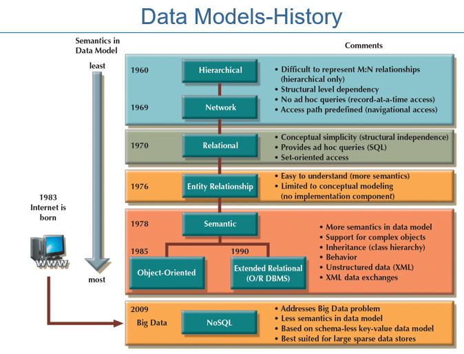
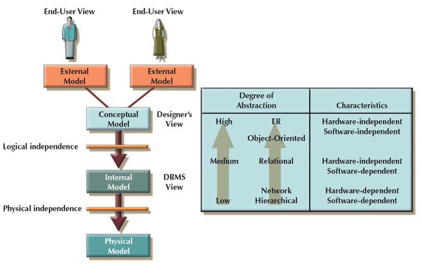
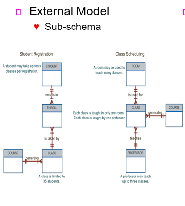
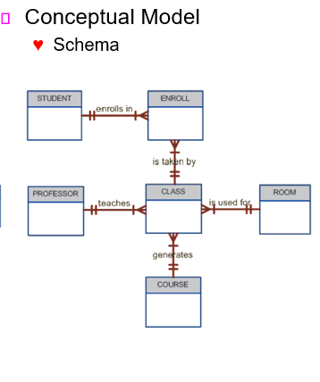
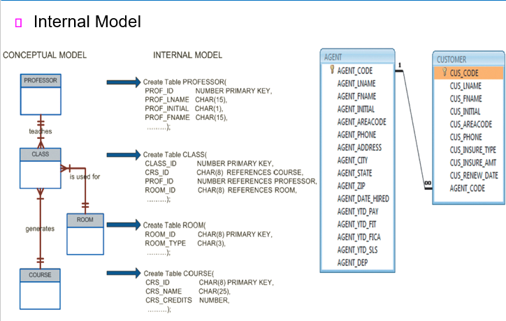
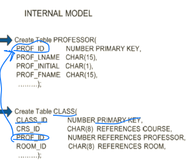
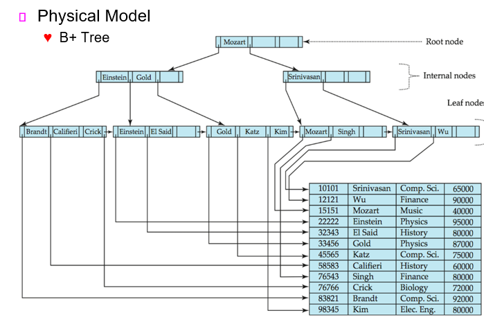
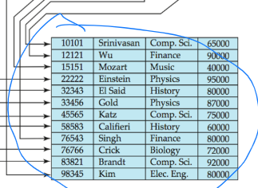
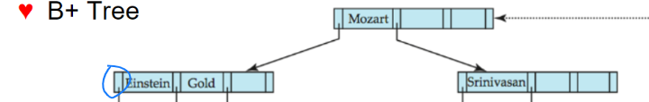

# 200331_W3D1_데이터모델2, 추상화

## 전 시간 리뷰

## Translating Business Rules into Data Model

- Business rules set the stage for the proper identification of entities, attributes, relationships, and constraints
  
  - Nouns translate into entities
  
- Verbs translate into relationships among entities
  
    
  
- Relationships are bidirectional
  - Questions to identify the relationship type - 사용자가 찾아야 하는 관계형 타입
    - How many instances of B are related to one instance of A?
    
    A라는 인스턴스 종류 한건이 B라는 인스턴스 몇건에 관련이 있는가?
    
    - How many instances of A are related to one instance of B?
    
      B라는 인스턴스 종류 한건이 A라는 인스턴스 몇건에 관련이 있는가?
    
      
  
- Entity name requirements - 엔티티 이름을 설정해야 할 경우
  
  - Be descriptive of the objects in the business environment - 비즈니스 환경에 맞게 설정
  
- Use terminology that is familiar to the users - 사용자들에게 친숙한 이름을 사용
  
    
  
- Attribute name  - 어트리뷰트 이름
  
  - Required to be descriptive of the data represented by the attribute 
  
    -이름은 데이터를 잘 나타낼 수 있도록 명확히 해야한다.

- Proper naming - 적절한 이름 짓기
  - Facilitates communication between parties - 그룹 구성원들 사이에서 소통이 원활하게
  - Promotes self-documentation - 서로 표준화가 이루어 지도록 해야함.

## 데이터 모델의 역사(pdf.2 이어서)

처음에는 **계층적 구조 모델**( - 수직적 데이터만을 설명) 밖에 없는 줄 알았는데, 그 후

 

**망형 데이터 모델** - 수평의 데이터를 설명할 순 있지만 데이터 간의 관계를 설명하기가 힘듬.

**관계형 데이터 모델** - 70년대에 이론으로 먼저 등장

E**ntity 관계형 모델** - 76년에 E-R 모델이 등장, 그래프나 그림으로 표현을 할 수 있는 개념적 모델이 생성됨.

**의미형(Semantic) 데이터 모델** 

- 객체지향형(Object-Oriented) - 데이터들을 각각의 객체로 보는 모델
- 확장된 관계형(O/R DBMS) -object(객체)들을 다룰 수 있는 모델

E-R 모델로 설명하지 못 했던 관계를 추가, 데이터들의 의미를 생각해서 데이터 모델링을 하는 것.

**NoSQL**

-비정형 데이터, 외부의 데이터들을 가져올 때 형태나 값들, 구조를 모르기 때문에 비정형 데이터라고 한다. 이러한 비정형 데이터를 관리하는 기술이 NoSQL이라 한다.

순으로 개발되었다.

## Emerging Data Models

##### Goals of Big Data

- Find new and better ways to manage large amounts of web and sensor-generated data

  -많은 양의 데이터들 중에서 조직이 관심을 둘만한 데이터들을 추출해야한다.

- Provide high performance at a reasonable cost  

  -적절한 비용으로 고 성능을 낼 수 있도록 해야한다.

  

##### Characteristics of Big Data 

- Volume, Velocity, Variety, Veracity

  -빅데이터의 특징, 원래는 3V였다가 4V로 바뀜 : 크기,속도,다양성,진실성

  

  다루는 데이터의 양이 많아진다.

  데이터를 처리하거나 수집하는 속도 또한 중요하다.

  다양한 타입의 데이터를 다룬다.

  fake데이터를 긁어 모아봐야 의미가 없다.

  

  

##### Challenges of Big Data 

- Volume doesn’t allow usage of conventional structures 

  -데이터 양이 많아졌기 때문에 정형화 된 구조로 다루는 것이 힘들어진ㄴ.

- Expensive

  -비용 문제

- OLAP tools proved inconsistent dealing with unstructured data

  -축적된 정형화된 데이터들을 분석하여 OLAP이라는 도구가 등장함.

  -온라인 분석 처리(Online Analytical Processing, **OLAP**)

##### New technologies of Big Data - 빅데이터  신기술

- Hadoop - 하둡

- Hadoop Distributed File System (HDFS) - 하둡 파일 분산 처리 시스템(하둡에서 제공)

- MapReduce - 맵리듀스(하둡에서 제공) , 데이터 병렬처리를 위한 프로그램

- NoSQL - 비정형화된 데이터들을 저장하기 위한 기술

#### NoSQL databases

- Not based on the relational model - 관계형 모델에 기초하지 않음.

  

- Support distributed database architectures - 분산 데이터 베이스 구조를 지원

  

- Provide high scalability, high availability, and fault tolerance

  -scalability - 규모가 얼마나 크든 작든 처리가 가능해야한다.

  -availability - 그룹 내 유저의 누구나 활용 가능해야한다.

  -fault tolerance - 장애 허용 시스템, 고장이 나더라도 부분적으로 기능을 수행할 수 있어야 한다.

  

- Support large amounts of sparse data

  많은 양의 흩어진 데이터(산발적인?)들을 지원해줌.

  

- Geared toward performance rather than transaction consistency

  NoSQL은 transaction 일관성보다 기본 성능이 매우 중요하다. 

  *기업에서 다루는 정형화된 데이터에서는 transaction처리가 매우 중요함(ex-은행에서 입출금 등이 동시에 일어나는 것을 다루는 일)

  

- Provides a broad umbrella for data storage and manipulation 

  폭 넓은 우산을 제공한다 - 많은 데이터 양을 저장하고 다룰 수 있게 해줌.

## Degrees of Data Abstraction - 데이터 추상화의 계층

End-User들은 데이터베이스의 내부가 궁금한게 아니라 자신의 업무와 관련되어 필요한 데이터들 만을 원함.

##### Logical independence - Conceptuual Model과 Internal Model은 서로 독립적이다.

##### Physical independence - DBMS가 보는 Internal Model과 어떻게 저장이 되는지에 대한 Physical Model은 서로 독립적이다.

##### Degree of Abstraction - 추상화의 수준, 위로 갈 수록 추상화의 수준이 높고 아래로 갈수록 낮다.

ER>객체지향>관계형>Network,계층형 순으로 추상화의 수준이 높다.

### 이러한 EndUser들이 보는 시점의 모델을 External Model 이라 한다.

##### 학생 등록에 대한 모델설명

end-user가 학생일 때, 학생이 수강신청을 하는 과정의 DB 모델

enroll은 원래는 등록이지만 한 학기 등록 하는 등록과 혼동이 올 수 있기 때문에 과목에 대한 수강신청으로 이해하면 됨.

class는 과목

course는 분반

student-enroll은 1대다의 관계, 학생 한명이 여러개의 수강 과목을 신청할 수 있다.

course(과목)은 여러개의 분반(class)을 가질 수 있다.

##### 과목 스케쥴링에 대한 모델 설명

하나의 강의실은 여러개의 분반(class)을 가질 수 있다. 

분반(class)들은 과목(course)과 1:1이거나 다:1 관계이다.

교수는 여러개의 분반(class)을 가질 수 있다.

#### 학생 등록, 과목 스케쥴링 모두 end user 의 관점임.

### Conceptual Model - 개념적인 모델 , DB 설계자가 만들고 가지고 있다.

 많은 External Model이 어떻게 얽힌 상태로 만들지 등을 구상하여 설계자가 구현해야한다.

위의 학생등록, 강의 관리를 합친 DB의 개념적 모델.

학생이 여러가지의 강의를 등록할 수 있고, 그러한 등록은 여러개의 분반이 가능하다 

(즉 한번의 수강신청으로 여러개의 분반 가능)

그 밖에도  교수,강의,강의실은 각각 여러개의 분반을 할당 받을 수 있는

1:다 관계가 된다.

### Internal Model - 관계형 데이터 베이스가 보는 데이터 베이스들의 모델 

즉 모든 데이터 베이스(학생DB,강의DB,교수DB등등)를 하나의 테이블로 보는 모델 (DBMS가 보는 관점의 모델, DBA가 관리)

좌측이 개념모델, 우측이 내부 모델

교수는 하나의 분반만을 맡을 수 있음.(다:다 관계 방지)

개념 모델을 실제 DB에 적용하기 위해서 각각의 요소들을 테이블로 만들어 준다.

식별키를 이용해서 관계를 설정한다. (1:1, 1:다,다:다)

ex)

1쪽의 PK를 다쪽의 FK로 넣어준다.

class의 경우 course,professor,room 3가지 항목을 FK으로 받는다.

### Physical Model : 실제 데이터가 저장될 때에 대한 데이터 모델

대부분 관계형 모델은 B+ Tree 구조로 테이블을 저장한다.

관계형 데이터 모델을 **테이블**로 저장한다.

어떻게 테이블로 저장하는가? 

이 테이블의 요소 하나 하나를 저장한다고 생각하면 됨.

row를 기준으로 한 줄 한 줄 씩 트리 형태로 저장한다.

*row와 record는 같은 의미, 

row는 테이블에서 사용 하는 용어, record는 IT업계에서 예전부터 써왔던 용어

각각의 정보(물리적 주소)를 한 node로 저장하고 포인터를 이용해 다음 node로 표시해준다.

#### 이런 게 있구나 정도만 알아두면 됨.

#### 각 4가지 모델의 용어와 의미를 알아둬야함.