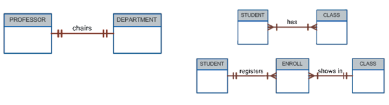

# 200402_W3D2_관계형 데이터 모델

#### 

## 목표

- Identify the relational model’s basic components and explain the structure, contents, and characteristics of a relational table

  관계형 모델의 구조와 요소 특징, 등등을 설명할 수 있어야 함.

- Explain the purpose and components of the data dictionary and system catalog

  시스템 카탈로그 = 데이터 딕셔너리에 관한 것 

- Identify appropriate entities and then the relationships among the entities in the relational database model

  entities와 관계형 모델을 설명할 수 있어야함

- Describe how data redundancy is handled in the relational database model

  관계형 모델의 데이터 중복 관리법

- Explain the purpose of indexing in a relational database

  인덱싱 -> 검색시간 간소화

## Tables and Their Characteristics

여기 나중에 해석

#### 관계형 테이블의 특징

1.테이블은 행,열 구조

2.각 테이블의 행(투플)은 하나의 Single entity set이라 보면 된다.

3.각 테이블의 열은 attribute라 하며, 각각 다른 이름을 갖는다.

4.행과 열 데이터들이 모여서 하나의 Single data value가 된다. 

5.모든 열의 데이터는 같은 데이터 형식을 가져야 한다.

6.각 열은 특정 범위의 도메인을 가진다. (값의 범위를 설정 가능)

7.행과 열의 순서는 DMBS에서 중요하지 않다.(immaaterial)

8.각 테이블은 유니크한 attribute를 갖는다.

## Table

관계표, 12개의 속성

속성의 이름

## Keys

- Keys consist of one or more attributes that determine other attributes

  - Ensure that each row in a table is uniquely identifiable - 각 행을 유니크하게 식별할 수 있다.

  - Establish relationships among tables and to ensure the integrity of the data - 각 테이블 간의 관계 설정을 가능하게 해준다.

    

- Primary key: attribute or combination of attributes that uniquely identifies a row

  ##### 프라이머리 키 : Attribute 중에서 유니크하게 그 열을 식별해 낼 수 있는 Attribute(테이블의 요소 하나)

  - Composite key: key that is composed of more than one attribute

  - Key attribute: attribute that is a part of a key

  - Entity integrity: condition in which each row in the table has its own unique identity 

    - All of the values in the primary key must be unique
    - No key attribute in the primary key can contain a null 
    - Null: absence of any data value

  - Referential integrity: every reference to an entity instance by another entity instance is valid 

    -참조 무결성, **Constraint(제약조건)** 을 바탕으로 데이터베이스의 정확성을 지키는 것 

  - Foreign key: primary key of one table that has been placed into another table to create a common attribute

    -일명 **외래키** 다른 테이블의 프라이머리 키를 Attribute로 가져온 경우 Foregin Key가 된다. 

    -일대다 의 관계에서는 항상 다쪽에서 외래키를 가진다.

    

- Secondary key: key used strictly for data retrieval purposes

프라이머리키는 오직 하나만 가질 수 있고 포린키는 여러개 가질 수 있다.

### 예시1 공통자료항목

같은 Attribute가 있을 때, 자연스럽게 관계 설정이 됨.

### Null값 Handling

Flags

- NULL값을 표시하기 위한 특정 값

  ex) 날짜 데이터의 Flags는 2099-99-99

  

NOT NULL 제약조건 

- 테이블의 특정 열에 NULL 값을 가질 수 없게 제약조건을 주는 것

UNIQUE 제약조건

- 테이블의 특정열에 중복값을 가질 수 없게 제약조건을 주는 것

## Data Dictionary and the System Catalog 

- Data dictionary
  - Description of all tables in the database created by the user and designer 

    모든 테이블에 관한 자료 

- System catalog
  - System data dictionary that describes all objects within the database 

    모든 objects에 대한 정보를 다루는 시스템 데이터 딕셔너리

- Homonyms and synonyms must be avoided to lessen confusion

  바람직하지 않은 오류2개

  - Homonym: same name is used to label different attributes 

    이름은 같은데 실제론 서로 다른 Attributes

  - Synonym: different names are used to describe the same attribute

    이름은 다른데 내용이 같을때.

    

    

### Relationships within the Relational Database

관계형 데이터 베이스의 관계

- One-to-many (1:M) 1:다
  - Norm for relational databases 

    

- One-to-one (1:1)  1:1
  - One entity can be related to only one other entity and vice versa 

    

- Many-to-many (M:N) 다:다
  - Implemented by creating a new entity in 1:M relationships with the original entities 
  - Composite entity (i.e., bridge or associative entity): helps avoid problems inherent to M:N relationships
    - Includes the primary keys of tables to be linked

다:다의 구현은 Composite entity, 혹은 associative entity 를 만들어서 중간에서 합쳐주는 entity를 만들면됨.

아래 사진에서의 ENROLL이 예시

학생은 여러개의 분반을 가지고, 하나의 분반은 여러명의 학생을 가지므로 M:N

중간에 수강(ENROLL)이라는 entity를 만들어줌.

ENROLL이라는 관계표에는 student의 key, class의 key값이 각각 저장되어있다.

### Data Redundancy - 데이터 중복

- The relational DB facilitates control of data redundancies through use of foreign keys
  - Common attributes that are shared by tables

    데이터 중복은 DB에서 처리해줌. 동일 attributes는 테이블에서 공유된다.

- To be controlled except the following circumstances:
  - Sometimes data redundancy must be increased to make the database serve crucial information purposes

  - Sometimes data redundancy exists to preserve the historical accuracy of data

    여러 상황에서 데이터 중복이 허용될 수 있다. (다:다 의 공통 자료항목 같은)

## Indexs

데이터 베이스의 검색 기능을 도와주는 INDEX

- Orderly arrangement to logically access rows in a table

  - Index key: index’s reference point that leads to data location identified by the key

  - Unique index: index key can have only one pointer value associated with it

    INDEX 테이블을 만들어서 검색을 도와준다.

- Each index is associated with only one table
  - The index key can have multiple attributes

인덱스 테이블(왼쪽)을 통해 저장된 행의 주소(Pointers)를 통해 바로 해당 작가의 그림들로 이동할 수 있다.

index는 오른쪽 그림 같은 형태라 이해하면 됨.

## E-R 모델(PPT4)

### 목표 

- Identify the main characteristics of entity relationship components

  entity 관계의 요소들의 특징들을 확인

- Describe how relationships between entities are defined, refined, and incorporated into the database design process

- See how ERD components affect database design and implementation

- Understand that real-world database design often requires the reconciliation of conflicting goals

표준화를 따라 모델을 만들어서 충돌을 줄이는 것

### The Entity Relationship Model (ERM)

- Entities
  - Refers to the entity set and not to a single entity occurrence
  - corresponds to a table—not to a row—in the relational environment
  - refers to a table row as an entity instance or entity occurrence
  - represented by a rectangle that contains the entity’s name
  - The entity name is usually written in all capital letters

각 entity(table)은 E-R에서 대문자로 표현하는 것이 관행

## Attributes

- Characteristics
  - Required attribute: must have a value and cannot be left empty (반드시 값을 가져야하는 특성)

    

  - Optional attribute: does not require a value and can be left empty

    

  - Domain: set of possible values for a given attribute 

    값의 제한 범위

    

  - Identifier: one/more attributes that uniquely identify each entity instance

    key같은 의미, attribute를 구분하는 유니크한 값

    - Composite identifier: primary key composed of more than one attribute

      

  - Composite attribute: attribute that can be subdivided to yield additional attributes (ex; address)

    여러개의 속성을 합쳐서 하나로 부르는 것

    

  - Simple attribute: attribute that cannot be subdivided

    더이상 나눠지지 않는 특성

    

  - Single-valued attribute: attribute that has only a single value

    

  - Multivalued attributes: attributes that have many values

    - Create several new attributes, one for each component of the original multivalued attribute

    - Develop a new entity composed of the original multivalued attribute’s components

      

  - Derived attribute: whose value is calculated from other attributes
    - Derived using an algorithm 

