# 200407_W4D1_속성,관계,설계

## Attributes

- Characteristics
  - Required attribute: must have a value and cannot be left empty (반드시 값을 가져야하는 특성)

    

  - Optional attribute: does not require a value and can be left empty

    

  - Domain: set of possible values for a given attribute 

    값의 제한 범위

    

  - Identifier: one/more attributes that uniquely identify each entity instance

    key같은 의미, attribute를 구분하는 유니크한 값

    - Composite identifier: primary key composed of more than one attribute

      

  - Composite attribute: attribute that can be subdivided to yield additional attributes (ex; address)

    여러개의 속성을 합쳐서 하나로 부르는 것

    

  - Simple attribute: attribute that cannot be subdivided

    더이상 나눠지지 않는 특성

    

  - Single-valued attribute: attribute that has only a single value

    

  - Multivalued attributes: attributes that have many values

    - Create several new attributes, one for each component of the original multivalued attribute

    - Develop a new entity composed of the original multivalued attribute’s components

      

  - Derived attribute: whose value is calculated from other attributes
    
    - Derived using an algorithm 
    
      파생된 속성, 다른 속성들에서 계산되어 만들어진 속성/ 저장을 따로 안 하는게 원칙이지만 계산이 복잡한 경우나 속도를 증가시켜야 하는 경우는 저장할 수도 있다.

### 다중속성

기본 원칙은 단일 속성 (Simple attribute)을 유지하는 것이다.

다중 속성(Multivalued attributes)일 경우에는 단일 속성으로 나눠주어야 한다.

ex)

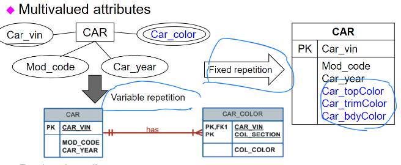

차의 색깔은 여러가지 색이 섞여있을 경우도 있으므로 별도의 Entity를 만들어주거나, Attribute를 single로 수정해줘야 한다.

### 파생속성

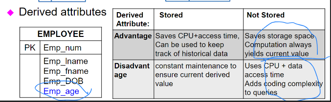

직원의 나이는 Day Of Birth(DOB)에서 자동으로 계산이 가능함.

이러한 경우는 저장을 따로 안 하는게 원칙이지만 계산이 복잡한 경우나 검색 속도를 증가시켜야 하는 경우는 저장할 수도 있다.

### Existence Dependence & Relationship Strength (의존성과 강한관계)

#### 의존성(Dependence)

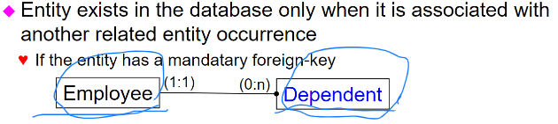

부양가족 이라는 속성이 있을 때,

이러한 부양가족은 반드시 Employee와 연결이 되어야 한다. (직원이 없이 부양가족만 있을 수는 없음.)

#### 강한 관계

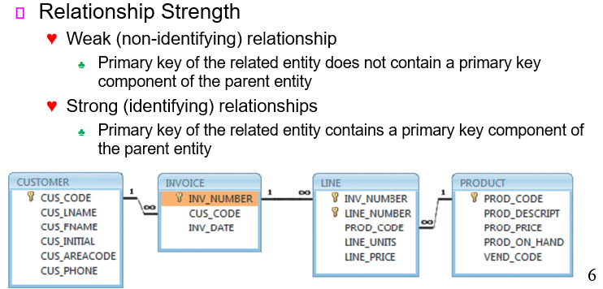

INVOICE 와 LINE처럼 관계가 설정 되어 있으며 INV_NUMBER라는 속성이 각각 프라이머리키와 포린키 관계로 연결 되있는 경우를 강한 관계(Strong relationship) 이라 하며,

LINE과 PRODUCT처럼 관계 설정은 되어있지만 공유하는 키가 없을 때느 Weak relationship 이라 한다.

### Weak Entity

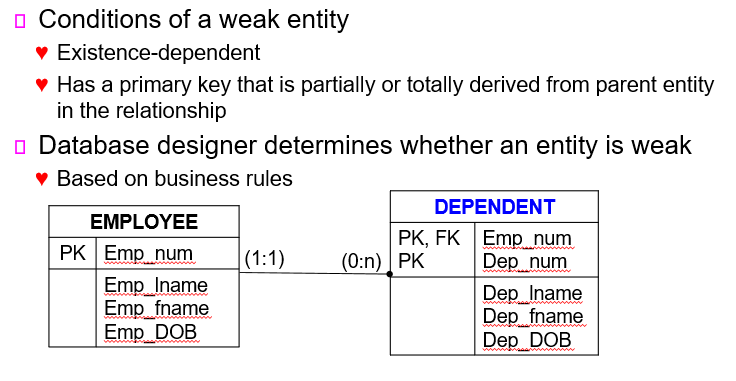

Existence-dependet 가 있으면서, PK의 연관이 있을 경우(강한 연결)

#### 의존성이 있고 강한관계(PK를 이용하는)일 경우가 Weak Entity 이다.

### Relationship Degree (관계의 종류)

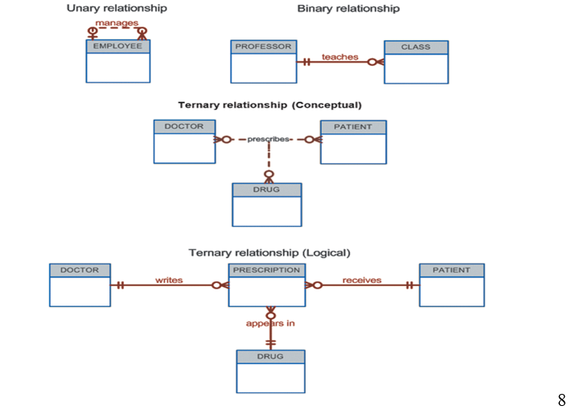

Unary relationship 은 하나의 Entity 내에서 서로 연결이 되는 경우 (ex 다른 사원의 사번(PK)을 FK로 받는 경우)

그 이후 2,3,4 개의 연결은 각각 binary, ternary, temary 라고 한다.

Binary (2) 예시

교수, 강의 : 1대다

Ternary (3) 예시

의사,환자,약 : 다 대 다 대다

Temary (4) 예시

의사 처방 약 환자 

의사 : 처방 은 1:다 

처방 : 환자 는 다:1

처방 : 약 은 다:1 (처방은 여러개일 수 도 있지만, 약은 하나?)

### ERD example

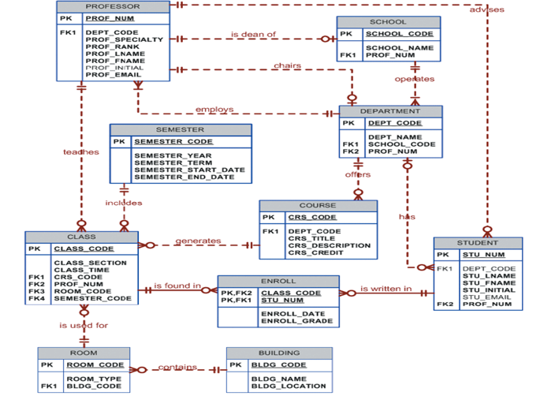

## Database Design Challenges

Database designers must often make design compromises that are triggered by **conflicting goals**

- Database design must conform to **design standards**

- High **processing speed** may limit the number and complexity of logically desirable relationships

- Information requirements
  - Maximum information generation may lead to loss of clean design structures and high transaction speed

### 설계원칙 (Design Challenges)

#### 정규화 를 최대한 진행 하라.(design standards)

데이터베이스의 **중복을 최소화** 하기위해서 테이블의 **종류를 최대한 분할**하는 것 

#### 속도를 높이기 위해서는?

정규화를 최대로 진행한 이후에, 다시 비정규화를 해서 관계표를 합치는 작업을 함

#### 정보요구

high transaction speed 때문에 모든 정규화 과정을 따를 수 없다.

### 설계 예시

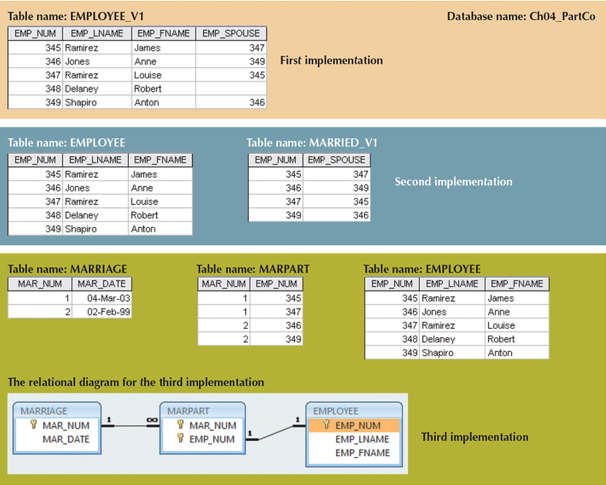

1.직원 Entity에 사내결혼을 했다면 배우자의 사번을 입력하는 속성을 추가. 

2.직원 Entity와 연결된 사내결혼 Entity를 추가

3.사내결혼 Entity, 와 사내결혼과 직원의 중간에서 연결 되는 MARPART 2개를 추가

1,2,3 모두 가능한 설계로 설계자가 최적의 설계를 선택해야한다. (설계의 우선순위에 따라)

1,2번은 데이터 중복의 여부가 있고 ex)345,347에 각각 똑같은 결혼 데이터가 들어감

3은 검색 시간 증가의 우려가 있다.

#### *정규화? 

데이터 베이스를 효율적으로 하기 위해 분할하는 것.

### Specialization Hierarchy (상세계층)

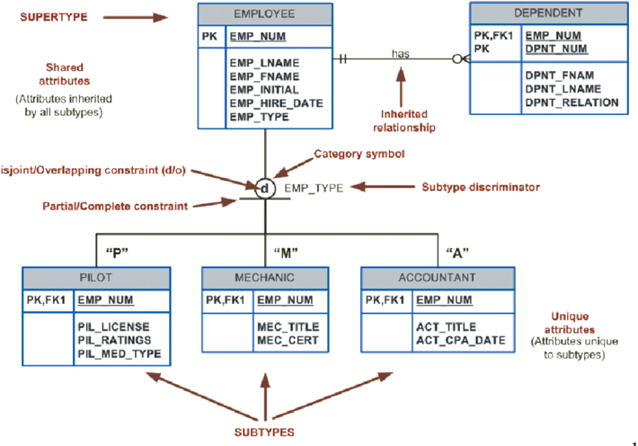

한 종류의 Entity인데, 한 Entity의 부분집합 같은 식으로 하위집합을 별도로 분리해서 3개의 하위 Entity를 만들었는데 이 같은 경우를 상세화 계층이라고 한다.

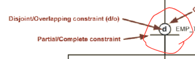

#### Disjoint / Overlapping 제약조건

Disjoint, 아래의 subtype중에 한 곳에만 속할 수 있다.

Overlapping, 아래으 ㅣsubtype 중 여러곳에 속할 수 있다.

## Inheritance (상속)

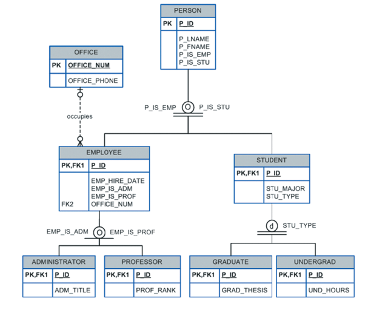

사람이라는 기본 Entity의 정보를 직원과 학생 모두가 상속받는다. 

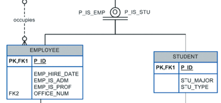

두줄의 O는 Overlapping constraint, 두가지 이외의 것은 해당X

ex) employee 와 student 두개다 해당 가능(대학원생), but 두 가지 이외의 것은 X

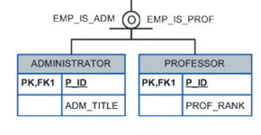

**한줄의 O**는 Overlapping 이지만 **incomplete(불안정한)**의 의미로, 두가지 이외의 다른 것들이 존재,

즉 교수이면서 관리자일 수 있지만, 두가지 이외의 다른 것일 수도 있다.

ex) 두줄의 d는 complete 이므로 아래의 두 종류 중 하나로 반드시 존재해야하므로 아래의 갯수의 합이 위의 Entity의 합이 된다. 

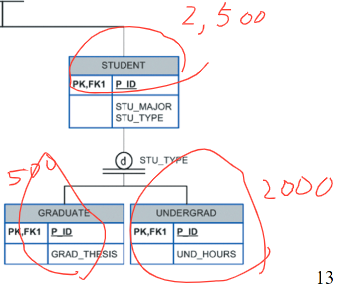

맨 아래에 위치한 Entity는 속성이 하나인가? -> X

맨 위의 Person / Employee, student 에서 속성들을 상속받는다.

## Entity Clustering

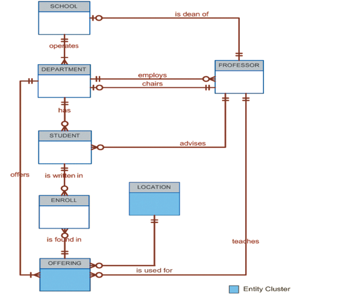

Entity Clustering 이란? 여러개의 Entity들을 묶어서 하나의 Class로 표현하는 것.

ex) 여기서의 OFFERING은 아래 사진의 SEMESTER, CLASS, COURSE 3개의 entity의 합(Entity Clustering)이다.

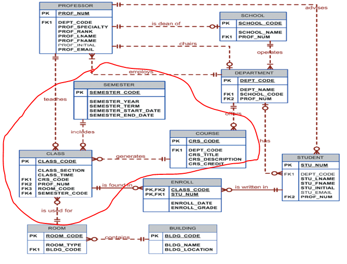

## Maintaining History of Time-Variant Data 

#### (시간이 지나면서 값이 바뀌는 데이터의 이력을 유지해야한다.)

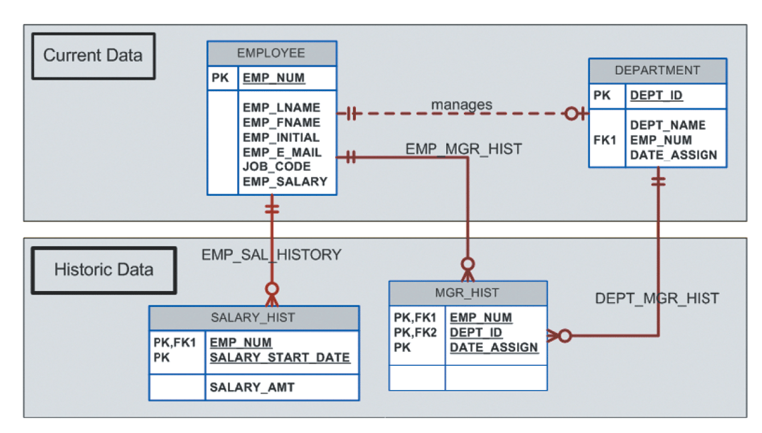

전의 급여 역사와 부서 이동 역사 등등을 따로 관리해야한다 (Historic Data)