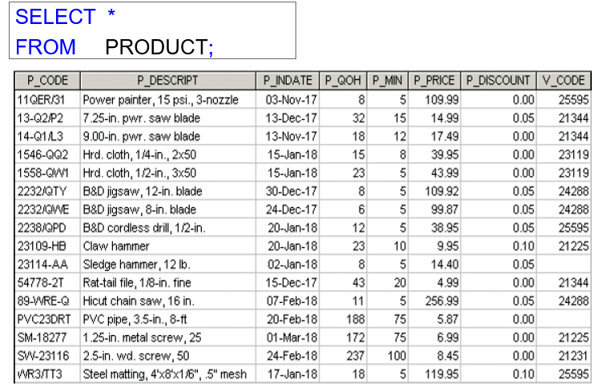
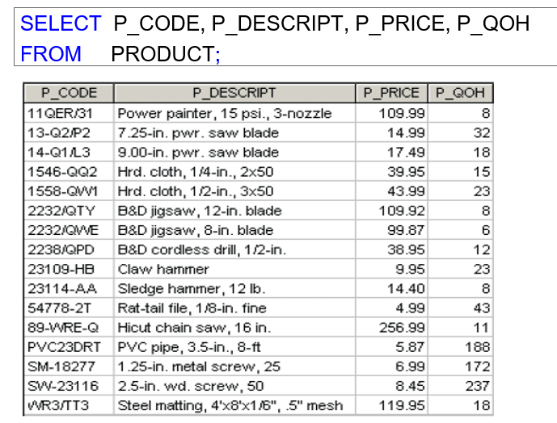
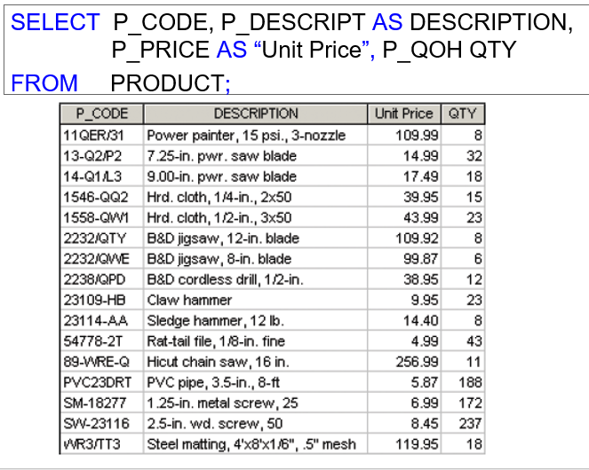
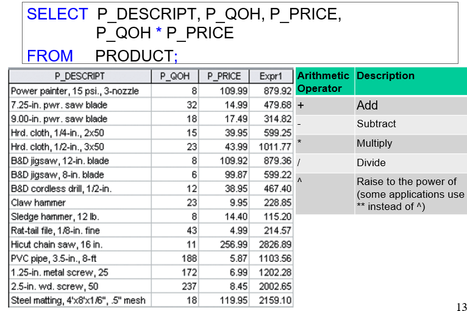
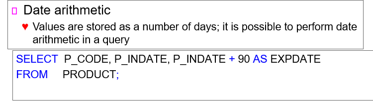
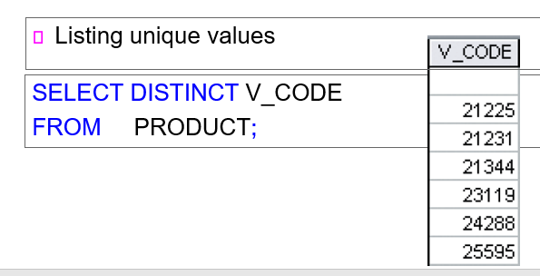
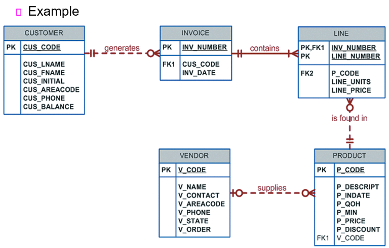
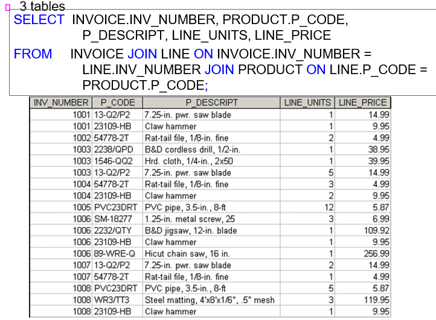

# 200409_W4D2_SQL,JOIN

## SQL의 종류

- Data definition language (DDL)

- Data manipulation language (DML)

- Transaction control language (TCL)

- Data control language (DCL)

## DDL(Data definition language)

테이블을 만들거나 지울 때 사용하는 명령어

##### CREATE, DROP, ALTER

### DML(Data manipulation language)

데이터베이스를 조작하는 명령어

##### SELECT, INSERT, UPDATE, DELETE, 

FROM,WHERE,GROUP BY, HAVING, ORDER BY, 

비교연산자 (>,<,=,<=,>=)

논리연산자(AND,OR,NOT)

### TCL (Transaction control language)

하나의 트랜잭션을 다루는 명령어

##### COMMIT, ROLLBACK, GRANT, REVOKE

##### Data type(자료형) 

Character(문자), 

Numeric(숫자), 

Date(날짜)가 있다.

SQL 쓰는법

select 컬럼이름 from 데이터베이스

alias = 별명, 데이터 베이스의 컬럼 같은 것을 짧게 변경해서 사용하는 경우

## SQL 사용 예시

PRODUCT 테이블의 모든 항목을 가져오는 것,

테이블의 특정 속성만을 가져오는 것,

속성을 가져오고 AS(Alias)로 이름을 바꾸는 것,

속성간의 연산 값을 가지는 속성을 만듬.

**나 ^인 제곱의 의미.

날짜 데이터 연산

INDATE에서 90일을 더한 값으로 EXPDATE 속성을 만들었다.

중복제거

DISTINCT 를 사용하면 중복 값들을 제거한 값을 보여준다.

## JOIN

#### Inner Join 

= 두개의 관계표를 합칠 때, 공동 자료항목을 기준으로 합치는데, 합치고 난 후에 공통 자료 항목이 같은 항목은 남기고 다른 결과들은 지우는 것,

즉, Common Value만 남기는 Join

#### Natural Join 

= Inner Join과 같은 의미, 공동 자료 항목을 찾고 자연스럽게 합쳐주는 것

공통 자료항목이 없으면 relational product를 남김.(단순 테이블의 곱)

#### USING Join

공통 자료항목이 있을 경우 USING뒤에 공통자료항목을 입력하면 해당 공통자료항목을 이용해서

JOIN을 한다.

-> Natural Join과 공통자료항목이 있을 때는 결과가 같지만 없을때는 Syntax Error가 나옴.

#### JOIN ON

특정 자료항목을 기준으로 JOIN을 할 경우 ON 뒤에 명시하여 JOIN 하는 기능

JOIN Condition을 만족하는 결과만 출력한다.

#### Outer Join 

= Inner Join의 항목을 남기고, 겹쳐지지 않는 항목 중에서도 일부를 남긴다.

*두 테이블의 자료를 전부 남기는 것을 Full Outer Join, 한쪽만 남기는 것을 Left, Right Join

예시로 사용할 테이블들

INVIOCE와  LINE을 첫 번째로 JOIN, INVOCIE.INV_NUMBER와 LINE.INV_NUMBER가 같은 경우에 JOIN을 하라고 명령함.

2번째 조인 : 위의 INVOICE와 LINE의 조인에 새로 PRODUCT를 JOIN함.

JOIN 조건은 LINE의 P_CODE와 PRODUCT의 P_CODE가 일치할 때,

*관계형 데이터베이스는 3개의 테이블을 한번에 조인할 수 없다. 그래서 1차 JOIN을 한 테이블에 다시 2차로 JOIN을 해 주는 방식을 사용해야 한다.

