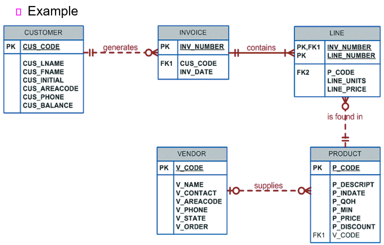

# 200414_W5D1_Aggregate,Grouping

## 전에한거 복습

## JOIN

#### Inner Join 

= 두개의 관계표를 합칠 때, 공동 자료항목을 기준으로 합치는데, 합치고 난 후에 공통 자료 항목이 같은 항목은 남기고 다른 결과들은 지우는 것,

즉, Common Value만 남기는 Join

#### Natural Join 

= Inner Join과 같은 의미, 공동 자료 항목을 찾고 자연스럽게 합쳐주는 것

공통 자료항목이 없으면 relational product를 남김.(단순 테이블의 곱)

#### USING Join

공통 자료항목이 있을 경우 USING뒤에 공통자료항목을 입력하면 해당 공통자료항목을 이용해서

JOIN을 한다.

-> Natural Join과 공통자료항목이 있을 때는 결과가 같지만 없을때는 Syntax Error가 나옴.

#### JOIN ON

특정 자료항목을 기준으로 JOIN을 할 경우 ON 뒤에 명시하여 JOIN 하는 기능

JOIN Condition을 만족하는 결과만 출력한다.

#### Outer Join 

= Inner Join의 항목을 남기고, 겹쳐지지 않는 항목 중에서도 일부를 남긴다.

*두 테이블의 자료를 전부 남기는 것을 Full Outer Join, 한쪽만 남기는 것을 Left, Right Join

예시로 사용할 테이블들

INVIOCE와  LINE을 첫 번째로 JOIN, INVOCIE.INV_NUMBER와 LINE.INV_NUMBER가 같은 경우에 JOIN을 하라고 명령함.

2번째 조인 : 위의 INVOICE와 LINE의 조인에 새로 PRODUCT를 JOIN함.

JOIN 조건은 LINE의 P_CODE와 PRODUCT의 P_CODE가 일치할 때,

*관계형 데이터베이스는 3개의 테이블을 한번에 조인할 수 없다. 그래서 1차 JOIN을 한 테이블에 다시 2차로 JOIN을 해 주는 방식을 사용해야 한다.

## 복습끝

#### Outer joins

- Returns not only the rows matching the join condition (rows with matching values in the common columns) and returns the rows with unmatched values

- ANSI standard defines three types of outer joins: **left, right, and full**

곱의 결과인 테이블에서 공통 자료 항목이 같은 row도 남기 는 것이 Inner Join이고, 공통자료 항목이 같지 않은 row도 남기는 Join

**left, right, full** 세 종류의 Outer Join이 있다.

#### Cross join

- Performs a relational product (also known as the *Cartesian product*) of two tables

  **한 쪽 테이블의 모든 행들과 다른 테이블의 모든 행을 조인**

  

  

#### Joining tables with an alias

테이블 조인을 할 때 별명을 붙여서 Join 가능

- An alias may be used to identify the source table from which the data is taken

- The ability to specify a table alias is very useful

  - Using a table alias allows the database programmer to improve the maintainability of the code by using a table alias that is descriptive of what data the table is providing within the query

    

#### Recursive joins

동일한 테이블을 Join 하는 것. ex) A와 A를 JOIN

- Recursive query: joins a table to itself

## Left Outer Join

왼쪽 테이블이 VENDOR 이므로, VENDOR의 데이터는 모두 남겨두고 일치하는 PRODUCT 테이블의 값이 있는 row의 값만 가져온다.

PRODUCT의 모든 데이터를 남기고 값이 일치하는 VENDOR만 가져올 때는 RIGHT JOIN

## 별명을 이용한 JOIN

PRODUCT 테이블을 P, VENDOR를 V라는 Alias를 지정하여 JOIN함.

## Recursive Join

EMP 테이블 2개를 조인하는데 Alias를 다르게 주어 E와 M 을 JOIN시킴.

주로 사번, 관리자번호 관리할 때 사용		

## ORDER BY

정렬의 기준을 정하는 명령어

FROM 절 아래, 보통 제일 뒤에 쓴다.

## WHERE 절

테이블 검색 조건을 지정하는 구문, 스킵가능

조건연산자 (AND,OR 등과 같이 사용 가능)

비교연산자 사용 가능

#### Selecting rows with conditional restrictions

- WHERE clause is used to add conditional restrictions to the SELECT statement that limit the rows returned by the query

- Syntax:

    SELECT   *columnlist*

    FROM   *tablelist*

    [WHERE   *conditionlist* ]

    [ORDER BY   *columnlist* [ASC | DESC] ];

  

#### Using comparison operators 

- on character attributes
  
- used to place restrictions on character-based attributes
  
- on dates
  - Date procedures are often more software-specific than other SQL procedures

    

#### Logical operators: AND, OR, and NOT

- SQL allows you to include multiple conditions in a query through the use of these logical operators

- Boolean algebra is dedicated to the use of logical operators

#### 예시

1번 : V_CODE가 21344와 같은 row

2번 : V_CODE가 21344가 아닌 row들만을 출력

## 날짜 데이터 조건문(Comparison Operators on Dates)

비교연산자를 이용해 조건문 설정이 가능하다.

2018-01-20 이후의 날짜들만 출력.

## WHERE 문에서의 특수 연산자

BETWEEN : 범위 내의 숫자만

IN : list 안에 값이 있는지 없는지,

LIKE : String Pattern이 비슷한 값이 있는지 없는지

IS NULL : 값이 null 인지 아닌지

NOT : 해당 값이 아닌.

#### 예시 - BETWEEN, IN

IN의 경우 21344~24288이 아니라, 21344나 24288 중 하나일 경우만.

#### 예시 - LIKE, NOT LIKE, IS NULL

Smith를 포함하는 String 만

NOT LIKE는 Smith를 포함하는 Stirng만을 제외

IS NULL은 해당 컬럼이 비어있는 row만.

## Aggregate Processing (집합, 합계 처리)

#### Takes a collection of rows and reduces it to a single row

- SQL provides useful aggregate functions that count, find minimum and maximum values, calculate averages, etc.

  

#### Aggregate functions (집합, 합계 함수)

- COUNT

- MIN and MAX

- SUM and AVG

이런 종류가 있음

select 문에서 사용하며, 값 하나만 리턴된다.

#### Grouping data

- GROUP BY clause syntax: 

    SELECT   *columnlist*

    FROM    *tablelist*

    [WHERE    *conditionlist* ]

    [GROUP BY   *columnlist* ]

    [ORDER BY    *columnlist* [ASC | DESC] ];

GROUP BY는 데이터들을 한 그룹으로 묶겠다는 의미.

합계함수(Aggregate functions)와 같이 사용하면 값이 하나가 아니라 Grouping 된 값의 수만큼 값이 나온다.

ex) 지역으로 그룹핑을 하면 지역별 평균이 나온다.

#### 예시 - 컬럼 내부 연산(TOTAL)

#### 예시 - 합계 함수 (Aggregate Processing)

##### COUNT나 AVG 등등은 SELECT 문에서 사용한다.

##### GROUP BY를 사용하여 V_CODE 별로 구분하여 평균을 구하였다.

## HAVING 절

GROUP BY의 결과에 적용되는 조건문

#### 예시 - HAVING, GROUP BY

평균 가격(GROUP BY로 계산해야만 나옴)이 10보다 작은 값들만 출력,

즉 HAVING절은 반드시 GROUP BY랑 같이 쓰여야 한다.

## 서브쿼리(Subqueries)

서브쿼리는? 쿼리 안에 쿼리를 넣는 것

ex) where문, from절, IN, HAVING 안에 또 쿼리를 넣음

#### Key characteristics 

- A subquery is a query (SELECT statement) inside another query

- A subquery is normally expressed inside parentheses

- The first query in the SQL statement is known as the outer query

- The query inside the SQL statement is known as the inner query

- The inner query is executed first

- The output of an inner query is used as the input for the outer query

- The entire SQL statement is sometimes referred to as a nested query

  

#### Subquery can return one or more values

쿼리의 결과는 하나의 row,column이나 table 자체가 올 수 있다.

- One single value (one column and one row)

- A list of values (one column and multiple rows)

- A virtual table (multicolumn, multirow set of values)

## 서브쿼리의 종류

#### WHERE subqueries

- Most common type of subquery uses an inner SELECT subquery on the right side of a WHERE comparison expression

#### IN subqueries

- IN operator: used to compare a single attribute to a list of values

- IN subquery: values are not known beforehand, but can be derived using a query

#### HAVING subqueries 

- HAVING clause: used to restrict the output of a GROUP BY query by applying conditional criteria to the grouped rows

- Multirow subquery operators: ALL and ANY

- ALL operator compares a single value with a list of values returned by the first subquery using a comparison operator other than equals

- ANY operator compares a single value to a list of values and select only the rows greater than or less than any value in the list

#### FROM subqueries

- FROM clause specifies the table(s) from which the data will be drawn

where, in, having, from 절에 사용할 수 있다.

#### Attribute list subqueries

- Inline subquery: subquery expression
  - Example: can be used to list the difference between each product’s price and the average product price

#### Correlated subquery 

- Executes once for each row in the outer query

- Inner query is related to the outer query; the inner query references a column of the outer subquery

- Can also be used with the EXISTS special operator
  - Can be used whenever there is a requirement to execute a command based on the result of another query
  - Can be used with uncorrelated subqueries, but it is almost always used with correlated subqueries

#### 예시 - 서브쿼리

