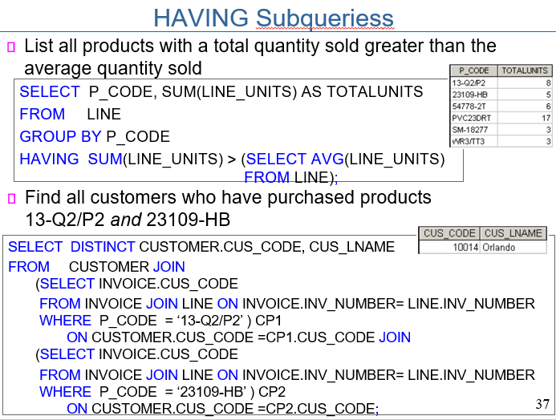

# 200416_W5D2_ㅁㄴㅇ

## 서브쿼리(Subqueries)

서브쿼리는? 쿼리 안에 쿼리를 넣는 것

ex) where문, from절, IN, HAVING 안에 또 쿼리를 넣음

#### Key characteristics 

- A subquery is a query (SELECT statement) inside another query

- A subquery is normally expressed inside parentheses

- The first query in the SQL statement is known as the outer query

- The query inside the SQL statement is known as the inner query

- The inner query is executed first

- The output of an inner query is used as the input for the outer query

- The entire SQL statement is sometimes referred to as a nested query

  

#### Subquery can return one or more values

쿼리의 결과는 하나의 row,column이나 table 자체가 올 수 있다.

- One single value (one column and one row)

- A list of values (one column and multiple rows)

- A virtual table (multicolumn, multirow set of values)

## 서브쿼리의 종류

#### WHERE subqueries

- Most common type of subquery uses an inner SELECT subquery on the right side of a WHERE comparison expression

#### IN subqueries

- IN operator: used to compare a single attribute to a list of values

- IN subquery: values are not known beforehand, but can be derived using a query

#### HAVING subqueries 

- HAVING clause: used to restrict the output of a GROUP BY query by applying conditional criteria to the grouped rows

- Multirow subquery operators: ALL and ANY

- ALL operator compares a single value with a list of values returned by the first subquery using a comparison operator other than equals

- ANY operator compares a single value to a list of values and select only the rows greater than or less than any value in the list

#### FROM subqueries

- FROM clause specifies the table(s) from which the data will be drawn

where, in, having, from 절에 사용할 수 있다.

#### Attribute list subqueries

- Inline subquery: subquery expression
  - Example: can be used to list the difference between each product’s price and the average product price

#### Correlated subquery 

- Executes once for each row in the outer query

- Inner query is related to the outer query; the inner query references a column of the outer subquery

- Can also be used with the EXISTS special operator
  - Can be used whenever there is a requirement to execute a command based on the result of another query
  - Can be used with uncorrelated subqueries, but it is almost always used with correlated subqueries

#### 예시 - 서브쿼리

