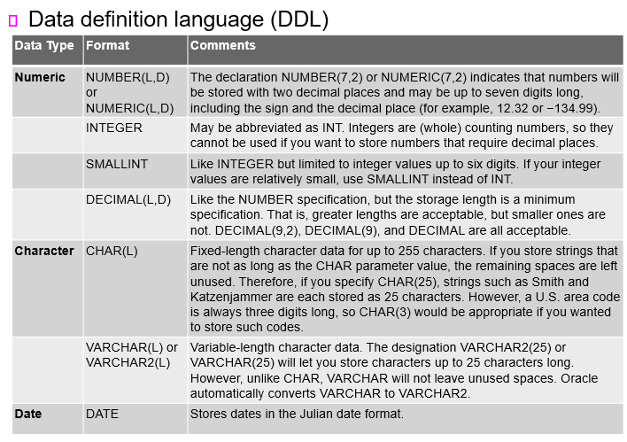

# 200416_W5D2_서브쿼리,DDL

## 서브쿼리(Subqueries)

서브쿼리는? 쿼리 안에 쿼리를 넣는 것

ex) where문, from절, IN, HAVING 안에 또 쿼리를 넣음

#### Key characteristics 

- A subquery is a query (SELECT statement) inside another query

- A subquery is normally expressed inside parentheses

- The first query in the SQL statement is known as the outer query

- The query inside the SQL statement is known as the inner query

- The inner query is executed first

- The output of an inner query is used as the input for the outer query

- The entire SQL statement is sometimes referred to as a nested query

  

#### Subquery can return one or more values

쿼리의 결과는 하나의 row,column이나 table 자체가 올 수 있다.

- One single value (one column and one row)

- A list of values (one column and multiple rows)

- A virtual table (multicolumn, multirow set of values)

## 서브쿼리의 종류

#### WHERE subqueries

- Most common type of subquery uses an inner SELECT subquery on the right side of a WHERE comparison expression

#### IN subqueries

- IN operator: used to compare a single attribute to a list of values

- IN subquery: values are not known beforehand, but can be derived using a query

#### HAVING subqueries 

- HAVING clause: used to restrict the output of a GROUP BY query by applying conditional criteria to the grouped rows

- Multirow subquery operators: ALL and ANY

- ALL operator compares a single value with a list of values returned by the first subquery using a comparison operator other than equals

- ANY operator compares a single value to a list of values and select only the rows greater than or less than any value in the list

#### FROM subqueries

- FROM clause specifies the table(s) from which the data will be drawn

where, in, having, from 절에 사용할 수 있다.

#### Attribute list subqueries

- Inline subquery: subquery expression
  - Example: can be used to list the difference between each product’s price and the average product price

#### Correlated subquery 

- Executes once for each row in the outer query

- Inner query is related to the outer query; the inner query references a column of the outer subquery

- Can also be used with the EXISTS special operator
  - Can be used whenever there is a requirement to execute a command based on the result of another query
  - Can be used with uncorrelated subqueries, but it is almost always used with correlated subqueries

#### 예시 - HAVING 서브쿼리

예시1) HAVING 절 안에 서브쿼리를 활용하여 평균 갯수보다 많은 것만 출력

예시2) 서브쿼리를 활용한 테이블 2개를 JOIN

#### 예시 - WHERE, IN 서브쿼리

예시1 ) where 문에 서브쿼리를 주어 평균 가격보다 높거나 같은 가격을 가진 품목의 코드와 가격만 출력

예시2 ) where 문에 IN 서브쿼리를 주어 주석,설명에 hammer나 saw가 들어있는 PRODUCT만 출력 

## SQL 함수

#### SQL functions are very useful tools

- Many types 

#### Date and time functions - 날짜 시간 관련 함수

- All date functions take one parameter of a date or character data type and return a value; refer to Table 7.10

#### Numeric functions  - 숫자 관련 함수

- Can be grouped in many different ways, such as algebraic, trigonometric, and logarithmic; refer to Table 7.11

#### String functions - 문자열 관련 함수

- Among the most-used functions in programming; refer to Table 7.12 

#### Conversion functions - 데이터 타입 변환 함수

- Allow you to take a value of a given data type and convert it to the equivalent value in another data type; refer to Table 7.13

## ex)

#### UNION - 합집합 , 두테이블의 길이가 같아야함, 두 테이블을 합침

- Combines rows from two or more queries without including duplicate rows

- Syntax:

    *query* UNION *query*

#### UNION ALL - 합집합 + 중복된 row는 지워버림

- Used to produce a relation that retains the duplicate rows

- Used to unite more than just two queries

#### INTERSECT - 교집합, 두 테이블의 공통 row만 남겨놓음

- Can be used to combine rows from two queries, returning only the rows that appear in both sets

- Syntax:

    *query* INTERSECT *query*

#### EXCEPT (MINUS) - 차집합, 공통 row를 빼버림

- Combines rows from two queries and returns only the rows that appear in the first set but not in the second

- Syntax:

    *query* EXCEPT *query*

    *query* MINUS *query*

#### Syntax alternatives

- Alternative syntax used to achieve the same output

## Crafting SELECT Queries

#### Know your data - 데이터를 이해해야함.

- The importance of understanding the data model that you are working in cannot be overstated

- Real-world databases are messy; most database systems remain in service in an organization for decades

#### Know the problem - 문제를 파악해야함.

- Understand the question you are attempting to answer

- Information reporting requests will come from a range of sources; may be one-time events or ongoing operations within an application 

#### Build one clause at a time

- FROM

- WHERE

- GROUP BY

- HAVING

- SELECT

- ORDER BY

### SQL2 PPT로 이동

## Objectives

#### Use SQL to create a table manually

#### Use SQL to create a copy of a table using a subquery

#### Manipulate the structure of existing tables to add, modify, and remove columns and constraints

#### Use SQL to do data manipulation (insert, update, and delete rows of data)

#### Use SQL to create database views, including updatable views

#### Use Procedural Language SQL (PL/SQL) to create triggers, stored procedures, and PL/SQL functions

#### Create embedded SQL

요약 : 데이터베이스를 관리, 생성하는 파트

## 데이터베이스 생성 - 정의

만들기 전에 구조를 정의해야함,

인덱스 같은 스키마를 어떻게 할지

데이터 타입은 어떻게 할지

## DDL - 데이터베이스 생성, 삭제 관련 명령어

### 데이터 유형

## CREATE문

컬럼이름 + 데이터타입 , 컬럼이름2 + 테이터타입2, constraint(각 컬럼별로 줄 수도 있음.)

### 실제 예시

PK를 설정할때 CONSTRAINT PRODUCT_P_CODE_PK라는 제약조건을 넣어 PK 설정을 해줄 수도 있고, 생략할 수도 있다.