# 200416_W6D1_테이블 생성, 관리

#### 테이블 생성 예시1 - VENDOR, PRODUCT

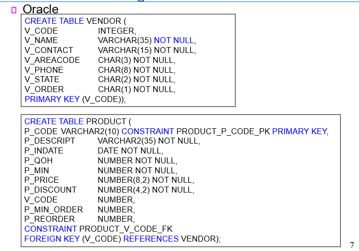

#### 테이블 생성 예시2 - CUSTOMER, INVOICE

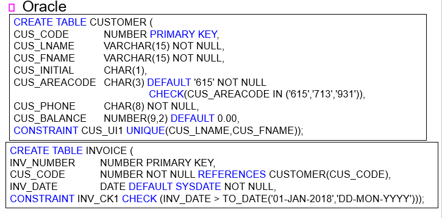

#### 테이블 생성 예시3 - LINE

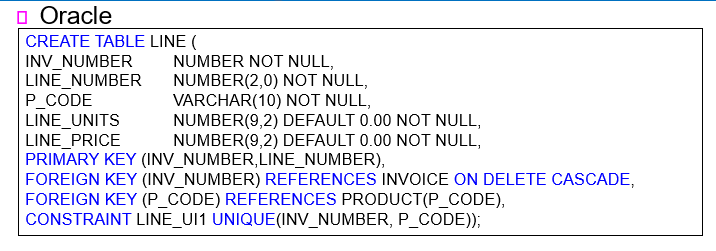

## INDEX

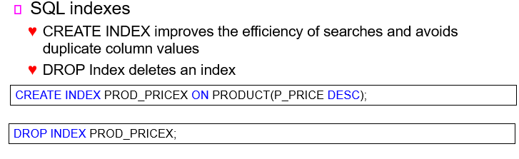

검색기능, 데이터 중복을 막아주는 DB의 기능 중 하나

CREATE로만들고 DROP으로 삭제함.

## Altering Table Structures (테이블 변경 관련 명령어)

- All changes in the table structure are made by using the ALTER TABLE command followed by a keyword that produces the specific change you want to make
  - ##### ADD, MODIFY, and DROP 

    

- Changing a column’s data type
  - ##### ALTER 

    

- Changing a column’s data characteristics
  - If the column to be changed already contains data, you can make changes in the column’s characteristics if those changes do not alter the data type

    

- Adding a column
  - You can alter an existing table by adding one or more columns

  - Be careful not to include the NOT NULL clause for the new column

#### 사용예시

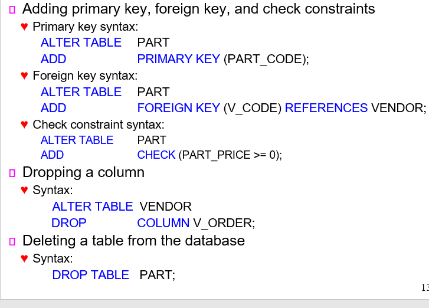

ALTER table 테이블이름 을 먼저 사용하고

ADD, DROP, MODIFY 등의 alter명령어를 사용한다.

## INSERT INTO - 테이블 행 추가하기 

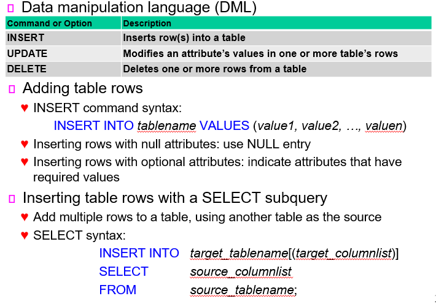

사용방법 : INSERT INTO 테이블이름 VALUES(추가할 VALUES의 값들,값2,값3)

#### 사용 예시

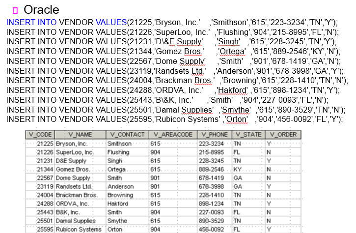

#### SELECT 서브쿼리를 이용한 INSERT INTO

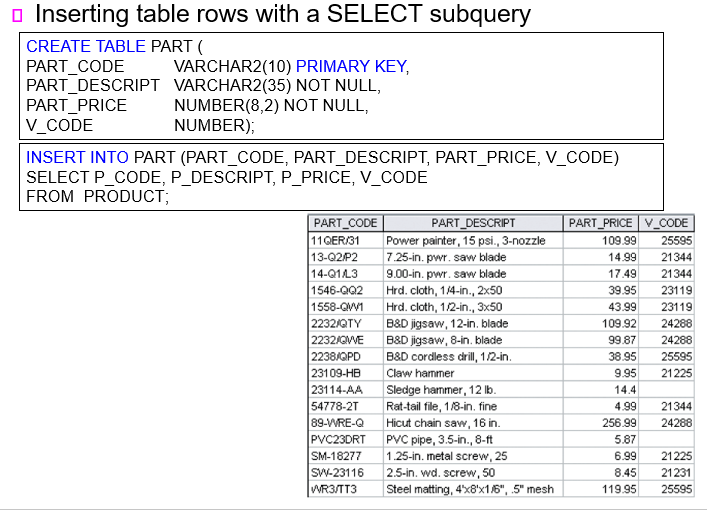

PRODUCT의 값들을 PART의 값에 복사하는 과정.

## 데이터베이스 상태 관리 명령어

#### -Saving table changes

- COMMIT command syntax: 

    COMMIT;

#### Updating table rows

- UPDATE command is used to modify data in a table

- UPDATE syntax:

    UPDATE   *tablename*

    SET  *columnname* = *expression* [, *columnname* = *expression*]

    [WHERE   *conditionlist* ];

#### Deleting table rows

- DELETE statement syntax:

    DELETE FROM   *tablename*

    [WHERE   *conditionlist* ];

#### -Restoring table contents

- ROLLBACK command is used restore the database to its previous condition

    ROLLBACK;

##### COMMIT : 현재의 변경 사항을 저장

##### ROLLBACK : 현재의 변경사항을 취소

UPDATE : 특정 테이블을 업데이트

DELETE : 특정 테이블을 삭제

## Virtual Tables: Creating a View

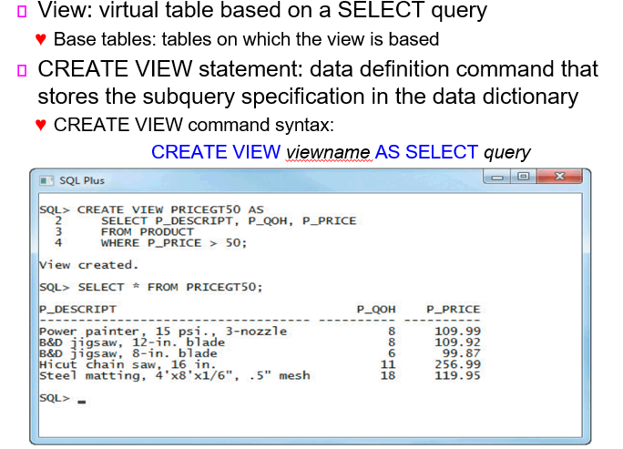

VIEW는 가상의 테이블 관점을 만들어서 테이블을 보다 간략하고 원하는 정보만 볼 수 있게 해준다.

#### VIEW UPDATE

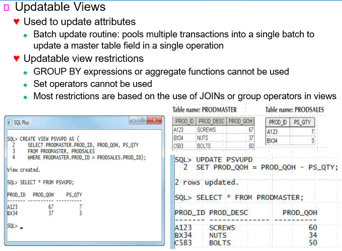

SELECT * FROM 뷰 이름

으로 설정했던 뷰의 내용을볼 수 있고,

UPDATE 뷰 이름

set 컬럼이름 = 내용 

으로 뷰의 내용을 변경할 수 있다.

## Sequences - 번호 자동매기기

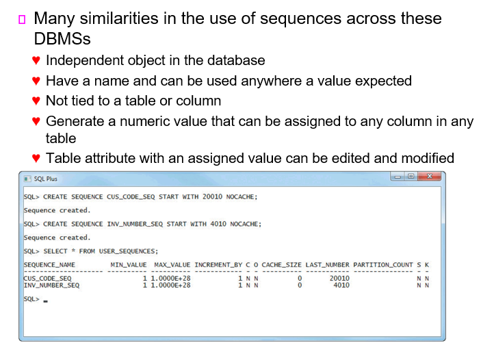

테이블을 생성할 때 자동으로 번호를 생성해주는 기능으로서 시작지점, 증가 범위, 증가or감소 여부 등을 설정할 수 있다.

## PL/SQL

절차적 SQL, 반복되는 SQL을 간단히 실행시키기 위한 기능

#### Performs a conditional or looping operation by isolating critical code and making all application programs call the shared code 

- Better maintenance and logic control

#### Persistent stored module (PSM): block of code 

- Contains standard SQL statements and procedural extensions that is stored and executed at the DBMS server

  

#### Procedural Language SQL (PL/SQL)

- Use and storage of procedural code and SQL statements within the database

- Merging of SQL and traditional programming constructs

- Procedural code is executed as a unit by DBMS when invoked by end user

- Anonymous PL/SQL blocks 

- Triggers

- Stored procedures 

- PL/SQL functions

MYSQL에서는 PSQL, oracle에서는 PL/SQL으로 이름이 다르다.

#### PL/SQL의 데이터 타입

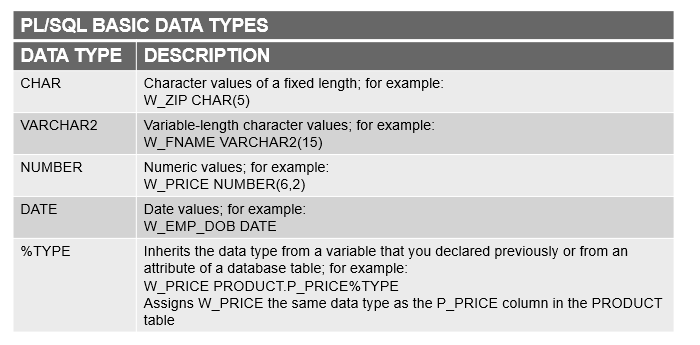

#### 트리거

다음 시간에 이어서함.