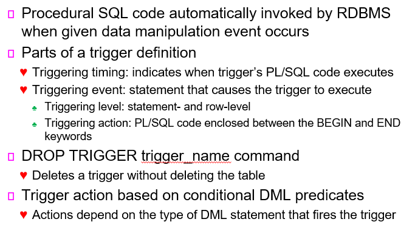
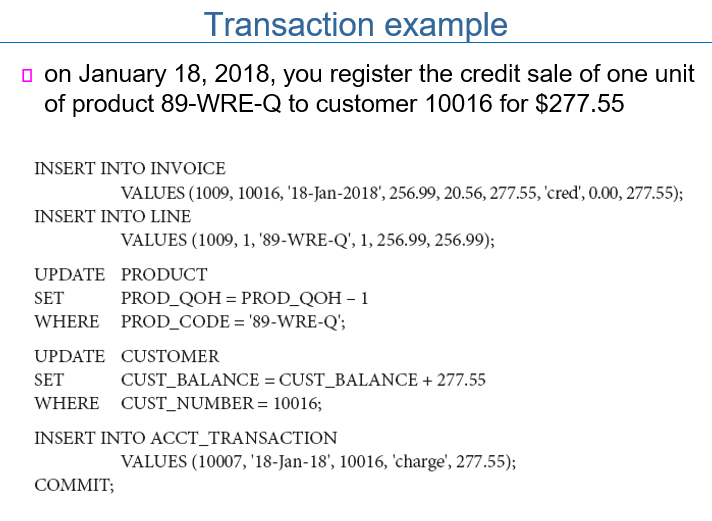

# 200423_W6D2_트리거,트랜잭션

#### 트리거

PL/SQL이 자동적으로 실행되게 만들어주는 RDBMS 기능

Triggering timing : 어떤 때에 실행이 되게 할 지

Triggering event : 어떤 내용을 실행하게 할지 

ex)

판매량을 새로 업데이트 시켜주는 트리거, 

QOH는 현재 보유 개수, P_MIN은 최소 개수

 MIN_ORDER는 재주문 가능한 최소 수량 

ex2)

현재 보유 수량을 8->4로 바꿔서 최소 개수 이하로 떨어지자 REORDER 수가 증가하였다.

ex3)

최소 개수를 5->10개로 증가시켜서 REORDER 수가 1 늘어났다.

## Stored Procedures

프로그램을 작성해서 이름을 부여해서 DBMS에 저장을 해 놓는 것 

#### Named collection of procedural and SQL statements

- Stored in the database

- Can be used to encapsulate and represent business transactions

#### Advantages

- Reduce network traffic and increase performance

- Decrease code duplication by means of code isolation and code sharing 

##### 장점

코두 분리, 공유로 인해 코드 중복을 줄여줌

네트워크 트래픽을 줄여주고 성능 증가

ex) 재고가 최소 보유량의 2배 이상일 경우 5% 할인

## Cursor

커서 : SQL문을 실행할 때, 한 row씩 프로세싱을 해야하는 프로그램을 짜야할 때 사용함.

#### Cursor: special construct used to hold data rows returned by a SQL query - 데이터 열들을 한꺼번에 다루는 SQL 쿼리

- Implicit cursor: automatically created when SQL statement returns only one value

  DBMS가 알아서 만들어서 실행하는 커서

- Explicit cursor: holds the output of a SQL statement that may return two or more rows

  유저가 직접 만들어서 실행되는 커서

- Syntax:

    CURSOR *cursor_name* IS *select-query*;

  

#### Cursor-style processing involves retrieving data from the cursor one row at a time - 한번에 data를 다룰 필요가 있을 때 커서를 사용함

- Current row is copied to PL/SQL variables

## Cursor 사용법

일단 OPEN을 하고, FETCH로 row들을 읽어야 한다.

## Stored function 과 Embedded SQL의 차이 

#### Stored function: named group of procedural and SQL statements that returns a value - 리턴 값을 가짐

- Indicated by a RETURN statement in its program code

#### Can be invoked only from within stored procedures or triggers - 트리거나 procedures 안에서 실행되어야함.

- Cannot be invoked from SQL statements unless the function follows some very specific compliance rules

## Embedded SQL - 내장된 범용 프로그래밍 언어  

#### SQL statements contained within an application programming language

- Host language: any language that contains embedded SQL statements

  -내장 범용 언어 ex) 자바, 파이썬

#### Differences between SQL and procedural languages

- Run-time mismatch
  - SQL is executed one instruction at a time
  - Host language runs at client side in its own memory space

- Processing mismatch
  - Conventional programming languages process one data element at a time

  - Newer programming environments manipulate data sets in a cohesive manner

- Data type mismatch
  - Data types provided by SQL might not match data types used in different host languages

  

특정 코드들을 이용해 HOST와 소통함.

## 3장 - 다수의 사용자의 트랜잭션을 컨트롤 하는 방법

locking methods

stamping methods

optimistic methods

3가지 방법이 있음.

## 트랜잭션이란?

전체적으로 처리가 다 끝나거나 중단되야하는 논리적인 한 단위 

하나 또는 그 이상의 데이터베이스 요청의 집합.

#### A logical unit of work that must be entirely completed or aborted

- A sequence of database requests that accesses the database

- Consists of:
  - SELECT statement 
  - Series of related UPDATE statements
  - Series of INSERT statements
  - Combination of SELECT, UPDATE, and INSERT statements

#### Consistent database state

- All data integrity constraints are satisfied

- Must begin with the database in a known consistent state to ensure consistency

- Most are formed by two or more database requests
  - A database request: equivalent of a single SQL statement in an application program or transaction

모든 데이터 무결성이 지켜졌을때 Consistent (일관성있는) DB라 한다.

#### Evaluating Transaction Results 

- Not all transactions update the database
  - SQL code represents a transaction because it accesses the database

- Improper or incomplete transactions can have devastating effect on database integrity
  - Users can define enforceable constraints based on business rules

  - Other integrity rules are automatically enforced by the DBMS

ex)

이 과정에서 하나의 DB만 업데이트 되면 안되고, 상품이 하나 팔리면 INVOICE(송장), PRODUCT ,CUSTOMER 등등 다양한 DB도 함께 업데이트 되야한다.

## 트랜잭션 예시

물건 하나를 구매했을 때, 

INOVICE와 LINE 테이블에 각각 row 하나를 추가하고

PRODUCT, CUSTOMER 테이블을 업데이트하고

ACCT_TRANSACTION 에 새로 row를 업데이트를 해야 (ACCOUNT_TRANSACTION)

5가지 구문이 전부 완료가 되어야 하나의 트랜잭션이 끝난다.

-> 임시 저장되어있던 값들을 COMMIT으로 영구저장

트랜잭션을 처리하는 중간에 전기가 꺼져서 과정이 중단될 경우?

데이터 일관성이 깨지게 됨.

#### -> 처리하기 전 상태로 되돌려야함 (ROLLBACK)

## 트랜잭션의 특징(ACID+S)

#### Atomicity - 원자성, 더 이상 분해되지 않는 논리적인 작업단위

- All operations of a transaction must be completed; 
   if not, the transaction is aborted

- a single, indivisible, logical unit of work

#### Consistency - 일관성, 하나의 작업은 마칠 때 연관된 상태로 저장되어야 함

- Permanence of database’s consistent state

#### Isolation - 고립성, 트랜잭션은 하나가 온전히 끝난 뒤에야 다음 트랜잭션이 실행됨, 즉 서로 겹쳐지지않음, 

- Data used during a transaction cannot be used by second transaction until the first is completed

#### Durability  - 지속성, 트랜잭션이 끝나면 undone상태로 되돌릴 수 없음

- Ensures that once transactions are committed, they cannot be undone or lost

#### Serializability - 순차성, 동시에 실행되는 트랜잭션을 잘 관리해서 일관적인 결과가 나와야함.

- Ensures that the schedule for the concurrent execution of several transactions should yield consistent results

멀티유저가 사용하는 DB의 경우 Isolation 과 Serializability  의 관리가 매우 중요함.

## SQL이 제공하는 트랜잭션 관리 기능

##### COMMIT, ROLLBACK으로 트랜잭션을 관리한다.

트랜잭션은 4가지 경우에서 계속 이어진다.

1.commit이 되기 전까지

2.rollback 이 나오기 전 까지

3.프로그램이 끝나기 전까지(트리거나 절차적SQL이 끝날 때)

4.프로그램이 비정상으로 종료되기 전까지