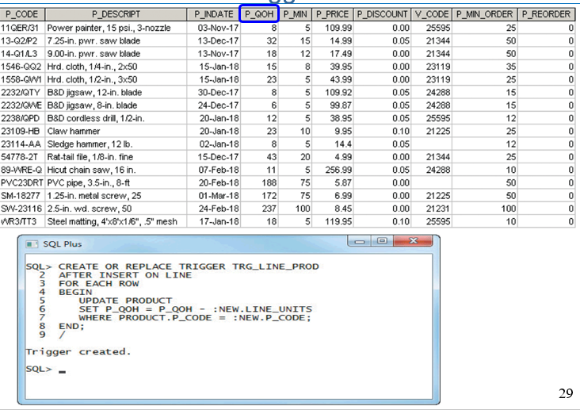
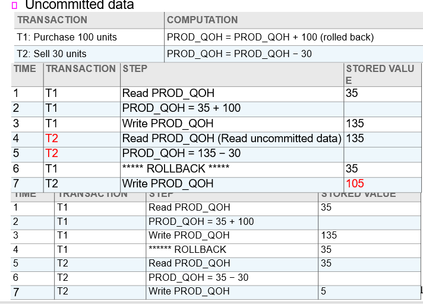
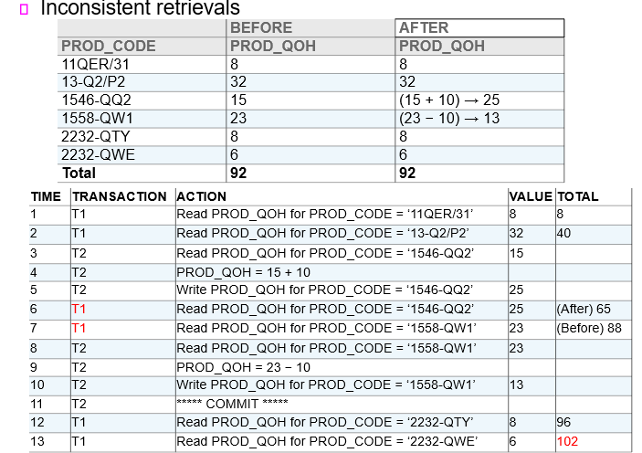

# 200428_W7D1_병행관리,Locking

## 트리거 수정

#### 트리거

PL/SQL이 자동적으로 실행되게 만들어주는 RDBMS 기능

Triggering timing : 어떤 때에 실행이 되게 할 지

Triggering event : 어떤 내용을 실행하게 할지 

ex)

판매량을 새로 업데이트 시켜주는 트리거, 

#### QOH는 현재 보유 개수, P_MIN은 최소 개수

 MIN_ORDER는 재주문 가능한 최소 수량 

ex2)

현재 보유 수량을 8->4로 바꿔서 최소 개수 이하로 떨어지자 REORDER 수가 증가하였다.

ex3)

최소 개수를 5->10개로 증가시켜서 REORDER 수가 1 늘어났다.

새로운 LINE_UNILTS가 들어오면 **현재 갯수**를 업데이트 한다.

## 트랜잭션 로그

트랜잭션에 대한 기록을 저장하는 곳

## Concurrency Control (병행성 관리)

시스템이 동시에 실행될 때 병행성을 관리해주는 것을 의미한다.

주 문제 는 3개로

##### 업데이트 과정 중 손실되거나

##### commit 되지 않은 데이터

##### 일관되지 않은 검색 

> 트랜잭션이 업데이트 전, 후로 검색 데이터가 다른 것을 의미

#### 업데이트 손실 예시

#### Commit 실패 예시

#### 일관되지 않은 검색 예시

## 스케쥴러

트랜잭션의 충돌을 방지하기 위해 concurrent control(병행성 관리) 알고리즘으로

각 트랜잭션을 시간적 순서에 맞춰 실행하게 해주는 것 

## Locking Method

## 

실행 순서를 맞추기 위해서 잠구는 것 

다양한 방법이 있음.

## Lock 세분화(Granularity)

#### 데이터베이스 레벨 Locking

#### 테이블 레벨 Locking

#### 페이지 레벨 Locking

#### row 레벨 locking

## Lock의 Types

binary로 1,0으로 구분을 할 수 있고

read,write,lock,unlock등 세분화해서 상태를 나누는 방법도 있다.

## 데드락

locks를 사용하다가 순차성이 깨지게 될 경우 스케쥴이 잘 작동하지 않게 되어 데드락을 생성하게 된다.

두 트랜잭선이 서로 unlock상태의 데이터를 기다리는 상태

컨트롤 방법은 3가지가 있음.

Deadlock prevention(예방)

Deadlock detection(감지)

Deadlock avoidance(회피)

Locking을 2Phases로 나눠서 관리하는 방법

Growing(성장)과

Shrinking(축소) 페이즈로 나누며

성장 단계에서 트랜잭션의 lcoks를 가지게 되고

축소 단계에서 모든 lock이 해제됨.(새로운 lock을 얻지 못함)