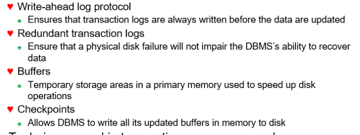

# 200512_W9D1_트랜잭션관리

## 데드락(Deadlock)

locks를 사용하다가 순차성이 깨지게 될 경우 스케쥴이 잘 작동하지 않게 되어 데드락을 생성하게 된다.

두 트랜잭선이 서로 unlock상태의 데이터를 기다리는 상태

컨트롤 방법은 3가지가 있음.

#### Deadlock prevention(예방)

자원 할당시 Deadlock의 필요조건 중 어느 하나를 미리 차단하여 방지하는 방법

#### Deadlock detection(감지)

데드락 자체를 탐색하고 그 상황을 복구하는 방법

#### Deadlock avoidance(회피)

자원요청에 대한 부가적인 정보를 이용하여 Deadlock으로부터 safe한 지를 동적으로

점검하여 safe 한 경우에만 자원을 할당해 주는 방법

## Time Stamping Method(타임 스탬프)

타임스탬프 형식에 시간을 기록하는 방식을 Time Stamping 이라 한다.

## Wait/Die and Wound/Wait Schemes

Wait/Die -> 기다리거나 죽임으로써 데드락을 해결

Wound/Wait -> 기다리거나 스케쥴을 바꿈.

## Concurrency Control with Optimistic Methods

긍정적인 결과를 예상하여 처리하는 방식

conflict가 없다 가정

locking이나 time stamping이 필요가 없다.

## ANSI Levels of Transaction Isolation

트랜잭션 고립에 대한 3가지 상태

1) Dirty Read

다른 트랜잭션에 의해 수정됐지만 아직 커밋되지 않은 데이터를 읽는 것을 말한다. 변경 후 아직 커밋되지 않은 값을 읽었는데 변경을 가한 트랜잭션이 최종적으로 롤백된다면 그 값을 읽은 트랜잭션은 비일관된 상태에 놓이게 된다.

2) Non-Repeatable Read

한 트랜잭션 내에서 같은 쿼리를 두 번 수행했는데, 그 사이에 다른 트랜잭션이 값을 수정 또는 삭제하는 바람에 두 쿼리 결과가 다르게 나타나는 현상을

3) Phantom Read

한 트랜잭션 내에서 같은 쿼리를 두 번 수행했는데, 첫 번째 쿼리에서 없던 유령(Phantom) 레코드가 두 번째 쿼리에서 나타나는 현상을 말한다.

- Read Uncommitted
  트랜잭션에서 처리 중인 아직 커밋되지 않은 데이터를 다른 트랜잭션이 읽는 것을 허용한다

  

- Read Committed (=Default mode)
  트랜잭션이 커밋되어 확정된 데이터만 다른 트랜잭션이 읽도록 허용함으로써 Dirty Read를 방지해준다. 커밋된 데이터만 읽더라도 Non-Repeatable Read와 Phantom Read 현상을 막지는 못한다. 읽는 시점에 따라 결과가 다를 수 있다는 것이다. 한 트랜잭션 내에서 쿼리를 두 번 수행했는데 두 쿼리 사이에 다른 트랜잭션이 값을 변경/삭제하거나 새로운 레코드를 삽입하는 경우

  

- Repeatable Read
  트랜잭션 내에서 쿼리를 두 번 이상 수행할 때, 첫 번째 쿼리에 있던 레코드가 사라지거나 값이 바뀌는 현상을 방지해 준다. 이 트랜잭션 격리성 수준이 Phantom Read 현상을 막지는 못한다. 첫 번째 쿼리에서 없던 새로운 레코드가 나타날 수 있다는 것이다. 한 트랜잭션 내에서 쿼리를 두 번 수행했는데 두 쿼리 사이에 다른 트랜잭션이 새로운 레코드를 삽입하는 경우

  

- Serializable Read
  트랜잭션 내에서 쿼리를 두 번 이상 수행할 때, 첫 번째 쿼리에 있던 레코드가 사라지거나 값이 바뀌지 않음은 물론 새로운 레코드가 나타나지도 않는다.

### 정리

## 데이터 베이스 복구 관리(Database Recovery Management )

데이터베이스의 상태가 inconsistent(일관되지 않음)일 때 consistent로 되돌리는 것을 

recovery(복구) 라고함.

하나의 트랜잭션 원자성을 기초로 복구함.

## Transaction Recovery

DBMS는 로그를 관리하고 로그를 바탕으로 Recovery가 필요한 경우 트랜잭션 복구를 함

#### 트랜잭션 리커버리 절차는 

이 4개고

#### 테크닉은 2개로 나뉜다. (테크닉에 따라 절차가 달라짐)

## 트랜잭션 복구 절차1-2

##### 지연 갱신(Deferred Update): 갱신 데이터->로그가 끝난 후 부분 완료를 하고 버퍼->데이터베이스 작업이 진행되는 방법

##### 즉시 갱신(Immediate Update): 갱신 데이터->로그, 버퍼->데이터베이스 작업이 부분완료 전에 동시에 진행될 수 있으며, 부분 완료가 되면 갱신 데이터는 로그에 기록이 끝난 상태

## ex)

