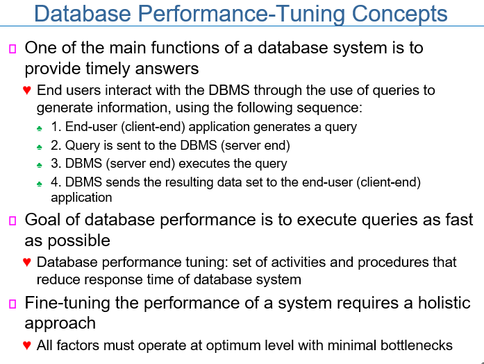
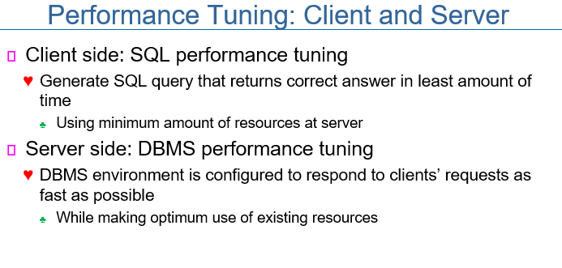
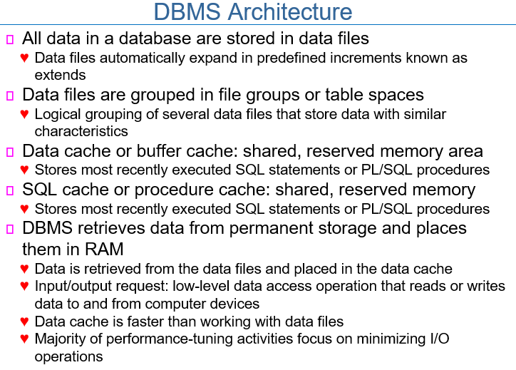
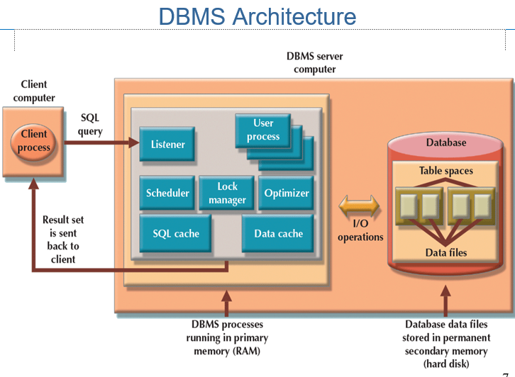
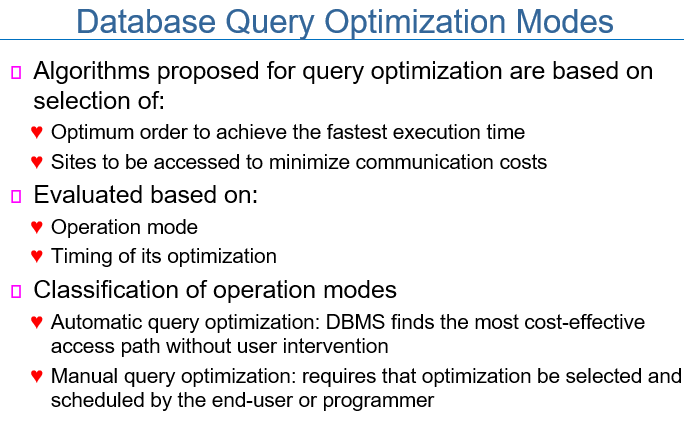

# 200514_W9D2_Tuning and Query Optimization(ch.8)

End user는 다음과 같은 순서로 DBMS와 상호작용함

1. End-user가 쿼리 작성
2. 쿼리가 DBMS에 보내짐
3. DBMS가 쿼리 실행
4. DBMS가 결과 return

클라이언트 측면 : SQL 수행 전환

서버 측면 : DBMS 수행 전환

DBMS 구조(Architecture)

업무상 관련이 높은 데이터들을 저장함. -> table spaces

SQL cache를 만들어서 최근 사용한 sql 데이터들을 따로 저장

primary memory = RAM

secondary memory = hard disk

쿼리 최적화 알고리즘은

##### 가장 빠른 실행시간을 기준

##### 접근 비용이 최소화되는 것을 기준

평가기준은?

##### 실행시간

##### 최적화 시간

실행(operation) 모드의 분류

자동모드 : 자동으로 실행되게 작성

매뉴얼 쿼리 모드 : 특정 명령어들을 프로그래머가 작성해놓음

