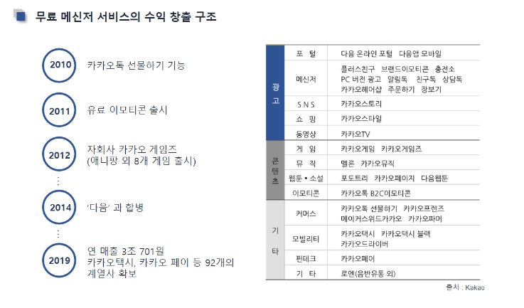

# 200323_W2D1_디지털 창업 용어정리

디창프 전 과목인 디지털 창업 과목에서 배우는 용어 등을 정리할 예정.

들어가기 전에

## 코로나 바이러스로 불황, 특수를 누리고 있는 사업 분야는 어디인가?

불황 : 항공업,요식업,서비스업 등등 대부분의 업종

특수 : 배달업, 위생용품업 등등

## 언컨택트 기술 (언탠트)

##### 일명 비대면 서비스

내면 접촉 피로감을 느끼는 소비자들이 늘면서 침묵의 서비스에 대한 수요가 증가하며 그 동안의 서비스들이 무인 기술로 대체되는 것

ex) 일본의 침묵 택시, 키오스크 서비스, 화장품이나 옷 매장의 과한 서비스 제한

## 학위?

대학을 졸업만 한다고 해서 되는 게 아니라 자신의 실력을 기르는 것이 중요하다.

## 스타트업이란?

#### 스타트업의 정의

현재의 가치보다 미래의 가치로 평가받을 큰 잠재력과 성장성을 갖춘 기술 중심 회사로 

주로 상장된 기업보다는 비상장 기업을 스타트업으로 본다.

 

또한 무조건 IT 회사일 이유는 없지만, 기술이 중심이거나 구현하는 데 있어서 기술이 큰 역할을 차지하는 회사를 스타트업이라고 부른다."

 

### 관련 용어 10

##### 1. 마일스톤 

마일스톤은 사업의 단기목표이다. 단기적 사업 계획 또는 실적 목표를 말하는데 제품 개발이나 고객 확보, 우수 경영진 고용 등과 같은 그때 그때 중요한 사안이 마일스톤이다.  시기 별로 어떤 마일스톤을 세우느냐가 투자유치에도 매우 중요하게 작용한다.
 
 

##### 2.린스타트업

린스타트업은 아이디어를 빠르게 제품(시제품)으로 만든 뒤 시장의 반응을 보고 다음 제품에 반영하는 것을 반복해 성공 확률을 높이는 경영 방식의 일종이다
 
 

##### 3.피봇(Pivot)

피봇은 제품의 시장 적합도을 맞춰보는 과정에서 반응이 없는 경우 새로운 고객과 수익성을 위해 서비스나 제품 혹은 사업 모델을 다른 방향으로 전환하는 것을 말한다.

 

##### 4.BEP(Break-Even Point) - 손익 분기점

일정 기간의 매출액이 해당 기간의 총 비용과 일치하는 부분, 스타트업만의 용어가 아니라 경영상 용어로 널리 사용된다.

 

##### 5. 엔젤투자

 초기 단계 스타트업에게 상대적으로 적은 금액을 투자하며 조언자로 참여하는 투자 방식이다.

 

##### 6.데모데이

각 스타트업들을 외부 투자사와 엔젤투자자, 업계 전문가들에게 소개하는 행사를 말한다.
 
 

##### 7.엑시트(Exit)

투자된 금액을 회수해 가는 것을 의미한다.

대부분 투자 제안 단계에서 엑싯 모델을 제시하고, 엑싯의 방법으로는 인수합병(M&A) , 기업공개(IPO) 등이 있다.

\* 기업공개(IPO)란 좁게는 해당 기업의 자본 공개, 넓게는 기업 경영의 전반적인 정보를 일반인에게 알리는 것을 말하는데 우리나라에서는 일반적으로IPO와 상장을 같은 의미로 쓰이며 코스닥에 등록하는 것을 말한다.
 
 

##### 8.시드머니(Seed-Money)

 

창업 전, 혹은 창업 직후 제품과 서비스 개발을 위한 인건비 그리고 개발비 투자를 말한다. 일반적으로 창업자 본인의 자금이 없는 경우 엔젤 투자자(또는 투자사)에게 보통주의 형태로 투자받는다.금액은 국내 기준으로 초기 개발비 정도인 2, 3천만 원 내외가 일반적이다.
 
 

##### 9.밸류에이션 (Valuation)

해당 기업이 가진 가치를 말하며 향후 얼마나 벌 수 있을 지를 예상해 현재 시점의 현금 가치로 환산한 값이다.

보통 기업의 매출과 이익, 현금흐름, 증자, 배당, 대주주의 성향등을 지표로 쓴다.

 

##### 10.유니콘, 데카콘

유니콘 : 비상장회사이면서 10억달러 이상의 가치를 가진 스타트업

데카콘 :  유니콘의 10배. 100억 달러 이상의 가치를 가진 스타트업

## 카카오 설립자 - 김범수 의장

삼성 SDS 입사 -> 윈도우의 가능성을 보고 윈도우와 C++ 공부에 매진 -> 피시방 개업

그 후 네이버 설립자인 이해진과 함께 NHN 설립 -> 카카오톡 출시 

#### 카카오톡의 수입 창출 구조

