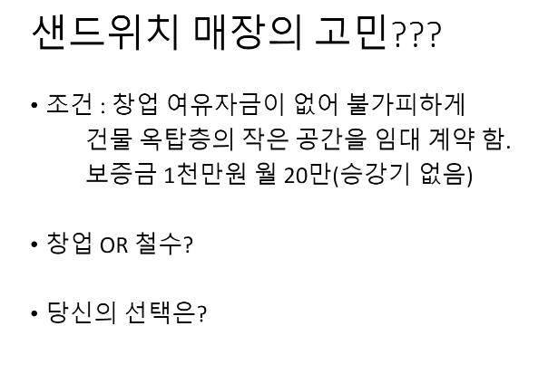
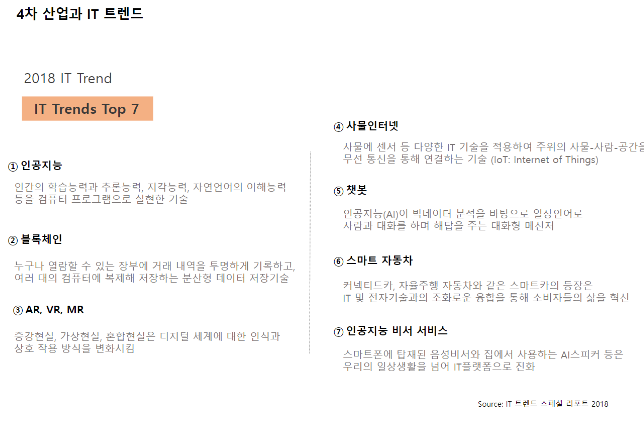
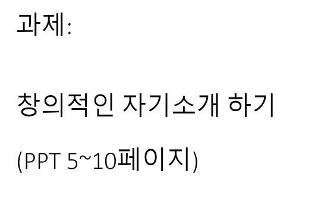

# 200325_W2D2_창업과 아이디어

20년도 1학기는 시스템적 문제 때문에 상대평가가 될 것임.

기본적인 입장은 철수 : 샌드위치 같은 경우는 패스트 푸드계열이라고 생각하기에 유동인구가 많이 다니는 지점, 즉 위치 선정이 매우 중요하다고 생각한다.

또한 접근이 힘든 위치이다보니 손님이 적을 수 밖에 없고 그렇게 되면 자연스럽게 식재료나 재고 관리에도 어려움이 생겨 음식의 퀄리티나 신선도에도 문제가 생길 것이라 예상됨.

그러나 창업 여유 자금이 없고 대출도 불가피한 상황이며, 자신은 어떻게든 이 사업을 해야겠다 라는 생각을 가지고 있을 경우에는 주변 지역에 대한 배달 서비스 등을 고려해보는 것이 그나마 차선책이라고 생각함.

(승강기가 없는 옥탑방에 손님을 왔다갔다 하게 할 순 없을 것 같다.)

-> 호주 맬버른에 있는 재플슈츠라는 샌드위치가게

7층의 옥탑방에서 온라인 주문을 마친 사람에게 낙하산을 단 샌드위치를 땅에 내려주면서 영업을 함.

## 4차산업혁명?

1차 : 공장 - 농업사회에서 공업사회가 됨.

2차 : 증기기관 - 물질적 풍요를 느끼게 된 시기, 

-> 옷, 나일론 등등 물건들을 대량 생산이 가능하게 됨.

3차 : 컴퓨터 , 인터넷 

4차 : 산업자동화 - 자동화공장

#### 아이디어 고릴라

ZUME Pizza

피자를 만드는 공정 자체가 로봇으로 간소화되고, 배달 하는 것 역시 배달 하는 도중에도 온도유지를 해주기 때문에 

1시간에 228개의 피자를 만들 수 있었고 비용 절감도 할 수 있었다.

트렌드를 읽는 능력이 매우 중요해졌다.

학력 인플레가 일어나고 모든 사람의 스펙이 높아져만 가는 요즘에는 단순한 학력만으로는 취업을 하기 힘들다.

#### 스타트업 인턴즈?

스타트업 관련 지원을 해주는 곳.

읽고 싶고 관심이 갈만한 내용으로 만들어라.

