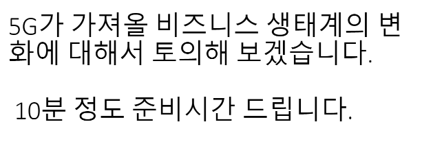

# 200330_W3D1_스타트업의 정의

배달의 민족 

김범진 대표 - 사장이 되는 법

사장이 되는 가장 쉬운 방법은 사장의 아들로 태어나는 것

하지만 이러한 경우는 매우 제한적이며, 창업의 기회는 모두에게 열려있음.

최고가 되기 위해 노력하라

초등학생이 중학생과 노는 방법? -> 중학생이 되면 된다.

즉 최고가 되면 최고랑 어울릴 수 있는 기회가 열린다.

좋아하는 일을 계속하면 

멀리서 보면 희극이지만 가까이서 보면 비극이다.

사장이되는방법

### 꾸준함

### 소명의식

### 최고가 되기 위한 노력

## 스타트업 정의 

#### '사업모델을 통해 시장의 문제를 해결하기 위해서  창업가들이 설립한 벤처기업'

## 배달의 민족으로 알아보는 스타트업

#### 배달의 민족의 계기?

배달 음식점의 비효율적인 광고 : 종이 광고, 전단지 등으로 광고를 해서 매달 비효율적인 지출이 생김.

사업모델 : 종이 광고나 전단지 등이 불필요한 모바일 앱으로 광고, 주문이 가능하게 함.

## 판교 사투리 (= 스타트업 용어)

#### 데모데이 : 투자자나 대중들 앞에 사업을 설명하는 것.

#### BEP : 손익분기점. (Break Even Point) : 수익과 지출이 일치하는 특정 지점.

스타트업의 경우 좀 더 힘든 경우가 많기 때문에 더욱 많이 쓰임

#### J-Curve : J자의 커브를 그려서 성장한다.

Valley of Death 라는 '역성장' 구간을 지나고 나서 상승하는 곡선을 그린다는 얘기.

#### Death Valley : J커브의 역성장 지점

#### 허슬 하다 : 힘든 순간을 버텨가고 있다, 버틴다 같은 의미

초기 스타트업을 잘 알려주는 말

#### 피벗(Pivot) : 방향을 전환한다.

내가원하는 방향이 있는데, 그 방향을 위한 방법을 이리 저리 전환해보는 것.

##### 린스타트업

린스타트업은 아이디어를 빠르게 제품(시제품)으로 만든 뒤 시장의 반응을 보고 다음 제품에 반영하는 것을 반복해 성공 확률을 높이는 경영 방식의 일종이다

##### MVP(최소요건제품,시제품)

Minium Viable Product의 약자로서, 최소의 노력과 개발 공수로 완성할 수 있는 제품

## IT 전시회

#### CES(International Consumer Electronics Show)

-미국소비자기술협회(CTA : Consumer Technology)가 주관해 매년 열리는 세계 최대 규모의 가전제품 박람회이다.

#### MWC (Mobile World Congress)

- GSM 협회가 주최하고 매년 2월에 열리는 세계 최대의 모바일 기기 박람회다. 

과제 :

