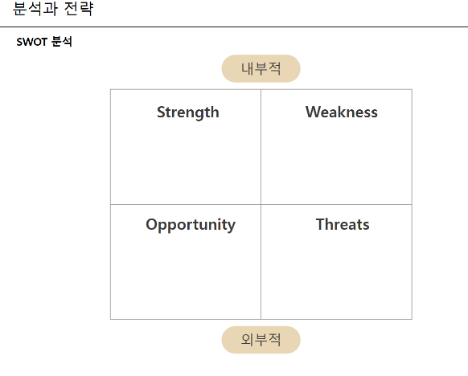
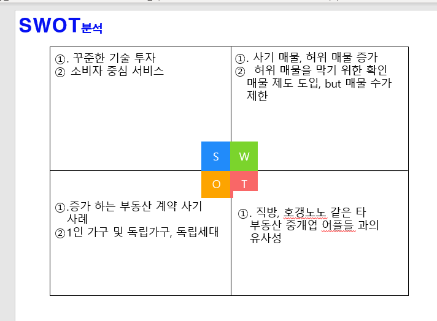

# 200420_W6D1_SWOT 분석

## 회사를 분석하는 방법?

SWOT, 3C 분석

### SWOT 

회사 분석의 가장 기본이 되는 툴

Strength, Weakness 는 내부적 요인이며

Opportunity, Threats는 외부적 요인이다.

마케팅 전략 수립에 있어 사업 및 경쟁 분석을 통해서 

바람직한 전략 대안을 찾게 하는 기법이 SWOT 분석이다.

SWOT 분석은 **경쟁사**와 비교한 자사의 **강점**과 **약점**을 분석하고

환경이 주는 **기회**와 **위협요인**을 분석하는 것을 말한다.

SWOT 분석을 통해 기업의 강점은 무기호하하고,

약점은 보완하거나 기회를 관망하는 전략으로 대응한다.

또한 환경의 기회요인은 적극  활용할 대응책을 마련하고

위협요인에는 능력을 배양하거나 일시 회피하는 전략을 마련한다.

SWOT, 3C 분석

S : 

## S

꾸준한 기술 투자 : 

월세 자동 결제 시스템 (다방페이)

중개사 업무 프로그램(다방프로)

집주인의 임대 관리 프로그램(임대인) 등 

단순히 방 정보를 제공하는 중개 서비스에 제한 되지 않고 넓은 분야에서의 꾸준한 기술 개발

소비자 중심 서비스 : 

반려동물, 단기임대 등 검색 필터 제공과 

단지 정보 제공 서비스 등, 소비자가 필요한 기능등을 개발

## W 

단순 이미지만으로의 정보 제공이 주가 되다보니 허위매물의 피해가 많아짐

이러한 허위 매물을 방지하고자 다방의 직원이 직접 연락하여 방문하는 확인 매물 시스템을 도입하였지만, 확인 매물의 수가 제한되어있다.

## O

부동산 매매업자와 고객 1:1 거래에서 발생하는 계약사기가 많아졌기 때문에 

중간에서 중개업을 해줌으로써 사기를 방지할 수 있다.

1인가구 및 독립세대의  증가로 인해 부동산 수요가 증가하였고, 이로 인해 자연스럽게 부동산 중개업인 다방의 수요도 증가하였다.

## T

중개업의 한계는 매매업자와 고객을 연결해주는 것 이기 때문에, 

직방이나 호갱노노와 같은 타 중개업체와 차별성을 주기가 힘들다.

## 보강 : 

꾸준한 기술 투자에 관한 디테일

소비자 중심 서비스의 핵심과 예시

다방만의 약점을 추가해라.

기회나 위협의 상세 및 내용 추가

요인 수가 적음