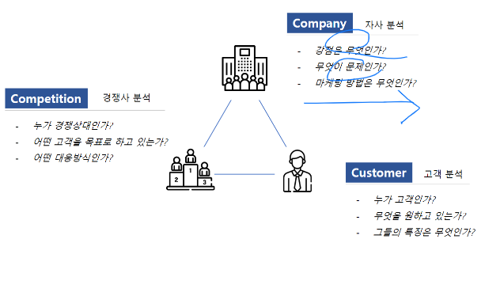

# 200422_W6D2_3C 분석

3C 분석, 5 force model 등

3C란 고객, 경쟁사, 자사 에 대한 분석을 진행하는 것을 뜻함.

SWOT은 

SW가 내부적요인

OT가 외부적,환경 요인을 뜻하는데,

3C 는 내부,외부 요인을 좀 더 차별화해서 분석하는 방법이다.

#### 자사 분석 

- 강점은 무엇인가?

- 무엇이 문제인가 ?

- 마케팅 방법은 무엇인가?

#### 경쟁사 분석  

- 누가 경쟁상대인가? 

- 어떤 고객을 목표로 하고 있는가? 

- 어떤 대응방식인가? 

ex) 신세계 백화점의 경쟁사는 -> 놀이공원 

-> 주말에 쇼핑을 가지 않고 놀이공원을 가므로

하남의 종합 엔터테이먼트 건물인 **스타필드** 를 건설 

즉 백화점 분야에서 예를 들면 직접적인 경쟁사(쿠팡,롯데백화점 등등)와 간접적인 경쟁사(놀이공원)가 존재한다.

#### 고객분석

- 누가 고객인가?
- 무엇을 원하고 있는가? 
- 그들의 특징은 무엇인가?

## 분석항목

#### 고객

- 우리의 현재와 미래의 고객은 누구인가?
- 고객은 어떤 니즈를 갖고 있는가?
- 무엇이 구매를 결정 짓는가?
- 시장은 어떻게 구성 되어 있는가?
- 시장 규모 및 장래성은 어느 정도 인가?

#### 경쟁사

- 우리의 경쟁자는 누구인가?
- 경쟁자의 강점과 약점은 무엇인가?
- 경쟁자는 업계를 어떻게 보고 있는가?
- 고객은 경쟁자들을 어떻게 생각하는가?
- 새로운 위협이 될 만한 업체는 있는가?

#### 자사

- 우리는 무엇을 목표로 사업을 하는가?
- 우리의 강점과 약점은 무엇인가?
- 비즈니스에서 이기는 유형과 지는 유형은 무엇인가?
- 충분한 비즈니스 자원을 보유하고 있는가?
- 사업을 추진하는데 적합한 조직인가?

발표자료 제작 : 30분

발표 : 3분

사업의 최종 목표 : 

 종합 부동산 플랫폼 

  부동산 중개서비스 고도화와 유관산업간의 연계가 어우러진 '종합 부동산 플랫폼'이 바로 스테이션3가 꿈꾸는 '다방'의 최종 목표다

  다방 서비스 고도화'와 '사업다각화

다방 강점 :

  부동산 업계에 VR서비스, 결제시스템, 빅데이터 분석 등의 새로운 기술을 과감하게 도입하고 있는 부분이 다방만의 가장 큰 차별점이라고 생각한다. 새로운 기술을 빠르게 적용하고 테스트하는 것이 사내문화로 자리잡았다.

다방 문제점 :

다방은 부동산 정보 앱의 고질적 문제인 허위매물을 해결하기 위해서도 애쓰는 중이다. 올 하반기 중 허위매물 차단을 위한 확인매물 제도와 진성매물지수를 선보일 예정이다. 

출처 : 이뉴스투데이(http://www.enewstoday.co.kr)  

사업을 추진하는데 적합한 조직인가?

:   일반적으로 스타트업의 경우 여러 가지 불안요인들로 인해 이직률이 상당히 높은 편인데, 스테이션3는 회사 설립 4년차에 접어든 현재까지 단 4명의 직원만이 회사를 떠났을 뿐 대부분 자기 자리에서 묵묵히 제 역할을 해 나가고 있다.

## 발표 피드백 정리 :

페이지가 많음에도 적절한 진행 굿

이미지에 맞춰가면서 분석 

즉 기술을 한 것으로 끝나지 않고 분석을 했다는 느낌이 들어서 좋음 

발표의 경우는 좀 더 임팩트 있게 (강약조절)을 하는 것이 좋음. -> 모든 발표자에게 해당

## 과제 

SWOT, 3C 분석에 대해서 정리해서 PPT로 제출 

금요일까지