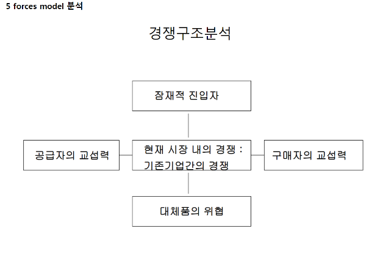

# 200427_W7D1_5force

### 질의응답 - 발표는 어떻게 잘하는가?

발표는 많은 발표 상황에 노출되어보고 시행착오들을 겪어봐야 실력이 는다.

취업상황의 면접, 발표 등을 하기 위해서는 많은 노력과 실전이 필요함

### 질의응답2 - PT는 어떻게 만드는가?

PT도 잘 만들어진 결과를 많이 보거나 특정 발표 상황에 맞게 잘 만드는 것이 중요

애플 같은 경우는 이미지 하나를 띄워놓고 길게 설명하는 편

한 슬라이드마다 요약 설명이 있는 것이 좋음

##### 경진대회에서는 발표 내용을 듣지 않고도 슬라이드 내용을 알 수 있어야함

### 질의응답3 - 개인 면담 및 궁금한 사항은

기본적으로는 메일로 상담,

길게 얘기를 해야하는 경우라면 따로 브레이크 그룹을 만들어서 수업시간 전에 화상으로 상담

## 5 Forces model

마이클포터의 분석이론

신규 시장에 진입하거나, 신규 사업에 착수 할 때 분석해야되는 모델 중 하나

교섭력 - 공급자의 경우에는 높은 가격, 구매자의 경우에는 낮은 가격을 요구할 수 있음

#### 단점 :

사업 전체의 이익과 기업의 이익구조가 다를 수 있다.

특정 잘되는 사업과 안 되는 사업을 설명하지 못 함

ex) 호황속에서 장사가 안되는 식당, 불황속에서 잘 팔리는 기업