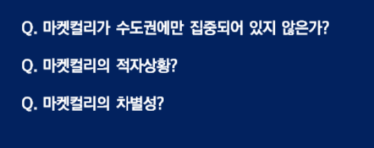

# 200513_W9D2_린캔버스 추가발표, 수업리뷰

#### 1,3,4조 질의응답 추가 조사 발표

## 4조 - 퀄키

#### 1.퀄키가 라이센싱을 분담하는 기업을 선정하는 기준?

-> 퀄키가 선정하는 것이 아니라 기업이 자발적으로 찾아오는 것,

상품(라이언스)을 쇼핑몰에 올려놓으면 기업이 사는 방식

#### 2. 상품 홍보를 위한 수단?

퀄키는 제품 홍보보다는 **플랫폼 홍보**에 집중함.

제품 홍보를 할 때에는 어떻게 만들어져이는가에 초첨을 맞춘 맞춤형 홍보방식

## 3조 - 우버

#### 악의적인 리뷰에 대해 우버의 대응은?

1. 특정 별 갯수 이하의 평가를 주면 그 이유도 함께 제시해야함.
2. 1번의 이유가 통제할 수 없는 이유일 경우 전체 평가에서 제외
3. 지속적으로 낮은 평가만 주는 사용자는 전체 평가에서 제외
4. 스마트폰을 통한 차량 주행 모니터링을 제공, 허위 신고를 방지
5. 운전자를 위한 피드백 기능 신설.

## 1조 - 마켓컬리

1.마켓컬리가 수도권에만 집중되어 있지 않은가?

-> 샛별배송은 수도권에서만 가능하지만 그외 지방에는 일반배송으로 가능

2.마켓컬리의 적자상황

-> 현재 적자는 투자비용, 배송비 등등으로 고정비를 제외한 적자는 메워짐

3.마켓컬리의 차별성

-> 산지부터 배송지까지 신선함을 유지할 수 있는 프로세스로 신선함을 유지

스타트업을 평가할 때는 확장성과 성장성이 가장 중요함.

## 셀프 피드백, 수업리뷰

어떤 과제를 해보니 어떤 것이 도움이 됐고,

셀프 피드백을 통해 우리가 어떤 점이 부족했었는지를 파악

#### 좋았던 부분 : 

린캔버스를 실제로 작성해보고 발표까지 해보니 9가지 항목이 머릿속에 자연스럽게 외울 수 있게 되었고 내 것이 된 것 같아서 좋았습니다.

#### 개선할 부분 :

다른 조들의 방식을 잘 참고하여 PPT를 좀 더 시인성 있게 만드는 방법을 배워야 할 것 같습니다.

빠르게 발표 준비하는 방법?

-> 텍스트 보단 이미지를 활용

퍼센트로 전의 작업보다 얼마나 나아졌는지 등등을 체크하면 훨씬 좋음

-> 체크리스트?