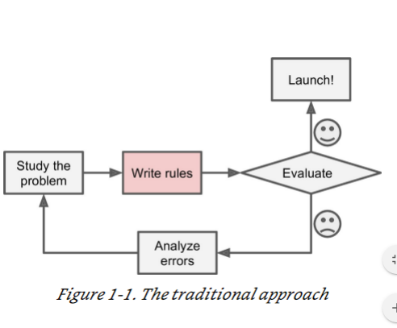

# 200316_머신러닝실습1주차

김성훈 - 모두를 위한 머신러닝/딥러닝 : https://hunkim.github.io/ml/

그 외 참고 자료 :

영문 온라인 강의 : Andrew Ng, “Deep learning”, Coursera

영문 오프라인 북 : Géron, Aurélien, “Hands-On Machine Learning with Scikit-Learn and TensorFlow: Concepts, Tools, and Techniques to Build Intelligent Systems” 

(한국어 번역판도 존재)

영문 온라인 북 : Neural network and deep learning, Michael Nielsen, http://neuralnetworksanddeeplearning.com/

## 평가방법

중간, 기말 시험2번으로 끝

필요하다면 퀴즈 볼 수도 있음

## 머신러닝이 주목받는 이유?

#### 성능(퍼포먼스)이 매우 좋기 때문.

2012년에 정통적인 이미지 프로세싱을 사용하지 않고 이미지 분류 문제를 해결하는데 기존 60%-62%대의 분류를 70%대로 끌어올림.

그 이후로 이미지 프로세싱, 기계학습을 하는 사람들이 딥 러닝 연구에 몰두하게 됨.

##### 인공지능과 같은 느낌을 주기 때문 

## Singularity(특이점)

기계의 성능이 인간의 성능을 뛰어넘는 시점

2045년 정도로 예상됨

## 기계학습이 인간의 지능과 닮았을까?

닮지 않았다고 생각 - 교수님의견

## 수업목표

##### 딥러닝 학습

##### CNN RNN 학습

##### 플랫폼은 Pytorch 사용

코딩 + 이론적인 배경을 함께 공부

수학이  필요함.

## 머신러닝의 범위 정의 

실제 **AI**는 매우 큰 범위고, 

**머신 러닝**은 AI를 이루기 위한 하나의 방편

**머신 러닝**은 기계에 무언가를 학습 시키는것.

**신경망**은 머신 러닝을 이루는 하나의 방편 중 하나로, 신경망 말고도 머신러닝을 구성하는 것들이 있다.

**딥러닝** 역시 신경망을 구축하기 위한 방법 중 하나

우리가 수업에서 다루는 범위는 신경망과 딥러닝.

# 1-1 

## 머신러닝의 정의 

#### Machine Learning (ML)

A computer program is said to learn from experience E with respect to some task T and some
performance measure P, if its performance on T, as measured by P, improves with experience E.

T를 수행하기 위한 성능을 P

#### 사람의 코딩과 머신러닝의 프로세스 차이 

##### 왼쪽 : 

수업에서 T(과제)를 받으면 어떻게 풀지 고민하는게 Rules

Output은 코딩 결과 

##### 오른쪽 :

경험 (E) 를 통해 스스로 판단을함, (개 사진들을 보고 이 사진들을 개로 분류)

로직을 만들기 위해 사람이 개입하지 않고 데이터만을 가지고 Task를 수행하기 위한 Loigc을 모델 스스로 생성 -> **머신러닝** 

#### 머신러닝이 왜 필요한가?

사진을 구분하는 알고리즘 등을 어떻게 구현할 것인가? -> 어려움이 있음

but 기계에 학습을 시키려면 (Logic을 만드려면) 어렵지만 데이터를 기반으로 모델을 스스로 학습 시키는 경우 좀 더 수월하게 할 수 있다.

## 머신러닝의 흐름 

Basically, it “learns” by looking at lots of data, which contains patterns, and it finds those
patterns by using a machine learning algorithm. The trained model is the output of that
learning phase which is then used to make predictions.

문제가 정의되면 머신러닝을 위한 데이터가 필요하다.

그 이후 머신러닝을 위한 알고리즘이 필요

##### ML의 플로우 : 문제정의 -> 데이터 수집 -> 알고리즘 정의

## 집값 예측 모델(예시)

x축 집 크기 , y축 집 가격

사람이 왼쪽 그림을 보면 정비례 한다는 것을 알 수 있지만, 기계가 이 결과가 정비례 한다는 걸 알 수 있게 학습시키고 싶다.

이러한 모델을 만들게 되면 다른 새로운 데이터가 들어와도 가격, 평수 등을 예측할 수 있게 된다.

#### 머신러닝이 잘해야 하는 부분

##### 1.우리가 가지고 있는 데이터를 잘 설명할 수 있어야한다.

##### 2.우리가 가지고 있지 않은 (새로운 데이터) 도 잘 설명할 수 있어야 한다.

## 집값 예측 - 모델 정교화

크기, 방의 수, 집의 위치, 동네의 평균 소득(Wealth)

집 크기 + 방의 수 = **집이 수용할 수 있는 가족의 수**

집의 위치 : **walkability** - 직장까지 걸어갈 수 있느냐?

집의 위치 + 평균 소득 : **school quality** - 주변 학교들의 수준

세개의 평가 기준을 새로 만듬.

#### 일반화된 신경망의 모델 

## 스팸 필터 관련 얘기(Example of applications : Spam filter)

스팸은 어떤 식으로 분류가 되는 걸까?

Traditional programming technique:
• look at what spam typically looks like.
• notice that some words or phrases (such as “**4U**,”
“**credit card,**” “**free**,” and “**amazing**”) tend to come up
a lot in the subject. Perhaps you would also notice a
few other patterns in the sender’s name, the email’s
body, and so on.
• Write a detection algorithm for each of the patterns
that you noticed
• Your program would flag emails as spam if a
number of these patterns are detected.
• Since the problem is not trivial, your program will likely
become a long list of complex rules — pretty hard to
maintain.

특정 단어들을 포함하면 스팸으로 분류 

알고리즘을 짜는 접근법

문제를 분석 -> 알고리즘을 작성 -> 테스트 -> 성공시 끝, 실패시 문제분석부터 다시 

## 머신러닝의 스팸 분류

##### 일단 데이터를 모아야한다.

데이터를 모아서 학습을 시키고, 결과를 확인함.

A spam filter based on ML
• Automatically learns which words and
phrases are good predictors of spam by
detecting unusually frequent patterns of
words in the spam examples compared to
the ham examples.
• The program is much shorter, easier to
maintain, and most likely more accurate

## 연설 인식

Example of applications : Speech recognition
• Say you want to start simple and write a program capable of distinguishing the words “one”
and “two.”
• You might notice that the word “two” starts with a high-pitch sound (“T”), so you could
hardcode an algorithm that measures high-pitch sound intensity and use that to distinguish
ones and twos.
• Not scale to thousands of words spoken by millions of very different people in noisy
environments and in dozens of languages.
• The best solution (at least today) is to write an algorithm that learns by itself, given many
example recordings for each word.

1을 듣고 2를 예상할 수 있을까? 

rules 를 짜기 매우 힘듬 -> 머신러닝을 사용해야함.

## 머신 러닝이 어느 상황에 좋을까?(ML is great for)

• Problems for which existing solutions require a lot of hand-tuning or long lists of rules: one
Machine Learning algorithm can often simplify code and perform better.

• Complex problems for which there is no good solution at all using a traditional approach: the
best ML techniques can find a solution.

• Fluctuating environments: a ML system can adapt to new data.
• Let’s think about what area ML is bad for…

sorting 알고리즘은 수학적인 방식으로 구현이 가능함.

##### 수학적으로 증명할 수 있는 알고리즘은 매우 강력한 알고리즘임 -> 굳이 머신러닝이 필요없다.

#### 사람은 굉장히 잘 하지만 수학적으로 Logic을 짜기가 힘든 경우 -> 머신러닝이 적합

문제가 주어졌을 때 그 subproblem 중에 머신러닝이 적합한 게 있는지 판단하는 것도 중요.

상업적으로 가장 성공한 ML 알고리즘 : 추천 알고리즘

## 이 아래는 가볍게(시험 문제 별로 ㄴㄴ?)

Types of ML

• Whether or not they are trained with human supervision (supervised, unsupervised,
semisupervised, and reinforcement Learning)

• Whether or not they can learn incrementally on the fly (online versus batch learning)

• Whether they work by simply comparing new data points to known data points, or instead
detect patterns in the training data and build a predictive model, much like scientists do
(instance-based versus model-based learning)

• These criteria are not exclusive;

ML의 종류

## 지도 학습(Types of ML : Supervised Learning)

• The training data you feed to the algorithm includes
the desired solutions, called labels

• A typical supervised learning task is classification.

• Another typical task is to predict a target numeric
value, such as the price of a car, given a set of
features (mileage, age, brand, etc.) called predictors.
This sort of task is called regression

• Note that some regression algorithms can be used for
classification as well, and vice versa. For example,
Logistic regression is commonly used for classification,
as it can output a value that corresponds to the
probability of belonging to a given class (e.g., 20%
chance of being spam).

모델X(instance) 가 Label을 가지고 있음.

특정 데이터를 어떤식으로 다루도록 지도해주는 학습.

주로 **분류** 문제를 해결하는데 사용.

주가 예측?

스팸인지 아닌지를 확률로 내보냄 -> 분류 문제인것 처럼 보이지만 결과값은 regression

##### 이런 것을 Logistic regression 이라함.

## 지도 학습 적용 사례

머신러닝을 위해서는 Data가 대용량 필요하다.

## 데이터의 종류

구조화된 데이터 : 엑셀과 같은 데이터

비구조화 데이터 : 소리, 텍스트, 사진

## 머신러닝이 뜬 이유?

 Why is deep learning taking off recently?
• Scale drives deep learning progress
• Data : huge amount of data from emerging areas -2007
• Computation : GPGPU, etc.- 2006 / 1000개 정도의 대용량 코어를 다루는 GPU(저성능, 많은코어, 데이터 다루는데 유용)
• Algorithms: large NNs, RELUs, etc.

= 스마트폰

많은 정보가 쌓이게 됨 -> 데이터량이 급증

## 비지도 학습

• The training data is unlabeled.

• For example, say you have a lot of data about your
blog’s visitors. You may want to run a clustering
algorithm to try to detect groups of similar visitors

• For example, it might notice that 40% of your
visitors are males who love comic books and
generally read your blog in the evening, while
20% are young sci-fi lovers who visit during
the weekends, and so on

사람을 특정 분류, 그룹으로 나눔.(사람이 나누는게 아니라 컴퓨터가 스스로)

비지도학습은 주로 Clustering에 사용된다.

Visualization algorithms are also good examples of
unsupervised learning algorithms: you feed them a
lot of complex and unlabeled data, and they
output a 2D or 3D representation of your data
that can easily be plotted.

 A related task is dimensionality reduction, in which
the goal is to simplify the data without losing too
much information. One way to do this is to merge
several correlated features into one. This is called
feature extraction.

데이터를 잘 분류할 수 있을지를 예측해보기 위한 **시각화**를 할 수 있다.

## anomaly detection(비지도 학습)

고장 데이터 등이 존재하지 않을 때, 기존 데이터들을 그룹으로 나눠서 이 범위를 벗어날 경우 고장으로 판단하는 탐지방법. 비지도학습임

## 강화 학습(Reinforcement Learning)

대표적인 예 : 알파고

시행착오를 통해 학습하는 경우 : 로봇,게임 등에 많이 사용

특정 행동을 하고 리워드를 받는 식, 그 리워드를 바탕으로 **policy**(규칙)을 스스로 수정한다.

The learning system, called an **agent** in this context,
can observe the environment, select and perform
**actions**, and get **rewards** in return (or penalties in the
form of negative rewards.

It must then learn by itself what is the best strategy,
called a **policy,** to get the most reward over time.

## 배치 러닝 (Types of ML : Batch learning)

• The system is incapable of learning incrementally: it must be trained using all the available
data. 

**offline learning**
• If you want a batch learning system to know about new data (such as a new type of spam), you
need to train a new version of the system from scratch on the full dataset (not just the new
data, but also the old data), then stop the old system and replace it with the new one.
• This solution is simple and often works fine, but training using the full set of data can take
many hours,
• Also, training on the full set of data requires a lot of computing resources (CPU, memory space,
disk space, disk I/ O, network I/ O, etc.).

대량의 데이터를 넣어서 한번에 학습하는 전략.

## 온라인 러닝 Online learning (Incremental learning)

you train the system incrementally by feeding it
data instances sequentially, either individually or
by small groups called **mini-batches**.

• Each learning step is fast and cheap, so the
system can learn about new data on the fly, as it
arrives

• Online learning is great for systems that receive
data as a continuous flow (e.g., stock prices) and
need to adapt to change rapidly

데이터를 나눠서 단계별로 학습시키는 방법, 미니배치라고도 불리며 배치학습보다 많이쓰임.

## 학습률(learning rate)

• how fast they should adapt to changing data  called the **learning rate.**
**•** high learning rate  your system will rapidly adapt to new data, but it will also tend to
quickly forget the old data
• low learning rate  it will learn more slowly, but it will also be less sensitive to noise in the
new data or to sequences of non-representative data points.
• If bad data is fed to the system, the system’s performance will gradually decline.
• To reduce this risk, you need to monitor your system closely and promptly switch learning off
(and possibly revert to a previously working state) if you detect a drop in performance.

## 거리 기반과 모델 기반 학습

거리 기반(Instance-based learning)

X라는 새로운 데이터가 주변 데이터들과의 거리를 비교하여 label을 판단해야함.

수업에서는 모델 기반을 배움.

모델 기반(Model-based learning)

학습 데이터를 기반으로 모델(boundary)를 만들어서 그 데이터를 판단한다.

## 적합도 함수, 비용함수

performance measure
• utility function (or **fitness function**) that measures
how good your model is
• **cost function** that measures how bad it is.

적합도 함수는 높게

비용 함수는 낮게 측정되는 것이 중요.

Simple linear model :
• 𝑠𝑎𝑡𝑖𝑠𝑓𝑎𝑐𝑡𝑖𝑜𝑛 = 𝜃0 + 𝜃1 ∗ 𝐺𝐷𝑃_𝑃𝑒𝑟_𝐶𝑎𝑝𝑖𝑡 라는 공식을 만들경우, 세타0과 세타1을 어떻게 설정할 것인지가 중요

거리 순으로 따지면 빨간 선보다 파랑선이 더 가깝기 때문에 파랑선을 채택,

Linear 정규 모델이됨.

## 분석 방식과 데이터의 상관관계

x축 (가로) 가 데이터의 양,

데이터 양이 많으면 많을수록 결과 값(성능)이 좋아진다.

모델이 엄청 좋지만 데이터가 없을 경우 -> 오버피팅

모델이 별로지만 데이터가 엄청 많을 경우 -> 성능이 좋아짐.

#### 즉 머신러닝은 좋은 알고리즘과 많은 양의 데이터가 필요하다.

## 오버피팅 

너무 많은 학습데이터를 받아서 새로운 데이터를 받을 때 정확하게 인식을 하지 못하는 경우.