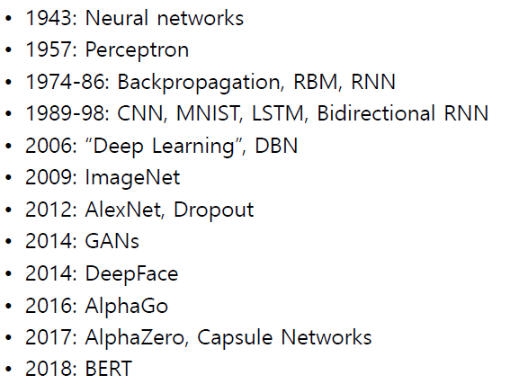

# 200319_머신러닝의 목표와 딥러닝

## 머신러닝과 딥러닝의 차이?

머신러닝이 더 큰 범위.

신경망을 구성하기 위한 알고리즘 중 하나가 딥러닝이다.

딥러닝 말고도 **SVM(support vector machine)**, **random forest** 등등의 알고리즘이 있다.

## 1-1ML pdf 32P부터

머신러닝은 

##### 1. 기존 데이터들을 잘 설명할 수 있어야하고, 

##### 2. 새로 들어온 데이터들을 설명할 수 있어야한다.

## Main Challenges of ML

### 1. **Poor -Quality Data**

기존 데이터들로 파란 선 처럼  모델을 만들고

새로운 데이터(빨간색 점) 을 넣어보니 모델이 적용이 안되서 기존 파란선(1-21에선 점선)을 새로운 직선으로 바꿈.

이런 일이 발생하는 이유? -> 표본 데이터가 새로 들어온 데이터와 다르기 때문 

이를 맞춰주는게 일반화(generalization)

### 2. Irrelevant features

사진데이터의 노이즈 같은 특징들을 제거하는 방법. 

요즘 경향은 Feature engineering 보다는 노이즈나 feature도 모델이 해결해야된다는 end-to-end 방식이 유행하고있다.

### 3. OverFitting

##### 새로운 데이터를 설명하지 못 할 때

1-22는 적합한 모델인가?

-> 답 X

60000~80000 사이의 GDP 국가의 삶의 만족도를 설명할 수 없다.

표본 데이터가 제한되어있기 때문에 새로운 데이터를 맞추지 못하는 경우.

왜 발생하는가 ? 

#### 표본 데이터가 부족하기 때문에.

어떻게 해결하는가? 

1.60000~80000같은 빈 칸 사이에 표본 데이터를 추가한다.

##### Hyperparameter

표본 데이터를 계속 주면서 세타를 튜닝하는 것.

모델과 관련된 세타를 parameter라고 부른다.

### 4. UnderFitting

##### 가지고 있는 데이터 (표본데이터)를 설명하지 못 할때

## Testing and ValiDating

표본 데이터로 모델을 학습할 때.

표본의 80%로 학습을 시키고, 나머지 20%로 확인을 한다.

여기서 80%는 설명이 되지만 20%가 설명이 안될경우? -> 과적합

80%조차 설명이 안될경우? -> 과소적합.

데이터를 3개로 쪼개서

50% 학습 / 30% Validation / 20% Test 로도 사용한다.

에러 수와 표본 새로운 데이터들간의 관계.

# 1-2 A Brief Introduction Introduction to Deep learning

#### 1-2는 딥러닝 개요, 간략하게 보면 됨

파이썬 + 파이토치로 머신러닝을 진행함.

무엇을 할 수 있나? (Exciting progress)

얼굴인식, 이미지분류, 음성인식, 번역, 자율주행 차, 게임, 

필기체 분석은 잘 안되는 분야.

## 딥러닝의 역사

## 신경망 체험해보기

http://playground.tensorflow.org

데이터와 Features를 설정.

하얀색 선이 모델이 된다.

## 파이토치 vs 텐서플로우

성능은 텐서플로우가 더 좋고 빠르지만 파이토치가 더 배우기 쉽기 때문에 파이토치를 다룸.

각 개발사

파이토치 = 페이스북

텐서플로우 = 구글