# 200322_W2D0_Colab설치

# Colaboratory란?

Colaboratory(또는 줄여서 'Colab')를 사용하면 브라우저에서 Python을 작성하고 실행할 수 있습니다.

- 구성 필요 없음

- GPU 무료 액세스

- 간편한 공유

  

 https://colab.research.google.com

새 노트를 만든 뒤 코드를 입력하면 아나콘다와 같이 코드가 인터넷 상에서 실행이 된다.

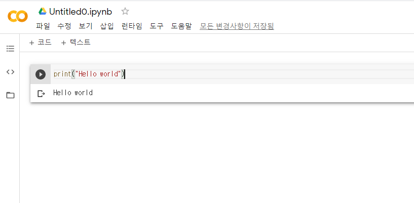

## 코드 or 텍스트 추가하기

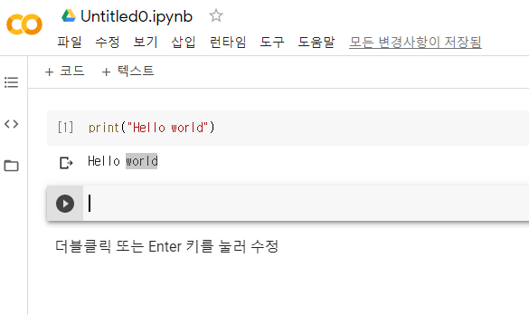

파일 수정 보기 등 메뉴탭 아래에 +코드 , +텍스트 버튼이 있는데 이것을 누르면 새로 입력할 수 있는 창이 추가된다. 

코드 아래부분에 마우스를 올리면 +코드 +텍스트 버튼이 바로 아래에 뜬다.

## 실행

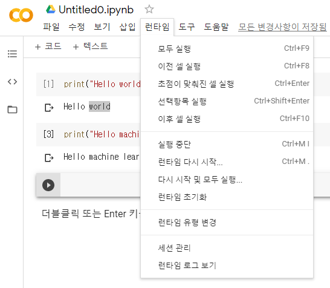

왼쪽 위 런타입 탭에서 실행 관리 관련 단축키들을 볼 수 있다.

가장 간단한 실행 단축키는 아나콘다와 같은 컨트롤 + 엔터

## 저장

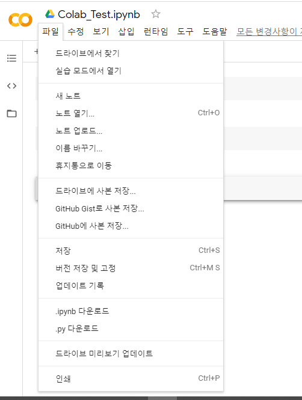

py파일, ipynb 파일등으로 저장이 가능하고, 드라이브나 깃헙에 따로 저장을 할 수 도 있다.

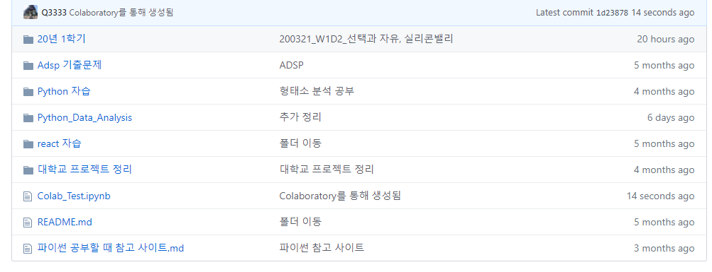

깃헙 연동 결과 

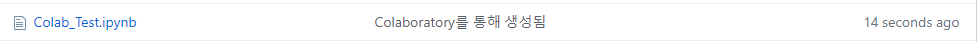

이런 식으로 깃에 올라간다.

## 구글 드라이브에 연동시키기 

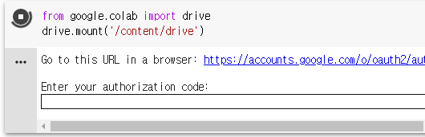

위의 코드를 입력시키면 인증 코드를 입력하라는 메세지가 뜬다.

해당 링크로 가서 코드를 입력하면

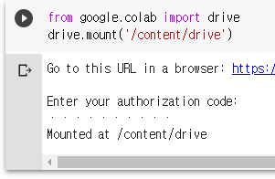

Mounted 라는 결과가 뜨고 드라이브랑 연동을 할 수 있게 된다.

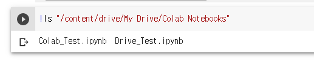

ls 명령어를 통해 드라이브안에 들어있는 파일들을 볼 수 있다.

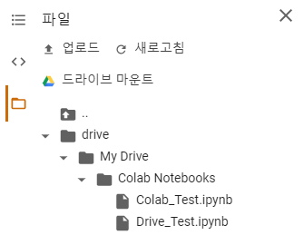

연동 결과 실제 드라이브 내에도 폴더가 생겼다.

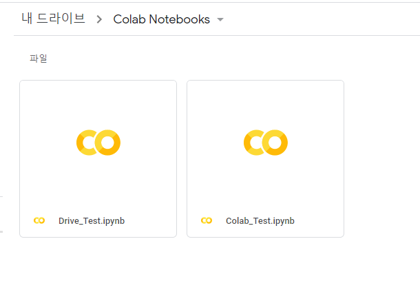

