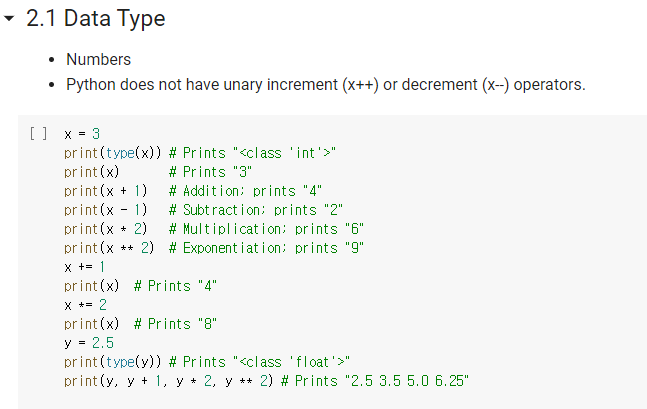
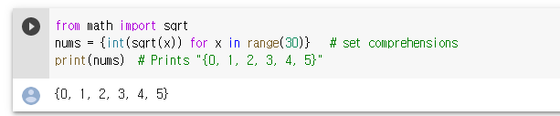
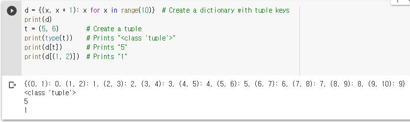

# 200323_W2D1_Colab,파이썬가이드

GPU와 CPU

머신러닝 CNN을 개발하기 위해서는 GPU가 편리하다.

## Colab의 장점?

• Write and execute code in Python
• Document your code that supports mathematical equations
• Create/Upload/Share notebooks
• Import/Save notebooks from/to Google Drive
• Import/Publish notebooks from GitHub
• Import external datasets e.g. from Kaggle
• Integrate PyTorch, TensorFlow, Keras, OpenCV
• Free Cloud service with free GPU 

GPU와 클라우드 서비스를 무료로 이용할 수 있다.

• Cloning Git Repository
• Using free GPU
• Installing Machine Learning (ML) libraries 

ipynb말고 py파일 역시 실행시킬 수 있다. 

## colab의 구성

colab은 코드셀, 텍스트셀 2개의 셀로 구성되어있다.

코드셀

텍스트셀

텍스트셀은 링크를 걸어서 사진이나 동영상을 넣을 수도 있고, 컨트롤 버튼도 만들 수 있다.

@목차를 만드려면 섹션제목셀을 만들면 된다.

자동완성기능이 있다.

## 셀 삭제 후 복원

흔히 쓰는 컨트롤+Z와 같은 기능

그외 ls나 pwd등 유용한 기능이 있다.

whos는 현재 변수들을 확인해주는 명령어

history는 과거 입력한 명령어들을 확인하는 명령어다.

del은 변수를 삭제해주는 명령어인데 %를 빼고 사용해야 한다.

## 파이썬 기초 강의

파이썬은 데이터 타입의 형태를 선언하지 않는다.

x++, x-- 같은 오퍼레이터는 지원 X

## 파이썬의 데이터 타입

## 정수,실수

## Booleans 데이터 타입도 제공한다.

## String 타입 = '말' / "말" 어느쪽이든 가능

스트링의 연산 (hello + ' " + world) 나

포매팅 ('%s %s %d' % (hello,world,12))

중간의 %는 빠지면 안됨.

##### @dir 명령어를 사용하면 가능한 명령어들을 보여준다.

#### 알파벳 변환

## List 타입

xs[-1] 은 마지막 엘리멘트를 뜻함.

xs라는 정수 컨테이너 안에 스트링을 넣어도 된다.

append는 해당 리스트에 요소를 추가하는 명령어.

pop은 맨 뒤의 요소를 제거하는 명렁어.

#### List의 slicing

리스트를 원하는대로 자를 수 있다.

range 명령을 쓰면 5가지의 요소를 담은 리스트를 리턴하게됨. (range(5) 면 0,1,2,3,4 리턴)

: 앞 뒤에 아무것도 안 하면 리스트 전체

:-1 은 마지막 하나를 제거

#### Iterable

\- Iterable :  An object capable of returning its members one at a time. 

Examples of iterables include all sequence types (such as list, str, and tuple) and some non-sequence types like dict and file and objects of any classes you define with an ***\*__iter__()\**** or **__getitem__**() method.  e.g

\- Iterator :  An object representing a stream of data. Repeated calls to the iterator’s **__next__**() method return successive items in the stream. When no more data are available a StopIteration exception is raised instead.

리스트는 이터러블이라서 요소를 하나씩 뽑아오는 것이 가능하다.

### Loop

평범한 반복문

### enumerate

iterable 한 객체를 짝 지어서 연결시켜주는 명령어

이런 식으로 사용한다.

### 리스트 만들기

다양한 방식으로 리스트를 만들 수 있다.

## 딕셔너리 타입

A dictionary stores (key, value) pairs,

딕셔너리는 (키,밸류) 형식으로 저장된다.

잘 쓰면 가독성이 좋은 코드를 만들 수 있다.

cat이라는 key를 이용해 cute라는 value를 추출해냈다.

fish라는 key와 wet이라는 value를 추가.

get을쓰고 뒤에 'N/A' 값을 넣는건 monkey가 없으면 N/A를 리턴해라 라는 의미다.

#### 리스트와 딕셔너리는 매우 많이 쓰임.

##### 딕셔너리 또한 iteralbe이다.

### 딕셔너리를 이용한 Loop

딕셔너리.items() 로 Loop를 돌릴 수도 있다.

### 딕셔너리의 활용

조건문 + 반복문을 이용.

## set 데이터 형식

set형식도 iterable이다.

#### set은 중복을 허용하지 않는 순서가 없는 데이터 집합.

중복을 허용하지 않기 때문에 0,1,2,3,4,5  각각 하나씩만 입력이 된다. (for 문은 30번 반복함)

## 튜플

d를 확인하면 이런 식이다.

## 함수 

함수를 정의할 때는 def 이름(매개변수) : 로 하면 된다.

매개변수를 디폴트로 지정해서 필요할때만 바꿔주는 경우도 가능.

## 클래스 - 머신러닝에서 많이 씀 중요!

init은 생성자. 매개변수의 첫번째는 무조건(self) 가 들어가야한다.

클래스 내부의 함수는 전부 self를 첫번째 매개변수로 받는다.

두번째 클래스인 MoreFourCal은 FourCal(첫번째 클래스) 를 상속받기 때문에 첫번째 클래스의 함수를 쓸 수 있다.

##  

### 클래스 내부 변수 이해하기

##### 설명 : 

x, y 는 A를 따라가기 때문에  A클래스 내부에 있는 "I am a class attribute" 라는 String을 지칭한다.

이후 A 내부의 String을 바꿔주면 A,x,y 셋다 바뀌게 되고 (같은 곳을 지칭하므로)

x가 지칭하는 String을 변경해주면 A,y는 바뀌지 않고 x의 좌표만 변경된다.

그 이후 다시 A를 바꾸면 이미 x의 좌표가 달라져있기 때문에 A,y 만 달라지게 된다.

##### @결론 : x,y가 A를 따라가는 상태였는데 x를 다른 좌표로 지정하면 A와는 별도의 좌표를 유지한다.

## Built-in functions(내장함수)

### dir

dir은 가지고 있는 내부 함수를 보여줌

### enumerate

iterable 자료형 + 인덱스 값을 리턴함

1,2,3 을 포함하게 해주는 함수라 생각하면 됨.

### eval

eval : eval(expression)은 실행 가능한 문자열을 입력으로 받아 문자열을 실행한 결과값을 리턴

이런식으로 문자열 or 숫자를 넣으면 각각에 맞는 연산을 실행시켜준다.

(문자열 연산, 숫자연산 둘다 가능)

### id

파이썬의 할당은 a라는 객체가 3이라는 값의 주소를 받아서 사용하는 형태가 된다.

##### a안에 3의 주소를 넣어준 것.

-위의 A,x,y가 달라진 것과 같은 맥락.