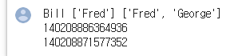

# 200326_W2D2_파이썬 가이드 2회차


## Class


```python
class Greeter(object):

    # Constructor
    def __init__(self, name):
        self.name = name  # Create an instance variable

    # Instance method
    def greet(self, loud=False):
        if loud:
            print('HELLO, %s!' % self.name.upper())
        else:
            print('Hello, %s' % self.name)

g = Greeter('Fred')  # Construct an instance of the Greeter class
g.greet()            # Call an instance method; prints "Hello, Fred"
g.greet(loud=True)   # Call an instance method; prints "HELLO, FRED!"

```


이러한 형태를 기억.


self 는 this랑 같다고 기억하면 됨.


init 은 생성자


## Assignment 


```python
some_guy = 'Fred'

first_names = []
first_names.append(some_guy)

another_list_of_names = first_names
another_list_of_names.append('George')
some_guy = 'Bill'

print (some_guy, first_names, another_list_of_names)

print(id(first_names))
print(id(another_list_of_names))
```


another_list_of_names = first_names 가 완전 복사가 아니라 id를 가져온 것이라

first_name과 another_list_of_names가 같은 내용을 공유하게 된다.


```python
some_guy = 'Fred'

first_names = []
first_names.append(some_guy)

another_list_of_names = first_names.copy()
another_list_of_names.append('George')
some_guy = 'Bill'

print (some_guy, first_names, another_list_of_names)

print(id(first_names))
print(id(another_list_of_names))
```


##### 직접 할당이 아니라 .copy()를 써야만 별도의 존재로 복사가 된다.





## Call

- ##### immutable object = 변경 불가

  > - ##### int, float, str, tuple
  >
  > - immutable 객체가 함수의 arguments로 전달되면 처음에는 call by reference로 받지만, 값이 변경되면 call by value로 동작한다(?). 즉 함수 내에서 formal parameter 값이 바뀌어도, actual parameter에는 영향이 없다.

- ##### mutable object = 변경 가능

  > - ##### list, dict, set
  >
  > - mutable 객체가 함수의 argument로 넘어가면 call by reference로 동작한다. 즉, object reference가 전달되어 actual parameter의 값에 영향을 미칠 수 있다.


immutable은 상수같은 개념으로, 

a=3 이라고 할당하면 a에 3의 id를 넣고, 

다시 a=4를 하면 a에 4의 id가 들어가게 된다.

(원래 있던 것을 수정하는 것이 아니라 참조하는 변수만을 바꿔준다.)


#### 결론 : list,dict,set 을 쓸 때에는 주의하자


## lambda

lambda는 function의 reference


lambda는 함수를 생성할 때 사용하는 예약어로, def와 동일한 역할이다.


이런 식으로도 쓰임.


f = lambda x: x+3 이 되었고

f의 x에 4를 넣어주어 7이 리턴되었다.


## 내장함수

### len,list


리스트로 만들어 주거나 길이를 리턴하는 함수


### range


range는 해당 지점까지의 수를 리턴.


range나 list나 iterable이다.


range는 3개의 요소가 올 수 있는데, 마지막 요소가 스텝이 된다.


### type


데이터 유형을 확인하는 코드

자주쓰임.


### zip


리스트 같은 동일한 자료형을 묶어주는 역할.

묶어서 투플로 만들어준다.

가끔쓰임.


## Numpy


Arrays, 즉 행렬을 다루는 라이브러리.


기본적으로 파이토치(머신러닝의 프레임워크)도 그렇고 텐서플로우도 그렇고 대부분의 머신러닝의 플랫폼이 Numpy와 호환이 된다.


