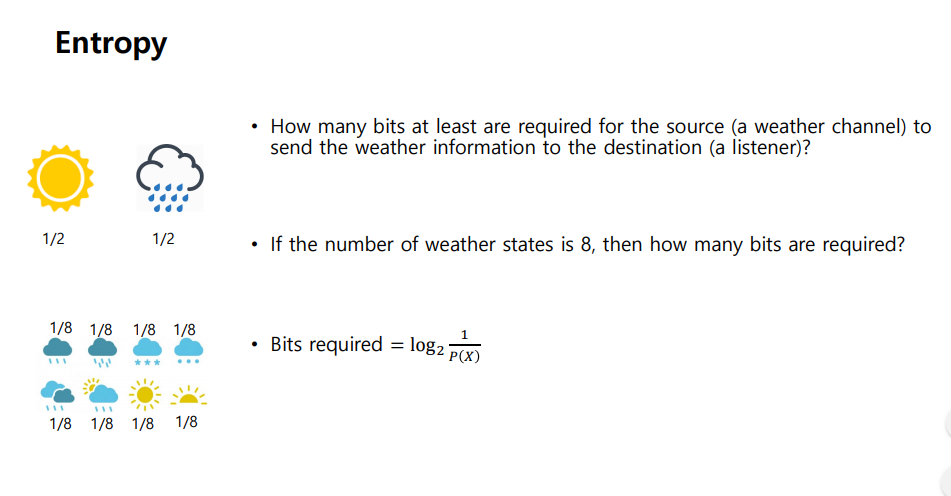
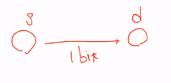
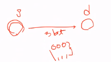

# 200330_W3D1_Numpy,머신러닝기초


## Numpy


### Array


1,2,3만 있을 경우에는 rank 1 array이며,


shape을 표현할 때 (3, ) 이 된다.


[1,2,3] , [4,5,6]이 있을 경우 2랭크 이며 , (2,3) shape이 된다.


### rank와 shape가 중요


rank는 깊이, shape는 형태


shape의 앞은 덩어리, 뒤는 요소 갯수라 생각하면 편함


## Array Slicing


3덩어리, 요소4개 이므로 shape은 (3,4)


b 는 a[:2, 1:3] 이므로 [2,3],[6,7] 이 복사가 된다.


##### b[0,0]을 바꾸면 a역시 바뀐다. -> copy 명령어를 사용한 것이 아니라 a의 주소를 그대로 가져와서


a.copy() 명령어를 쓰면 a[0,1]은 바뀌지 않는다.


## Array indexing


Array indexing : You can also mix integer indexing with slice indexing. However, doing so will yield an array of lower rank than the original array.


슬라이싱과 다르게 인덱싱을 하면 **랭크가 떨어진다.**


## Integer array indexing

**Integer array indexing** : When you index into numpy arrays using slicing, the resulting array view will always be a subarray of the original array. In contrast, integer array indexing allows you to construct arbitrary arrays using the data from another array.


[0,1,2] ,[0,1,0] 은

0,0 / 1,1 / 2,0 과 같은 의미다.


## array arrange indexing


arrange(4) = 0,1,2,3 의 의미이다. b는 0,2,0,1 이므로 각각

0,0 / 1,2 / 2,0 / 3,1 의 의미가 된다. = 1,6,7,11


## Boolean array indexing

**Boolean array indexing** : Boolean array indexing lets you pick out arbitrary elements of an array. Frequently this type of indexing is used to select the elements of an array that satisfy some condition. Here is an example:


bool_idx를 이용해 2초과인 값만 출력할 수 있다.


bool_idx 를 사용하지 않고 a[a>2]같은 방법으로도 출력이 가능하다.


## Array Type

Every numpy array is a grid of elements of the same type. Numpy provides a large set of numeric datatypes that you can use to construct arrays. Numpy tries to guess a datatype when you create an array, but functions that construct arrays usually also include an optional argument to explicitly specify the datatype


dtype을 이용하면 요소들의 형태를 알 수 있다.


요소의 타입을 캐스팅 하고 싶으면 dtype으로 캐스팅 할 수 있다.


## Array Math (열 연산)


**Array math** :Basic mathematical functions operate elementwise on arrays, and are available both as operator overloads and as functions in the numpy module:


```python
x = np.array([[1,2],[3,4]], dtype=np.float64)
y = np.array([[5,6],[7,8]], dtype=np.float64)

# Elementwise sum; both produce the array
# [[ 6.0  8.0]
#  [10.0 12.0]]
print(x + y)
print(np.add(x, y))

# Elementwise difference; both produce the array
# [[-4.0 -4.0]
#  [-4.0 -4.0]]
print(x - y)
print(np.subtract(x, y))

# Elementwise product; both produce the array
# [[ 5.0 12.0]
#  [21.0 32.0]]
print(x * y)
print(np.multiply(x, y))

# Elementwise division; both produce the array
# [[ 0.2         0.33333333]
#  [ 0.42857143  0.5       ]]
print(x / y)
print(np.divide(x, y))

# Elementwise square root; produces the array
# [[ 1.          1.41421356]
#  [ 1.73205081  2.        ]]
print(np.sqrt(x))

```


## dot

**dot** is available both as a function in the numpy module and as an instance method of array objects: Vs. np.matmul()


```python
import numpy as np

x = np.array([[1,2],[3,4]])
y = np.array([[5,6],[7,8]])

v = np.array([9,10])
w = np.array([11, 12])

# Inner product of vectors; both produce 219
print(v.dot(w))
print(np.dot(v, w))

# Matrix / vector product; both produce the rank 1 array [29 67]
print(x.dot(v))
print(np.dot(x, v))

# Matrix / matrix product; both produce the rank 2 array
# [[19 22]
#  [43 50]]
print(x.dot(y))
print(np.dot(x, y))
```


## sum


sum은 모든 요소를 더하는 것.


axis 0 은 덩어리로 더하는것


axis 1은 세로로 더하는것>???

ex) 1,3을 기준으로 1에는 2를 더하고  3에는 4를 더함


## Transpose - 전치행렬, 행과 열 뒤바꾸기


대각선으로 요소  뒤바꾸기


2-3 을 바꿨다.


## Broadcasting

- **Broadcasting** is a powerful mechanism that allows numpy to work with arrays of different shapes when performing arithmetic operations. Frequently we have a smaller array and a larger array, and we want to use the smaller array multiple times to perform some operation on the larger array.

> - E.g., suppose that we want to add a constant vector to each row of a matrix. We could do it like this:


위의 2 방법은 x+v , [1,0,1]을 합쳐주면 같은 값이 나온다.


v가 x와 형태가 다르지만 형이 자동으로 맞춰진다 = broadcasting


## reshape


형태를 바꿔주는 명령어.


[1,2,3]을 3덩이로 바꿔줌.


v는 3,2이지만 


2,3인 x와 형변환이 자동으로 된다.


## transpose - 전치행렬, 행과 열을 바꿈


x는 1,2,3,4,5,6

w는 4,5,


4+ 1,2,3

5 + 4,5,6 이 되서 


5,6,7

9,10,11이 된다.


x*2 는 1,2,3,4,5,6 에서 각각 곱하기 2를 해준 결과


# **Matplotlib**


sin x 그래프 그리기


3.14를 기준으로 0.1씩 잘랐다.


## 그래프 두개 동시에 그리기

```python
import numpy as np
import matplotlib.pyplot as plt

# Compute the x and y coordinates for points on sine and cosine curves
x = np.arange(0, 3 * np.pi, 0.1)
y_sin = np.sin(x)
y_cos = np.cos(x)

# Plot the points using matplotlib
plt.plot(x, y_sin)
plt.plot(x, y_cos)
plt.xlabel('x axis label')
plt.ylabel('y axis label')
plt.title('Sine and Cosine')
plt.legend(['Sine', 'Cosine'])
plt.show()

```


## 그래프 분할해서 보기


```python
import numpy as np
import matplotlib.pyplot as plt

# Compute the x and y coordinates for points on sine and cosine curves
x = np.arange(0, 3 * np.pi, 0.1)
y_sin = np.sin(x)
y_cos = np.cos(x)

# Set up a subplot grid that has height 2 and width 1,
# and set the first such subplot as active.
plt.subplot(2, 1, 1) # subplot(nrows, ncols, index, **kwargs)

# Make the first plot
plt.plot(x, y_sin)
plt.title('Sine')

# Set the second subplot as active, and make the second plot.
plt.subplot(2, 1, 2)
plt.plot(x, y_cos)
plt.title('Cosine')

# Show the figure.
plt.show()

```


# 머신러닝


## 로지스틱 회귀분석


수업은 텐서플로우가 아니라 파이토치로함.


사진 이미지 파일을 분류하기 위해 64*64 크기의 이미지를 3개의 어레이(R,G,B)로 나눈다 

Feature vector = 64x64x3 


single training example = 지도학습 (답을 이미 알고있음)

x = 64x64x3

y = output , 1,2


### 로지스틱 


regression은 실수로 나타나야하는데, 이는 확률로 나타나야함.

= 확률값으로 classification


이는 조건부 확률로서

x -> ? -> y 


x가 ?에 넣었을 때 y가 될 확률.


?를 학습시키는 것을 w,b 라고 한다.


식 정리 : 


x는 모든 x(64x64x3)


결과값은 확률을 원하기 때문에 sigmoid 함수를 씌워준다.


6 같이 생긴게 sigmoid


이 값이며, 값은 항상 0~1이 나온다.


값이 잘 나오게 w와 b를 튜닝해야되는데 이 때 


에러율을 조절할 수 있는 함수들을 loss function 이라고 한다.


y=1일때, 


값 최소화를 하면 값이 y가 1일때이다.


y=0 일때


값 최소화(minimize)를 하면 y=0으로간다.


결론 :


이러한 함수를 사용한다.


## 유도법 1


y=1일때 기(참)일 확률 = y햇

y=0 일때 기일확률 = 1-y햇


기다 아니다 할때 그 기임.


두 함수를 합쳐준다.


그리고 결과값의 양쪽에 로그를 취해준다.


## 유도법 2


전체 로스는 각각의 데이터들의 로스 값의 합과 같다.


통신 이론을 만든 사람.


어떻게 하면 적은 비트 수를 사용하여 노이즈에 강한 상태로 정보를 보낼 수 있을까


## Entropy(불확실성?)




비가오거나 해가 뜨는 2가지 밖에 없을 경우 1비트로 정보를 보낼 수 있다.




0or 1로


만약 날씨의 경우의 수가 8가지라면? 

-> 3비트로 충분하다.




결론 : 


만약 언제나 맑음일때는 ?


0비트. 즉 알려줄 필요가 없다.


즉 정보의 확률에 따라 필요 bit 가 달라진다.


또한 정보가 불확실할때 필요한 bit양이 커진다.


비트수 x 확률 까지 해주어야함.


가장 불 확실할 때가 3비트.


가장 많이 나올 확률인 2개를 00,01 두비트만 사용하고


거의 나오지 않을 확률을 5비트를 주는 식으로 할당하면? 2.42의 결과값이나옴.


실제 확률을 엔트로피로 계산하면 2.23이  나왔는데

아래에  추정해서 계산한 값은 2.42값이 나옴.


이때, 실제확률과 예측한 확률의 차이를 

cross-entropy 라고함.


예측확률과 실제 확률이 같아지면? -> Cross-entropy값이 entropy 값이 된다.


만약 예측 entropy가 더 크면 값의 차이가 있다는 뜻. (클수록 차이도 큼)


KL-divergence를 줄인다는 것은 실제 확률값과 예측 확률값을 줄인다. 라는 의미다.


