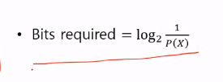
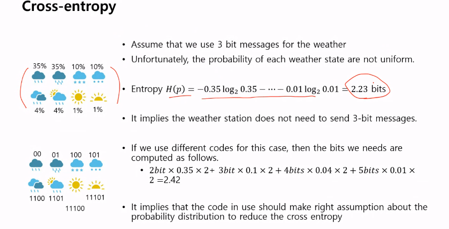
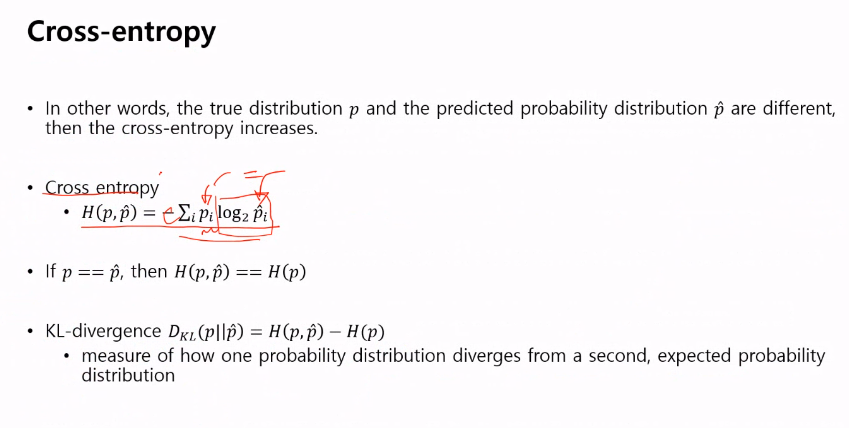
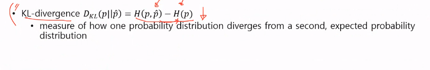
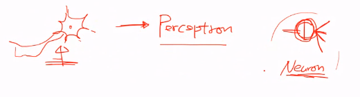
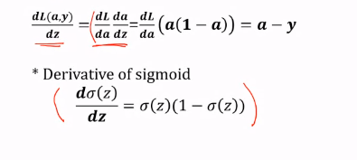
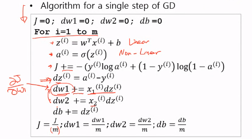

# 200402_W3D2_Cross Entropy, Logistic

# 머신러닝(전 주에 한거)

## Entropy(불확실성?)

비가오거나 해가 뜨는 2가지 밖에 없을 경우 1비트로 정보를 보낼 수 있다.

0or 1로

만약 날씨의 경우의 수가 8가지라면? 

-> 3비트로 충분하다.

결론 : 

만약 언제나 맑음일때는 ?

0비트. 즉 알려줄 필요가 없다.

즉 정보의 확률에 따라 필요 bit 가 달라진다.

또한 정보가 불확실할때 필요한 bit양이 커진다.

비트수 x 확률 까지 해주어야함.

가장 불 확실할 때가 3비트.

가장 많이 나올 확률인 2개를 00,01 두비트만 사용하고

거의 나오지 않을 확률을 5비트를 주는 식으로 할당하면? 2.42의 결과값이나옴.

실제 확률을 엔트로피로 계산하면 2.23이  나왔는데

아래에  추정해서 계산한 값은 2.42값이 나옴.

이때, 실제확률과 예측한 확률의 차이를 

cross-entropy 라고함.

예측확률과 실제 확률이 같아지면? -> Cross-entropy값이 entropy 값이 된다.

만약 예측 entropy가 더 크면 값의 차이가 있다는 뜻. (클수록 차이도 큼)

KL-divergence를 줄인다는 것은 실제 확률값과 예측 확률값을 줄인다. 라는 의미다.

---------------------------------------------

# 0402 ~

크로스 엔트로피는 확률 분포의 거리이다.

확률 분포의 거리를 나타내는 방법은 다른 방법도 존재.

#### 왜 크로스 엔트로피를 쓰느냐?

-> 특별한 특성이 있기 때문 (Convex, 장애물이없음)

현재 모델

w와b를 최소화 하는 변수로 튜닝해야함.

Binary Classfication 의 식

기울기가 >= 0 

즉,

이러한 형태를 가져야함.

L이 w방향으로 Convex함.

Minimize하는 w값을 찾는 것이 목표.

w를 찾는 방법은 ? 장애물이 없다는 가정(Convex)에 아래로 쭉 내려가다보면 낮은 지점에 도착함.

The cross-entropy function of logistic regression 에서는 항상 Convex(장애물X)하다.

#### 그러므로 크로스 엔트로피를 쓰는 이유는 Convex하기 때문이다.

## Gradient Descent (경사 하락)

우리의 목표는 ?

최소화된 지점을 가야한다. (빨간 화살표)

이러한 곡선이 있을 때 오른쪽에서 시작을 하면 Convex하기 때문에 아무 문제 없이 최저값을 찾을 수 있음.

##### 그럼 왼쪽에서는? 

수학적인 완벽한 방법이 없음.

##### 왔다갔다하면서 자신이 현재 local 최저점인지 , global 최저점인지를 파악하는 것이 중요.

#### 알고리즘

w값을 튜닝하기 위해서는 기울기가 낮아지는 값(dw/dl)을 구한뒤 알파(a)를 곱한 값을 빼 주어야 한다.

#### w와 b의 확장

### Computation graph

펄셉트론 이론은 모양을 본뜻 것이지, 신경세포와 같지 않다. (기능적으로 다름)

그럼 뉴럴 네트워크는? 

Computation graph임.

이러한 그림을 전전파(Forward propagation) 라고 부름.

반대방향은 역전파(Backward propagation) <-

### Computation graph with back propagation

##### 역전파 = chain rule임

간단한 미분은 직접 가능하지만 길어지거나 복잡해질 경우?

back propagation을 한다.

# 로지스틱 최종

앞서 배운 내용들을 토대로 로지스틱 분석을 짬.

chain rule로 구함.

L=크로스엔트로피

a=y^(y햇)

각각 미분으로 구함

시그모이드 함수

시그모이드를 미분한 값

두번쨰 텀

w1으로 미분하면 x1이 나옴

전체 그림

### 코딩을 짜기 위한 알고리즘

위의 3식이 그동안 유도했던 3개의 식

아래가 코딩

순서대로 z는 Linear

a는 Non-Linear

J 는 += 이므로 누적합 ( 끝에 m으로 나눠줌 )

미분(누적합)

전체 식

한스텝을 밟기 위해 n번의 for문을 돌고 

계속해서 이동을 해야하기 때문에 이중for문으로 돌려야 한다.

다음 시간에는 이걸 조금 더 빠르게 만드는 방법을 알아볼 예정.