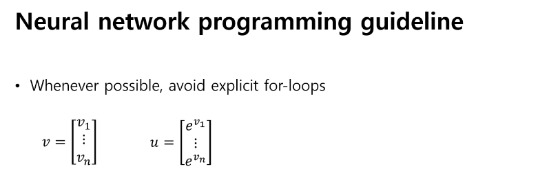
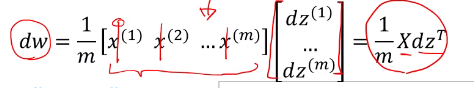

# 200406_W4D1_로지스틱 마무리,Vectorization

그동안 배운 것 정리

ㅁ 라는 모델에 X라는 인풋을 넣고 Y햇이라는 아웃풋을 얻는다.

binary classification 을 하는 것이 목적,

여기서 Y햇은

시그마를 통과해서 나오는 결과로

앞에는 W트랜스포즈X, bias b 를 더해서 

리니어 트랜스포메이션 한번, 언리니어 트랜스포메이션 한번 해서 나오는 결과.

우리는 여기서 w와 b를 튜닝하는 것이 목적.

평가를 하기 위한 Loss function 을 정의함.

y햇과 y를 다 더하고 평균 낸 값을 최종 코스트로 쓰고 잇음

이러한 최종 코스트를 미니마이즈 하는 것이 최종목표.

정리를 하면 이런 식이 나온다.

코딩으로 만드는 방법은 아래와 같다.

a는 학습률, 

a에 따라 업데이트가 된다. (몇 걸음을 걷는지, 스텝)

이 for문을 다시 몇 번 돌릴 건지 하는 걸 epoch라고 함.

epoch 안의 for문을 없애는 것을 벡터라이제이션 이라 부른다.

GD는 (Gradient Descent) 의 약자.

한 걸음을 가기 위해 위의 코드를 전체 다 돌려야 하므로 너무 오래걸린다.

-> for문을 없애자 -> Vectorization.

ex)

z= w[i] * x[i] 에 b를 더해준 값의 누적합을 구하는 과정,

이러한 식을 numpy가 지원을 해주므로 오른쪽 벡터라이즈로 바꿔준다.

numpy에서 GPU를 활용하기 때문에 왼쪽보다 오른쪽의 결과가 더 빠르게 나타난다.

GPU는 4000core CPU는 8core

core의 성능은 CPU가 압도적으로 좋지만 단순한 계산을 할 때에는 GPU가 더 좋다.

#### 속도 향상 비교 - Experimental comparison

### 벡터라이즈 비교2

## 현재 모델에 벡터라이즈 적용

왼쪽에서 오른쪽으로 바꾸는 과정

먼저 dw1,dw2를 보면 w1와w2는 w의 벡터이므로 dw로 표현 가능하다.

x1,x2,1

w1,w2,b를 더한 값(웨이티드 썸)이 z

z = weighted? sum

시그마z = a or y햇 (아웃풋)

dz는 미분값,

즉 스칼라 * 엘리멘트 2개이므로 

이렇게 쓸 수 있다. 

디멘젼은 2,1

디멘젼을 추적하는 것이 벡터와 행렬을 다룰 때 매우 중요하다.

누적합이기 때문에 초기화 하는 것도 바꿔줌.

zeros = 0인 행렬을 만들고 디멘젼을 (n_x,1)로 줌.

### 벡터라이즈 적용 2페이지

### 

### 

z는 데이터 하나에 대해서 리니어 트랜스포메이션 한번

a는 넌리니어 트랜스포메이션을 의미함.

이제 이걸 for문에서 제외해야하므로 모든 값에 대한 식으로 바꿔주어한다.

식을 계산하기 위해 행렬 X를 만드는데 컬럼 단위로 데이터가 있는 형태로 만듬. 

(위에 W*x(i)의 식을 만들기 위함.)

이런 식으로 w와 X행렬을 연산하는 식을 만듬.

결과적으로는 이런 행렬들의 연산이 된다. 

연산을 하면 총길이가 m인 행렬이 나옴.

이제 m개의 b를 마련해준 뒤 계산을 하면 첫 번째 연산 값이 나옴.

->

 

의 값이 나옴.

결과 : 

이제 for문 안에 

식을 다뤄야 하는데, 이는 우리가 여태 구한 z(엘리멘트) 값에 시그마만 씌워주면 된다.

시그마를 씌워주기 위해선 디멘젼 값을 알아야 하는데 디멘젼 값은

맨 아래 구한 (Nx, 1)

#### 파이썬 코드

b는 단순 상수,

계산이 되는가? -> 브로드캐스팅으로 계산이 되고 Z가 나옴.

Z는 n개의 행렬이 나온다.

### 식 바꾸기 3

z의 미분값, 디멘젼은?

y는? 정답지, 트레이닝셋의 Y (1,0,1,1,....) 같은 1,0형태

Y 큰와이(y햇)는?  : 0~1 사이의 실수가 나옴. 

결론은 dz는 A행렬과 Y행렬을 빼는 것으로 for문 밖으로 뺄 수 있다.

### 바꾸기4

dw와

db의 누적값은?

먼저 dz( z의 미분값 )은 

이런 형태로 나왔다.

하지만 dw는 벡터의 형태이므로

이러한 모양이 나온다.

dw는 m의 요소만큼 더한 뒤 m개로 나누어 주는 값이므로

의 식으로 구할 수 있다.

디멘젼은 같은가?

dw = 

dw와 x 모두 행 벡터로 같은 디멘젼을 가지고 있음.

즉 이러한 식으로 바꿀 수 있다.

dz 를 벡터로 뽑음.

x(1) x(2)는 x데이터를 컬럼으로 모아놓은 것.

전에 했던 

이다.

dz의 행렬 역시

바로 위에 있다.

결국 dw 는

가 된다.

디멘젼은 맞는가?

에서 dw는 (nx,1), X을 m으로 나눈 값은 (nx, m) dzT는 (m,1)

곱하기 하면 m이 없어지므로 올바른 식이다.

##### 파이썬 식

#### db구하기

x대신에 1을넣고 w대신에 b를 넣으면 된다.

즉 dw를 구하는 식

에서 x대신 1을 넣어주면 됨.

위의 식을 풀어쓰면

1을 벡터로 바꾸고, dz를 컬럼으로 쌓았음. (내적이라 같은 결과)

엘리멘트가 1인 벡터를 이렇게 표현.

결론 

dw의

 

에서 X대신 1의 벡터를 넣어준 값이다.

db는 스칼라이므로 (1,1), 

은 (1,m) - 1벡터를 m으로 나눈 값 과

 (m,1) - d는 상수 1

 의 합이므로 m 이 사라져서 (1,1)

##### 파이썬 코드

db는 dz 벡터의 모든 값의 합과 같음.

그러므로 np.sum 으로 dz의 요소를 모두 더하고 m으로 나눠준 값이 바로 db가 된다.

-> for문 밖으로 뺄 수 있음.

## 정리 - for문 없애는 벡터라이즈

for문 안에 있는 코스트는 어떻게 없애는가 ?

J, 즉 코스트는 m번만큼 합산을 하는 값이기 때문에

이러한 행렬이 나온다.

이 행렬을 위에 했던 것 처럼 np.sum 을 하면 J값이 나오기 때문에 간단해서 생략됨.

dz,dw,db는 위에서 구했음.

w는 벡터 (w1,w2), b는 스칼라, 상수

이제는 이 코드를 epoch 만큼 for문을 반복하면 됨.

*추가정보

데이터는 컬럼 벡터를 원칙으로 하기 때문에

m방향(행,row방향) 으로 쌓이면 Mx가 디멘젼이 된다.

