# 200409_W4D2_로지스틱 코딩


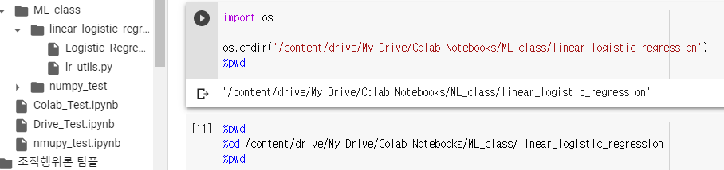


디렉토리 변경을 위해 os.chdir이나

cd를 해야함.


@강의자료 중 'Logistic_Regression_with_a_Neural_Network_v1' 코드를 사용함.


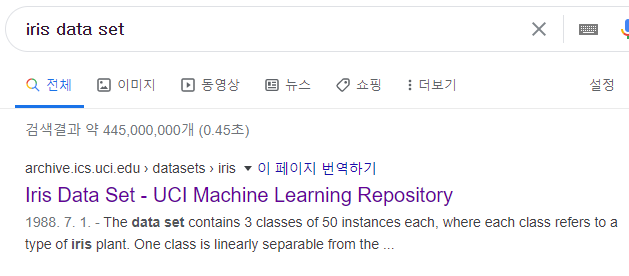


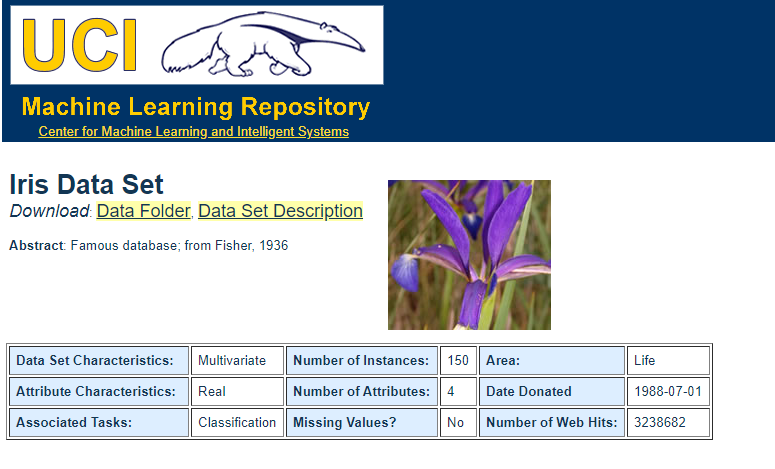


UCI의 DATA SET을 사용할 예정.


## iris 데이터의 구조

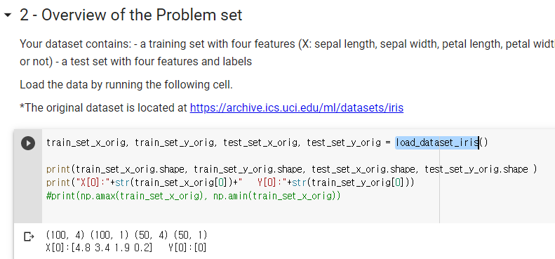


train_set_x = 100,4

train_set_y = 100,1

test_set_x = 50,4

test_set_y = 50,1 의 사이즈다.


2번째 print의 내용은 x와 y 데이터의 예시

x는 꽃잎의 sepal length, sepal width, petal length, petal width 등의 길이고 

y는 기다 아니다 즉 0,1로 맞다 아니다를 판별함. Virginica면 0, 아니면 1 이다.


## 첫번째 코딩 답

```python
### START CODE HERE ### (≈ 3 lines of code)
m_train = train_set_x_orig.shape[0]
m_test = test_set_x_orig.shape[0]
num_px = train_set_x_orig.shape[1]
### END CODE HERE ###
```


트레인,테스트 데이터 갯수를 알아보는 법.


## 두번째 코딩

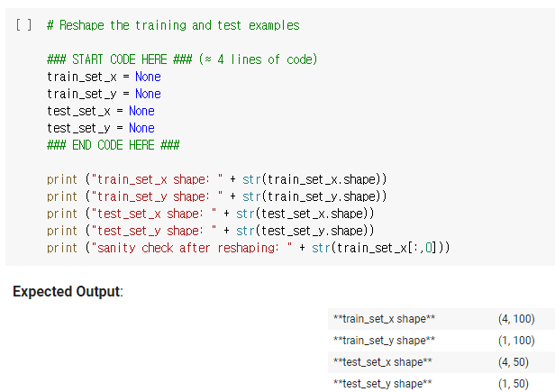


형태를 바꾸는 것


100,4 -> 4,100의 형태로 바꿔라.


## 두번째 코딩 답 

.T를 붙여서 Transpose(전치행렬, 열과 행을 바꿔주는 명령어)를 하면 됨.

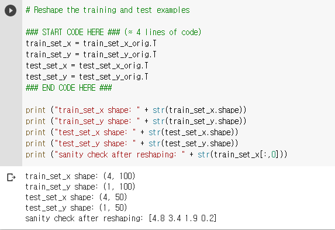


## 세번째 코딩 - 정규화

정규화란? 데이터의 범위를 0~1로 변환하는 방법.


#### 정규화 공식 : (x - x평균값) / x의 표준편차


#### 


#### 표준편차?

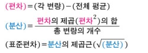


##### 구하고자하는 값

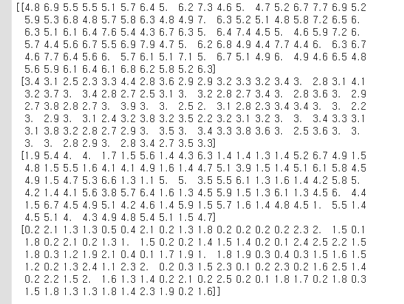


이러한 100개의 데이터들이 담겨있는 4덩이 

즉 4,100의 데이터에

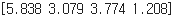

이 평균값들을 빼주려 한다.

즉 첫 1덩이에 5.838을 100번 빼주어야함. 


### 세번째 코딩 답 


#### 1.평균, 표준편차 구하기


#### 2.벡터 -> 행렬로 바꾸기 

(4,) -> (4,1) 형태로 바꿔준다.

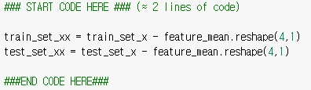

reshpae을 이용하여 (4,)의 shape을 가진 feature_mean을 4,1의 구조로 바꿔주었다.


간단히 보면 이러한 차이.

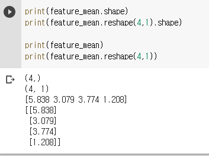


#### 3.정규화 시켜주기


정규화 공식 : (x - x평균값) / x의 표준편차

공식에 따라서 

식을 완성했다.


결과값 : 

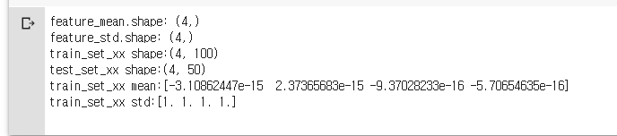