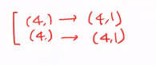
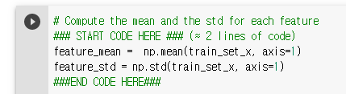
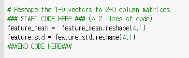

# 200413_W5D1_ㅁㄴㅇ

#### 전에 실습 이어서

x 데이터의 형태

4*100

y는 1*100의 형태이다.

#### x데이터의 형태를 정규화 시킴.

ex) 4~6의 데이터를 0~1로 바꿔줌.

#### 정규화 공식 

##### 정규화 공식 : (x - x평균값) / x의 표준편차

#### 벡터와 행렬?

왼쪽이 벡터, 오른쪽이 행렬

(4,) -> (4,1)

## 세번째 코딩 정답

1.평균, 표준편차 구하기

2.벡터를 행렬로 바꾸기

3. 정규화 시켜주기

