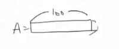

# 200413_W5D1_로지스틱 알고리즘 모델 실습

#### 전에 실습 이어서

x 데이터의 형태

4*100

y는 1*100의 형태이다.

#### x데이터의 형태를 정규화 시킴.

ex) 4~6의 데이터를 0~1로 바꿔줌.

#### 정규화 공식 

##### 정규화 공식 : (x - x평균값) / x의 표준편차

#### 벡터와 행렬?

왼쪽이 벡터, 오른쪽이 행렬

(4,) -> (4,1)

## 세번째 코딩 정답

1.평균, 표준편차 구하기

2.벡터를 행렬로 바꾸기

3. 정규화 시켜주기

결과 값 :

### @정규화 결과 확인

실수값 연산이라 정확히 0~1로 떨어지진 않는다. (그냥 앞이 0,1인 양수,음수까지만 )

#### test 데이터의 평균과 표준편차을 안 구하는 이유는?

머신러닝은 

1.내가 가지고 있는 데이터를 잘 설명하는 것

2.새로 들어올 데이터를 잘 설명하는 것

1,2가 중요한데 , 2의 평균과 표준편차를 모른다고 가정하기 때문에 Train 데이터만의 평균과 표준편차로만 값을 계산한다.

## 3. 알고리즘 만들기

### 3.1 sigmoid 함수 만들기

교재

인터넷(더쉬운버전)

### sigmoid 함수 답

위의 공식대로 1 / 1+exp(-z)를 이용함.

### @Papers with code

https://paperswithcode.com/sota

머신러닝과 관련된 논문, 코드들을 모아 놓은 사이트

### 3.2 Initializing parameters

답: 

## 3.3 - Forward and Backward propagation (@)

dw와 db를 구하는 방법.

데이터 형식들 : 

b는 a+y를 다 더한 뒤 평균을 내면 됨.

### propagation 답

#### A와 cost(=J)

#### dw와 db

### 3.4 - Optimization

공식 : 

답 1 :

답 2 :

결과 : 

