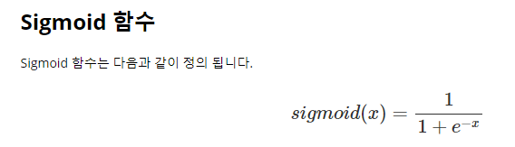
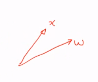
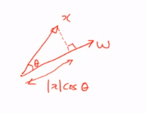
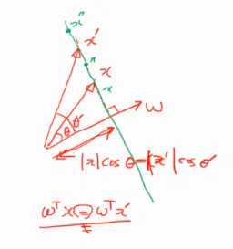
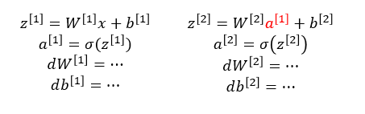
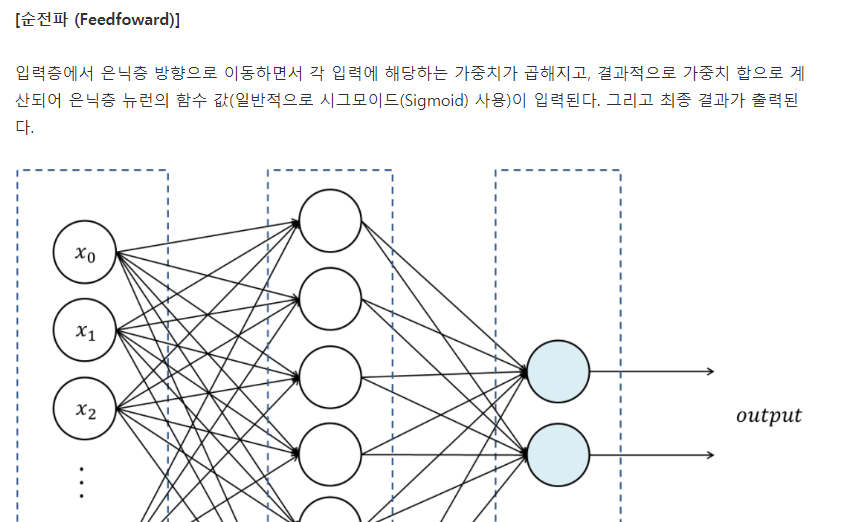

# 200416_W5D2_Shallow NNs

Shallow는 '얕은' 이라는 의미

Deep learning의 Deep NNs와 반대의미

얕은 뉴럴 네트워크를 뜻함, 레이어의 숫자가 적다.

layer가 2개정도를 Shallow NNs라 함.

#### 현재 실습 하고 있는 모델 (Logistic)

데이터를 반으로 나누어 Linear(선형데이터) Transformation(변환)와 Non Linear Transformation을 줌.

좀 더 자세히 보면

Linear Transformation은 z=wTx(w의Transpose한 값에 x를 곱함.) +b 이고

Non Linear Transformation은 시그모이드 함수 a=알파(z)이다.

참고로 시그모이드 계산법은 아래와 같다.

x와 w라는 벡터가 있다고 가정할 때,

w1x1 + w2x2 +..... wmxm 을 더한 값은 x와w선의 내접을 의미한다 . (x와 w사이에 있는 넓이)

#### 내접을 구하는 공식

##### w절대값 * x절대값 * cos 세타

여기서 x절대값 코사인 세타만 보면?

x로부터 수선을 내려서 w까지의 거리 (1) 과

w의 길이(2)를 곱한 값과 같다.

여기서

x` (x프라임) 이라는 새로운 벡터를 추가해보자.

여기서 wTx와 wTx`의 값은 같다.

이유? ->

x프라임과 함께 세타(내각)도 세타 프라임이 되어 넓어지므로 x프라임 * cos  세타프라임 의 값은 같아진다.

즉 내접( wTx와 wTx`)이 같아진다.

이런 내접이 같은 x, x프라임 등 많은 벡터들을 다 모으면 직선이 나옴.

내접이 같은 요소들을 모으면 이런 직선이 나옴.

내접이 같은 요소들을 다 모은 결과는

 wTx =b를 만족하는 x 와 같은 의미다.

##### 이러한 값은 2차원에서는 직선이지만 3차원에서는 평면이 된다.

즉 이 값은

 

평면이 된다.

만약 2차원에서 3차원 4차원으로 계속 차원이 늘어나면? **hyper space** 이라 한다.

**hyper space**속에서 생기는 차원은? **hyper plane** 이라 부른다.

여기서 wTx = b 는 **hyper plane**을 나타내는 식이 된다.

이 식에서 > < 와 같은 부등호를 줄 수 있는데, 그 의미는 평면의 왼쪽이냐 오른쪽이냐를 의미한다.

그러므로   이 식은 평면 하나를 놓는 것을 의미한다.

이 평면을 튜닝하는 w와 b는 평면의 기울기와 이동거리를 의미한다.

즉 우리가 w와 b를 이용하여 평면을 컨트롤 하는 것이다. (기울기를 바꾸거나 축을 이동시키거나)

다시 설명하면 

이런 그래프 속 o와 x 데이터들이 있을 때 이를 구분하는 식이

 

이며

이렇게 구분을 해주는 평면을 찾기 위해서 평면을 튜닝하는 w와 b 값을 찾아야 하는 것 이다.

평면을 찾고 

왼쪽에 있는 데이터(o) 는 1

오른쪽에 있는 데이터(x)는 0 

이런 식으로 구분 하는 것이 **시그모이드** 이다.

 

위의 Linear Transformation을 통해 나온 값이  내접 보다 클 경우  왼쪽의 o데이터 들이 되고 1값을 가지게 된다.

내접보다 작을 경우 시그모이드 함수를 통해 0 값이 나온다.

#### 이 과정이 뉴런 하나의 과정

즉 이 과정 하나가 hyper space를 절반으로 나누고자 하는 hyper plane에 속하며, 그 hyper plane의 파라미터를 튜닝하는 것이 우리 Learning의 목적이다.

하지만 이 과정으로는 해결 못 하는 경우가 있는데,

이러한 경우는 평면으로 데이터를 구분하기가 힘들다.

이런 경우를 XOR 문제라 함.

## hidden layer

위에서 배운 하나의 뉴런들이 모여서 이런 계층을 이루게 됨.

첫번째 레이어를 hidden layer라 부르고

두번째 레이어를 output layer라 칭함.

hidden layer에서 하는 일은? 선형변환, 비선형변환 한번씩

위에서 배운것들을 그대로 함

식으로 표현하면

z1은 첫번째 레이어를 의미.

z2는 두번째 레이어(output layer) 이며, input 값으로 첫번째 레이어의 Non-Linear Transformation 값이 들어간다.

그리고 다시 시그모이드 함수에 넣으면 우리가 원하는 y햇 값이 나온다.

## 왜 이런 복잡한 구조를 쓰는가?

input값이 무수한 점들이 모여 파란 선과 빨간 선으로 보일 때,

이를 분류하기 위한 작업을 하고 싶다.

이 때 우리가 배운

이 로지스틱 리그레션으로 구분을 할 수 있을까?

100% 정확도는 아니지만 구분은 가능하다.

가운대 나누어진 선이 hyper plane, 구분선임

여기서 히든 레이어를 추가하게 되면?

x1,x2을 히든레이어가 x1프라임, x2프라임 으로 바꿔줌.

바꿔준 결과 예시

#### Linear Transformation과 Non-Linear Transformation의 의미는?

히든레이어를 추가하면 히든레이어에서 Linear Transformation 한번, Non-Linear Transformation 한번을 실행하게 되는데 여기서 

##### Linear Transformation는

해당 그래프에서 선을 로테이션(회전), 확대, 이동, 축소 시켜주는 것 이고.

##### Non-Transformation는

선의 특정 부분을 확대, 축소 시키는 것

그래서 이 두개를 잘 섞어서 변환을 하게 되면

이러한 그림이 나오는 것 이다.

이러한 변형을 시켜주는 애가 바로 hidden layer다.(w와b를 잘 튜닝해야함.)

이러한 히든레이어 덕분에 hyper plane 하나로 파란 데이터와 빨간 데이터를 100% 정확하게 분류를 할 수 있게 되었다.

(기존의 위 그림에서는 분류는 가능하지만 100%는 불가능)

#### 즉 정확도를 높여주기 위해서 hidden layer를 사용한다.

그럼 이 경우는 어떨까?

이 경우는 hidden layer에서의 변환이 이루어져도 빨간색 데이터가 파란색 데이터 안에 있다는 사실이 변하지 않는다.

어렵게 말하면 빨간색 점들이 같혀있는 topology는 변하지 않는다.

#### 해결 방법은?

히든 레이어를 3개 만들어서 3차원 공간에서

 

hyper plane 평면 하나를 만들어서 해결함.

#### 결론 : 1) hidden layer가 매우 중요하다, 

#### 2) hidden layer에 들어가는 node의 갯수도 매우 중요하다.

-> hyper plane을 잘 설정하기 위해 튜닝하는 변수들을 hyper parameter라 함.

## Shallow NNs

w1,d1은 첫번째 튜닝변수 

dim은 디맨젼.

대충 이런 모양

w은 4x3의 크기, b는 상수이므로 4,1크기

괄호의 앞 숫자가 output

뒤의 숫자가 input이다.

### 전에 배운 식들을 적용

첫번째 레이어에서 4개의 식이 나옴. 

이 4개의 식을 쌓음 

결과 아웃풋 :

### 결과 식  : 

x가 들어왔을 때 빨간 선의 4개가 일어남.

#### x는 하나의 data이므로 Vectorize를 해야함.

벡터라이즈를 안 하면 오른쪽 아래 for문을 돌려야함

### 벡터라이즈

x가 1,2,3 3개이므로

이러한 벡터화를 거쳐야함.

아래의 4개 벡터화를 통해 위의 for문을 스킵할 수 있다.

### 

Z와A의 디멘젼은 여기를 참고.

#### 첫번째 레이어의 모양

Z1의 모양 : 

4*m 의 모양이 나온다.

A1의 모양 : 

역시 4*m

#### 두번째 레이어의 모양

Z2의 모양 : 

W2 = 1*4

A2 = 4*m

b = 스칼라, 상수

그러므로 Z2의 모양은 1*m이 나옴.

A2의 모양 : 

Z2와 똑같은 1*m

#### 보통 가로축이 데이터의 갯수

#### 세로축이 데이터의 *Dimension*(구조)을 뜻함.

즉 이 그림에 따라

Z1, A1은 첫번째 레이어이므로 디멘젼이 전부 4이고

Z2,A2는 두번째 레이어이므로 디멘젼이 전부 1이다.

W의 디멘젼만 조심하면 된다.

W1의 경우 Output, Input 순서로

(4,3) 이고 (x1,x2,x3 -> a1,a2,a3,a4)

W2의 경우

(1,4) 이다. (a1,a2,a3,a4 -> output)

## Activation functions (=sigmoid)

A1, A2를 구할 때 썼던 sigmoid가 Activation functions인데, 

 Activation functions은 Sigmoid 뿐만 아니라 tanh(하이퍼볼릭탄젠트)도 가지고 있음.

이런 그림

결과값은 tanh가 sigmoid보다 잘 나오지만,

A2(y햇)은 확률값으로 나와야하는데 시그모이드는 0~1, tanh는 -1~1이므로 

시그모이드가 확률값을 만족하기 때문에 시그모이드를 사용한다.

A1의 경우에는? 확률 값이 아니므로 시그모이드가 아닌 함수를 사용할 수 있는데,

#### 오늘날에는 ReLU(Rectified Linear Unit) 함수가 가장 일반적이다.

0보다 작으면 0값,

0보다 크면 y=x값을 가지는 것이 ReLU 이다.

#### sigmoid와 tanh보다 결과값이 훨씬 잘나옴

이유는? : 

0보다 큰 양수값의 미분이 항상 1이기 때문.

변종 ReLU도 있지만 ReLU로도 충분함.

## Non Linear Transformation이 필요한 이유는?

아래 식 처럼 A1, A2에 Non Linear Transformation을 주지 않을 경우

최종 아웃풋인 Z2값이 한 줄로 정리가 되는데, 이 경우 중간에 아무리 hidden layer를 많이 쌓아도 

결과는 Linear Transformation 하나가 되버린다. (즉 hidden layer를 쌓은 의미가 없다는 뜻.)

## Activation functions의 미분값(Derivatives)

sigmoid는 커질수록 0에 수렴 (안 좋은 특성임)

tanh는 최대 , 최소값이 0에 수렴

### 반면 ReLU는?

미분값이 양수일땐 1이 나옴.

## Back propagation(역전파)

우리가 여태 구한 것은 forward propagation(순전파)이고

Back propagation을 구하려면 위의 식을 구해야함.

식은 다음 시간에 마저.

## 순전파와 역전파

순전파 (Feedforward) 알고리즘 에서 발생한 오차를 줄이기 위해 새로운 가중치를 업데이트하고, 새로운 가중치로 다시 학습하는 과정을 역전파 (Backpropagation) 알고리즘 이라고 한다. 

이러한 역전파 학습을 오차가0에 가까워 질 때까지 반복한다. 역전파 알고리즘을 실행할때 가중치를 결정하는 방법에서는 경사하강법이 사용된다.

### 순전파

순전파는 자연스럽게 알고리즘을 실행하여 최종 아웃풋이 나오는 실행

### 역전파

역전파는 Input, Output을 아는 상태에서 다시 알고리즘을 학습시키기 위해 뒤로 되돌아가는 것을 의미함.

