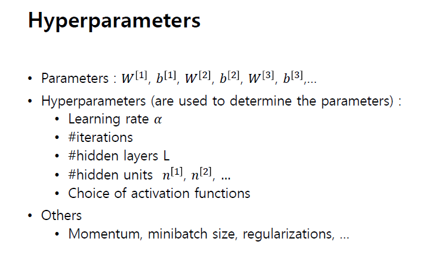
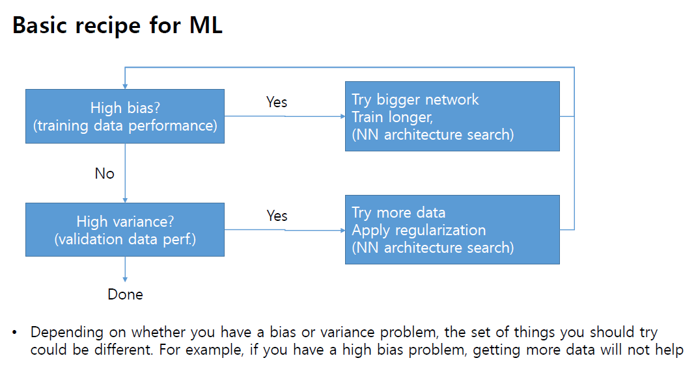
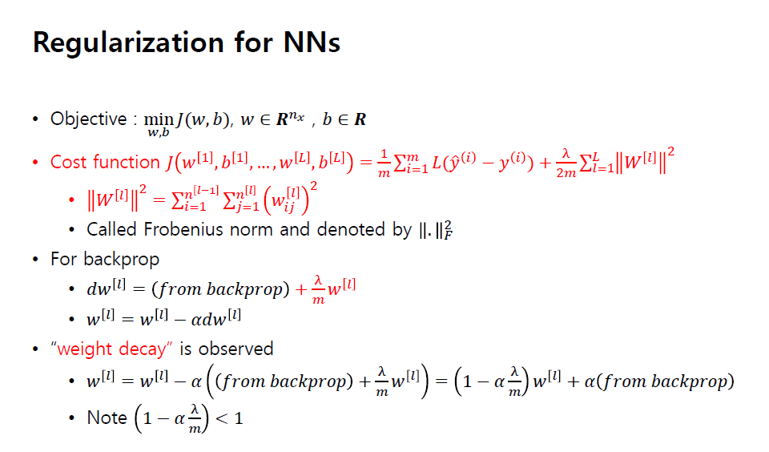

# 200427_W7D1_Deep NNs, 정규화

이번주 목요일 수업 x

다음주 과제로 대체

## 딥 네트워크 (Deep NNs)

역전파를 하지 않음

-> 점화식을 통해서 아무리 길어져도 값을 구할 수 있다.

모든 layer가 fully-connected 상태일때만 점화식을 사용할 수 있고,

connected가 아닐경우에는 일일히 back propagation을 구해야한다.

## back propa 함수

## 스텝펑션

w와 기울기는 비례함

w를 높이면 급경사가 됨

## 왜 딥러닝?

히든레이어의 갯수를 무한히 늘리지 않고 딥러닝을 사용하는 이유는?

왼쪽(딥러닝)과 오른쪽(셀로우러닝)의 역할은 같음.

but 적은 게이트 수로 실행을 할 수 있는 건 레이어가 깊은 쪽.

## 딥러닝의 파라미터들

hyper parameter를 잘 설정하기 위해선 많이 경험해보는 것이 중요함.

## 딥러닝에서 다루게 되는 데이터

3가지로 나뉨.

training

validation(확인)

test

과거에는

7:3이나

6:2:2 식으로 나눔.

하지만 현재에는 데이터가 많기 때문에

98:1:1 과 같은 식으로 나눔.

## Bias and Variance

왼쪽의 그림은 학습이 거의 안됨, 과소적합

오른쪽은 너무 학습이 많이 되어 outlier까지 다룸, 과적합

bias와 확인 데이터의 상관관계

## Bias와 Variance의 학습 방법

high bias (과소적합)의 해결방법 -> 좀 더 큰 네트워크를 사용, 

high variance(과적합)의 해결방법 -> 더 많은 데이터들을 확보하거나 데이터에 정규화를 적용

## 정규화 방법(L2 정규화)

L2 공식 : 

back prop

과적합을 줄이는 정규화

## Drop out 정규화

레이어를 없애는 방식의 정규화

의외로 매우 잘 작동하며, 요즘에는 매우 많이 쓰이는 정규화 방식이다.