# 200511_W9D1_정규화 마무리, 코딩

## 정규화 방법(L2 정규화)

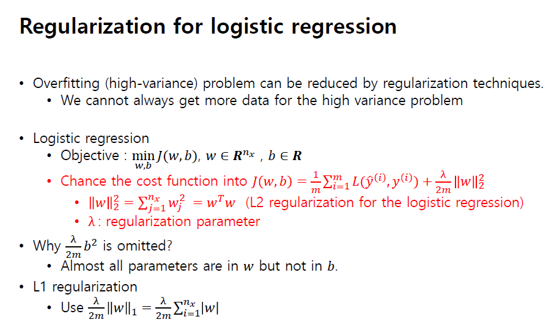

L2 공식 : 

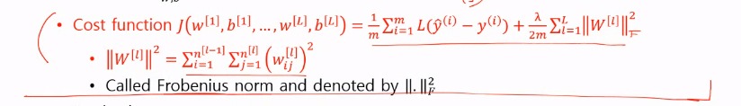

𝜆은 람다임.

back prop

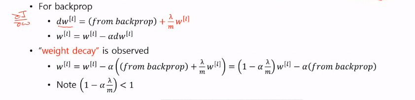

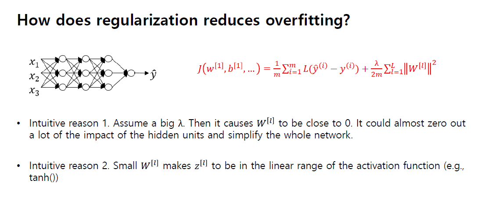

과적합을 줄이는 정규화

## Drop out 정규화

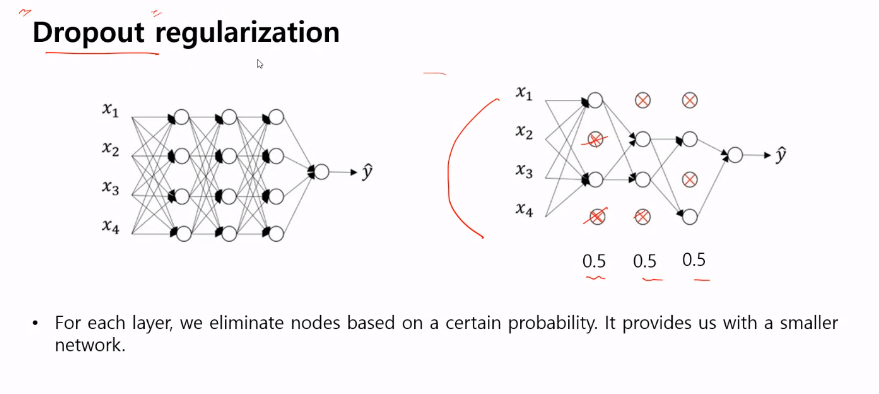

특정 레이어를 없애는 방식의 정규화

끊어지지 않은, 연결된 애들만 업데이트를하고 전전파를 할 때 또 다시 연결을 만든다.

트레이닝 할 때 마다 연결 상태가 달라짐.

그러나 의외로 매우 잘 작동하며, 요즘에는 매우 많이 쓰이는 정규화 방식이다.

## 구현 - 드랍아웃

80%를 살리겠다고 설정 (hyper parameter)

d3 은 True,False만 분리한 array

만약 이 랜덤 number가 만들어 진게 keep_prop(설정한 숫자) 보다 작은 것만 남겨둔다.

3번째 줄에서 drop out이 일어남.

노드를 깎아낸 만큼 a3이 커진다.

마지막 줄은 테스트하기 편하게 하기 위한 코드

스케일링 텀

### 테스트 코드

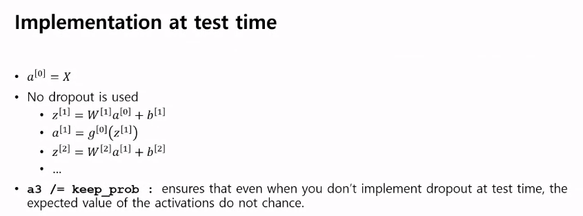

## 왜 드랍아웃이 작동하는가?

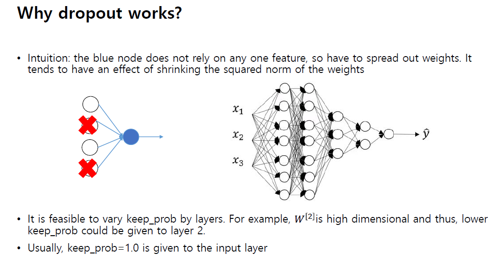

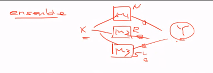

여러가지 상이한 모델 데이터들 같은 데이터 학습을 시키면 각 데이터의 고유 특성이 희석되면서 다수결의 원칙을 따르는 앙상블과 비슷하게 잘 작동됨. 

->집단지성?

## 드랍아웃의 특징

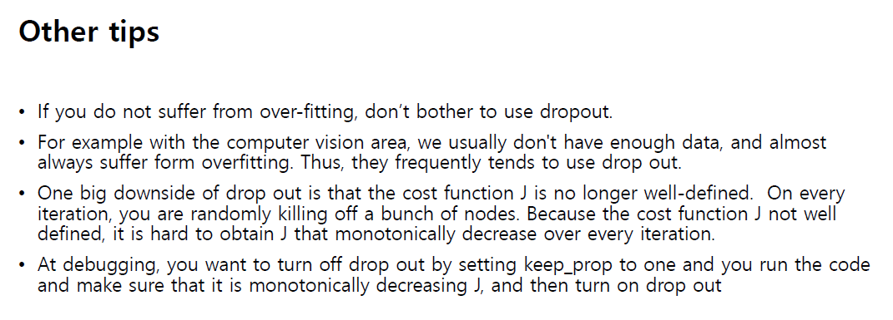

 

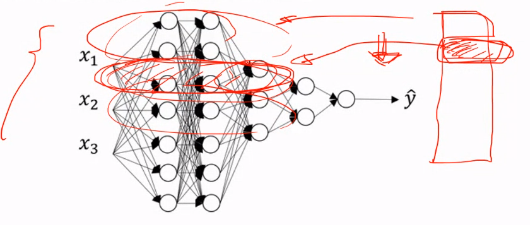

일부 데이터들로 전체 데이터를 학습 시켰을 때 그 일부가 전체 데이터를 대변하지 못 할 수가 있다.

그러므로

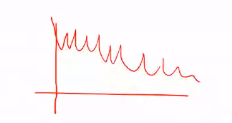

이러한 결과가 나올 수 있는데, 이러한 결과가 꼭 나쁜 것만은 아님.

but 디버깅할때는 드랍아웃을 끄고 하는 것이 좋음.

## 정규화 테크닉

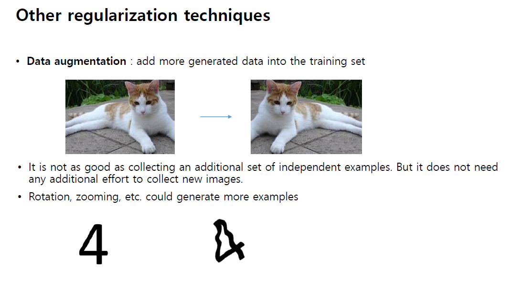

데이터를 많이 가져오거나, 모델을 정리하거나

data augmentation = 기존 데이터를 변형

ex) 고양이 사진은 뒤집어도 고양이 / 1000개의 데이터를 변형 -> 2000개

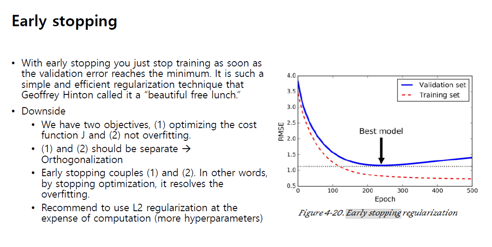

에러 갯수 그래프

학습이 되면서 점점 에러가 줄어들면 매우 좋은 결과지만

파란선과같이 다시 에러율이 올라가기 시작된다면?

-> 과적합이 일어나고 있다는 것.

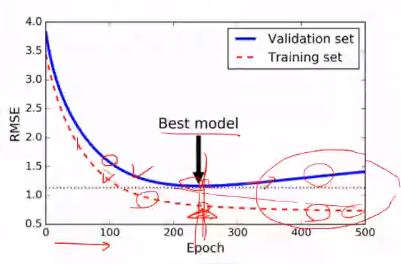

정규화 같은 다양한 방법이 있지만 저 best model 지점에서 멈추는 것도 방법 중 하나

-> Early Stopping 이라는 기술

## 정규화

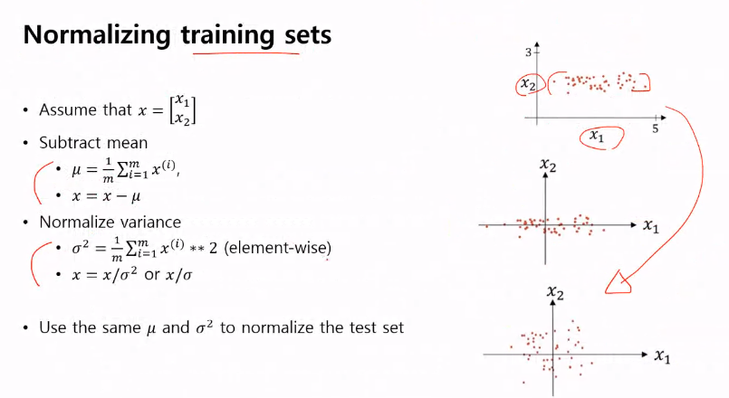

2차원일 때 맨위의 그림보다는

맨 아래의 그림이 적합하기에

정규화를 통해 만들어준다.

## Vanishing gradient - 중요

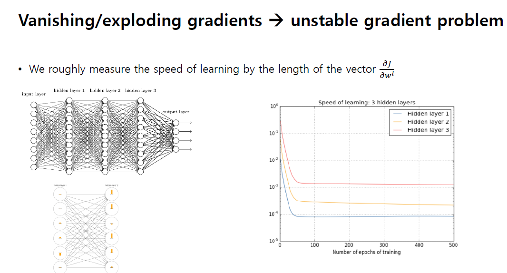

뉴럴 네트워크가 그동안 잘 작동하지 않았던 문제에 대한 이야기

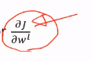

이 변수를 설정함에따라 성장률이 달라진다.

커질수록 걸음걸이가 크고 작을수록 신중히 변화하는 느낌

input layer와 가까울수록 학습 속도가 낮음.

레이어가 많아지면?
학습이 되지 않을 수도 있다.

-> Vanishing gradient (학습을 해도 학습이 되지 않는 현상)

## Vanishing gradient는 2가지 이유로 일어남.

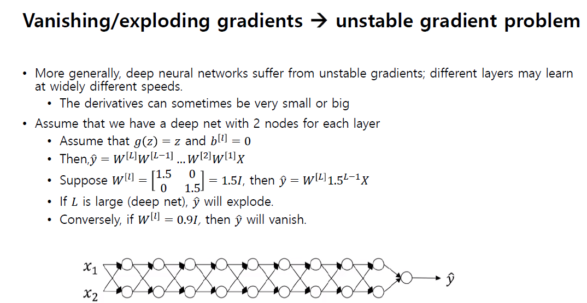

#### 1.레이어가 너무 길다.(웨이트가 계속 곱해짐)

#### 2.활성화 함수(sigmod, tanh) -> 신호(gradient)가 사라져버림

-> 미분 값이 0이기 때문.

unstable 한 gradient라고도 함.

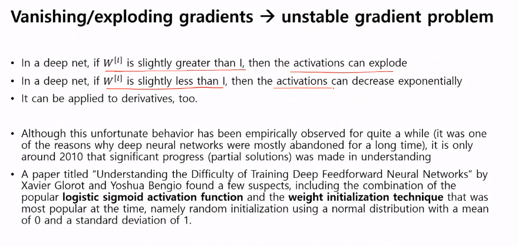

W (웨이트) 가 1보다 조금만 커져도 값이 폭발할 수 있음.

1보다 조금만 작아도 값이 사라질 수 있음.

히든레이어에서 sigmoid나 tanh를 쓸 경우 Vanishing gradient가 발생할 수 있으므로, 아웃풋에서만 사용해야한다.

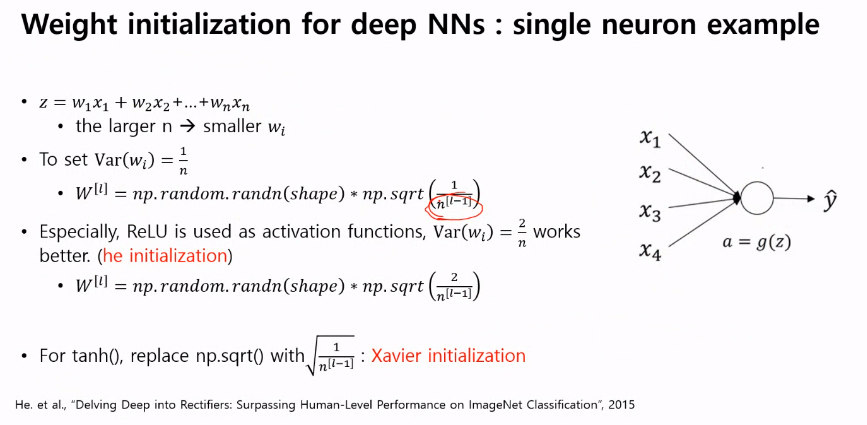

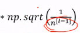

그전 노드의 갯수를 나눠주는 것이 좋음

-> 노드 갯수와 상관없이 정규화를 시켜주기 때문에 잘 작동함.

https://losslandscape.com/

loss function을 시각화 한 사이트

initialization이 초기 값이 굉장한 영향을 끼친다.

## 정규화 코딩

7_regularization_blank 소스코드 실행.

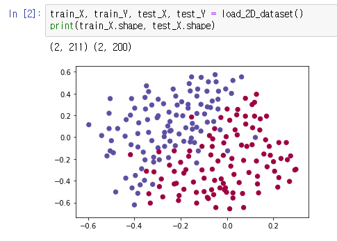

데이터를 뿌려서 보여주기

모델설정

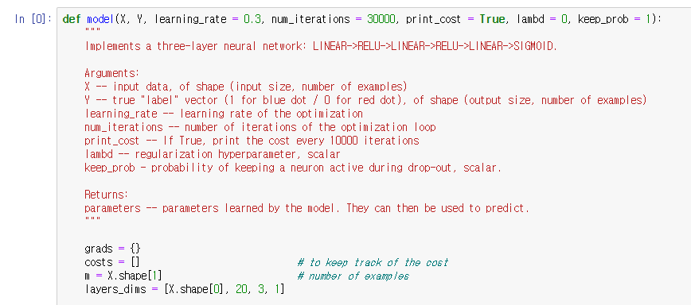

keep_prob이 1은 drop out이 없다는 것을 의미함.

히든레이어2개, 출력 레이어1개

전전파

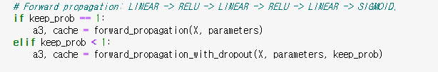

드랍아웃이 있을 경우와 없을 경우로 나눔

코스트 펑션

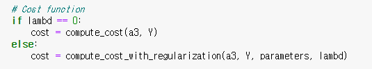

람다가 0 -> l2정규화

#### 예측과 그림

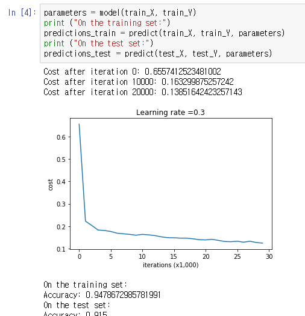

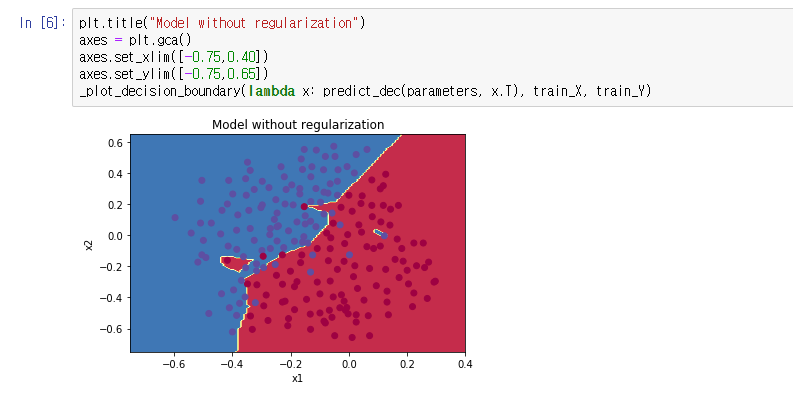

과적합이 조금 일어났음.

