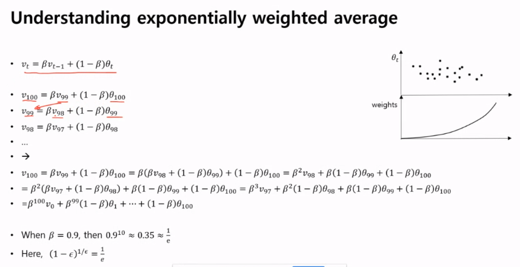
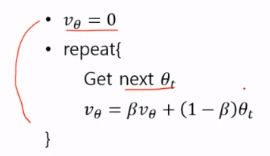

# 200514_W9D2_최적화 알고리즘(Optimization algorithm)

## ppt 8 - 1p

데이터는 어떻게 생겼는가?

벡터로 표현할 때, X, Y가 존재

데이터가 m개 존재함.

데이터가 5백만개라 가정하면?

forward propagation을 하고

cost를 계산하고

back propagation을 함.

그 다음 update

이 과정이 하나의 에폭(epoch)

즉, X라는 데이터를 가지고 f.p, b.p를 하고 그 average를 가지고 update를 함.

update 공식

x의 평균값으로 이 공식을 실행함.

이 과정에서 데이터를 5백만개를 활용하게 되는데, 이 데이터들을 모두 활용하는게 과연 옳은 방법인가?

-> 속도가 느려짐

#### 그러므로 데이터가 많을 때는 Mini-batches를 사용한다.

Mini-batch란?

X라는 큰 데이터를 조각내서 활용하는 것.

f.p , b.p를 실행하는데 X가 아닌, 조각 낸 데이터들을 활용

1000개씩 잘라서 f.p , b.p를 1번

다시 f.p, b.p 2번

이런 식으로 반복함.

이 과정이 끝나면 5백만개의 데이터가 5천번의 걸음으로 종료가 되므로

과정이 매우 빨라진다. -> 최적화(optimization)

## 2P

1000개씩 쪼갠 데이터를 미니배치1번, 미니배치2번 같은 방법으로 나누어서

5천번까지 데이터를 나눔.

미니배치 데이터들을 F.P 한번, Cost 계산 한번, B.P 한번 실행

이 과정을 5000번 반복하면 전체 데이터를 다 쓰게 된다.

이 과정이 한 번의 Epoch이고

Epoch 단위로 다시 반복함.

#### 결론 : 트레이닝을 할 때 미니배치로 잘라서 사용한다.

## 3p 

#### 미니배치의 특성

#### 일반 배치의 경우? (데이터 5백만개 한번에 트레이닝에 활용)

X데이터를 트레이닝에 활용함.

그로인해 알고리즘 입장에서는 Global View가 생김.

무슨 소리냐하면 전체 데이터 생김새를 통해 Gradient(기울기)가 생성되는데,

J공간(cost가 그려지는 공간)에서 최적의 공간을 판단하고 한 발자국 내딛음.

보통은 이 결정이 뒤집히지 않고 쭉 가게 되있음. 

(위의 그림처럼 기울기가 예쁜 곡선)

#### 반면 미니배치는?

저 조각난 데이터가 모든 데이터를 대표할 가능성이 불확실함.

즉 코스트를 따라 한발짝 이동했다가 그 방향이 아닐 가능성이 존재

그 결과 코스트의 학습 곡선이 매끄럽지 않게 나오게 된다.

## p4

미니배치의 사이즈가 1인 경우 (=배치와 같음)

##### 이를 stochastic gradiant라 부름.

곡선이 이도 저도 아닌 shape가 생김.

그래서 mini batch를 가장 많이 쓴다. (보통 2의 배수로 잡고 )

#### 각각의 장단점

#### Exploration =탐험

내가 가진 지식이 불충분 하다고 가정 

Global optimal을 Searching 하는 과정

(=미니배치, stochastic )

#### Exploitation = 재사용 , 사용

내가 가진 데이터를 가지고 잘 활용을 하여 더 좋은 성능을 내겠다.

(=배치)

둘 다 optimization을 찾는데 매우 중요함.

but 검색의 초반에는 stochastic 가 유리,

데이터가 쌓이면 쌓일수록 batch가 유리.

running epoch에 따라 다르게 최적화 전략을 택하는 것도 좋음,

어떤 것에 비중을 두느냐에 따라 테크닉이 달라짐.

## 5p

64,128,256,512 와 같은 2의 배수

-> GPU의 메모리를 위해 2의배수로

미니배치 사이즈를 너무 크게 하면 GPU에 다 안올라갈 수 있음.

ex) 데이터5백만개에 5백만개의 미니배치 같은 경우

## 6p

#### Optimization 알고리즘을 설명하기 위해서는 exponentially weighted average를 구하는 방법을 알아야 한다.

(=평균을 구하는 방법)

ex) 1년간의 평균 온도

#### 1번째 방법 - 이동평균

보통은 이 값들의 이동평균을 구해서 그래프를 그림

#### 2번째 방법 - 점화식

V2를 예로 들면

v1(첫 항목까지의 평균) * 0.9 + 새로운 온도 0.1세타2

바로 전 까지의 평균값에 90% weight

새로운 값에 10% weight

## 7p - 점화식 공식 정리

베타= 가중치 ex)0.9

1-베타 = 반대편 가중치 ex)0.1

베타값을 0.9로 주면? 10일 정도의 평균 데이터가 나옴.

0.98로 주면? 50일 정도의 평균 데이터가 나옴.	(=과거 데이터 중시)

0.5로 주면? (=현재 데이터 중시)

빨간색 그래프(베타0.9)가 가장 그럴듯함.

## 8p  - 점화식 공식 풀이

v100 (100일까지의 평균)을 펼쳐보면?

이런 식이 나옴.

과거 데이터가 아니라 현재 데이터에 조금씩 가중치를 두므로 weights는 점점 증가하는 모양.

그러므로 이 방법의 이름이

####  exponentially(증가하는) weighted average

이다.

## 9p -  exponentially weighted average 구하는 공식

아래 공식을 반복함.

무빙에버리지를 안 쓰고 이 방법을 쓰는 이유는?

@MA

무빙에버리지는 특정 기간동안의 평균을 계속해서 구하는 공식

####  exponentially weighted average를 쓰는 이유는?

-> 메모리가 적게 든다.

## 10p exponentially weighted average의 테크닉

.

이 방법은 초기 데이터들의 값이 매우 편향되어있다. (뒤로 갈수록 수렴하긴 함.)

그래서 초기 값에서 처지는 경우들이 생김.

그래서 이러한 방법으로 보완해줌. (분자는 기존 공식, 분모를 추가)

(t= 데이터 포인트)

#### t가 계속 증가하면?

분모(1-베타티승)가 1에 수렴하게 됨.

즉 초반에는 점점 영향을 많이 끼치다가 후반에 갈 수록 분자에 수렴하게 됨.

## 11p - momentum 방식

두개의 weight를 가진 뉴럴네트워크라 가정할때

과거값들을 따라서 -> 방향으로 이동하지만 웨이트에따라 위 아래로 크게 요동을 친다.

##### 이때 과거의 데이터들을 통해 스스로가 -> 방향으로 가는 것을 깨닫게 하여(그때그때의 Gradient를 이용하는 것이 아닌 평균적인 움직임을 이용함) 학습시키는 방식

Gradient의 평균값을 위의 공식( exponentially weighted average 구하는 공식)에 집어넣는다.

이렇게 계산하면 가속도가 붙은 것 처럼 이동할 수 있다.

## 12p

공식 정리 

## 13p - 또하나의 테크닉 RMSprop(Gradient에 따른 정규화 방식)

오른쪽에서 진행하면 완만하고

위에서 부터 진행하면 가파르게 진행된다.

but 알파값은 동일함.

그러므로 오른쪽 기준으로 한 발자국 움직이는 것과 같은 길이를

위에서 움직이면 이미 목표지점을 초월해버림

#### -> Gradient가 급하면 천천히 내려오고 완만하면 빠르게 내려오도록 설정

dw가 Gradient인데 무언가로 나누어줌.

무언가? -> sdw : Gradient 제곱의 평균

즉 아래 분모값은 dw의 평균값에 루트를 씌운 것과 같다.

(그림은 화살표가아니라 평균값)

즉 전체에서 봤을 때, 기울기가 급하면 분모가 커지기 때문에 정규화가 됨

기울기가 작으면 분모가 작아져서 분자가 커지기 때문에 또 정규화가 됨.

## 코세라(Coursera) - 온라인 프로그래밍 강의 사이트

https://www.coursera.org/

## 14p - 아마 가장 많이 쓰게될 공식

Gradient 평균값 / 루트 Gradient 평균값의 제곱(=절대값)

#### Adam optimization은 RMSprop이랑 momentum방식을 합친 것

여태 배운 것들이 위에 코드에 다 정리되어있음.

초기값 보정해주는 함수.

weighted average

#### Adam의 HyperParameter는?

알파 = Gradient를 이용해서 이동거리를 계산할 때

베타원 = 평균값을 구할 때 

베타투 = 제곱의 평균을 구할 때

입실론 = 분모가 0이 되지 않게 하기 위해 아주 작은 값을 넣어줘서 방지 

우리는 주로 알파를 건드리고 나머지 Hyper parameter는 잘 건드리지 않음

## 15p

Learning rate 는 

위에서 설명한 **Exploration(확장)** **Exploitation(사용)** 개념이

초기에는 확장, 후반에는 사용 개념이 더 중요해야함.

두가지를 병행해야하는데, 초반과 후반을 조절하기 위해서 Learning rate를 조절해줘야함.

그래서 Epoch이 진행될 때 마다 Learning rate를 감소시켜줌 

(초반에 Learning rate가 높으면 그 값에 따라 그래프가 요동을 침 -> Exploration, 확장)

(후반에는 그래프가 일정하게 됨 -> Exploitation, 사용)

## 16p Learning rate decay 구현

#### 방법은 여러가지 있음.

1번 - 분모에 epoch_num을 추가

epoch_num은 횟수에 따라 계속 늘어나는 정수

2번 - 분모인 epoch이 늘어남에 따라 계속 학습률이 감소하는.

어떤 테크닉을 쓰던 간에 잘 되는 걸 찾아서 써야함.

## 17p - local optima

우리는 예민한 발바닥 알고리즘을 사용하는데(눈을 감고 조심스럽게 내려가다가 끝이 보이면 멈추는 식)

우리의 목표인 Global minimum(전역 해)에 도달 하기 전에 

Local minimum(지역 해)에서 멈추게 될 경우 (알파값이 크면 바로 넘어가긴 함)

지역해에 빠진다고 함.

지역해 뿐만 아니라 **plateaus** 라는 문제도 있는데

2번째 그림의 중간지점에 오게 되면 오른쪽으로 갈지 왼쪽으로 갈지 갈림길에서 헤매는 경우가 생김.

## 18p - plateaus 

지역해에 빠지는 것도 문제고, 

plateaus 가 생기는 경우도 문제.

## 19p 고찰

구글의 Chollet이라는 사람이 작성한 글

딥러닝에 대한 흔한 오해는 바로 Gradient descent가 local minimum을 피해 global minimum을 찾는 게 가장 좋은거라고 알려져있지만,

##### 그게 과연 가장 좋은 일일까?

라고 의문을 제기함.

혹시 그 값이 overfitting을 나타내지 않을까? 

아니면 그 값이 local minimum을 나타낼 수도 있음.

##### 즉 global minimum을 찾는 것 보다 더 중요한 것은 이 데이터를 나타내기 적당한 모델을 찾는 것이 아닐까? 

라고 제안.

##### 아주 정확한 global minimum을 찾기 보단 적합한 모델의 global minimum을 찾는 것이 더 중요함.

### 기억할 것 ->  Learning rate decay나 Adam optimization을 가장 많이 쓰게 될 것.