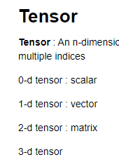

# 200518_W10D1_Pytorch

## 파이토치 vs 텐서플로우

파이토치는 다이나믹그래프

텐서플로우는 스태틱 그래프

텐서플로우2는 다이나믹 그래프로 바뀜

학계에서는 파이토치를 많이 쓰고

성능면에서는 텐서플로우(스태틱 그래프) 가 좋으므로 실제 업계에서는 텐서플로우를 많이 쓴다.

파이토치는 파이썬과 매우 닮았으며 사용하기가 쉽다.

## 파이토치의 특징

1.쉽다

2.파이썬과 매우 닮아있다.

파이토치를 배우고 텐서플로우로 넘어가는 것도 쉬움.

반대도 가능

파이토치 - 페이스북

텐서플로우 - 구글

에서 만듬.

0차원 - 스칼라

1차원 - 벡터

2차원 - 매트릭스

## 파이토치 실습

#### 함수 설명은 아래 링크에서

#### https://pytorch.org/docs/master/torch.html

##### rand = random number를 가져와줌.

(10,1) 사이즈의 random number를 생성

X,W,b 는 tensor 3개를 만듬

##### matmul = matrix 행렬곱

##### clamp = input값을 넣고 min, max를 설정할 수 있음.

##### cat = A와 S를 붙이라는 의미.

#### 데이터 생성

torch.를 사용해서 numpy array를 복사하면 타입이 tensor가 나온다.

a는 원래 [1,1,1,1,1] 인데 +1을 해서 [2,2,2,2,2]가 되었고

b역시 같은 값을 공유하게 된다.

empty를 하면 빈값이 아닌 쓰레기 값이 들어있는 tensor가 생성됨.

#### torch <-> numpy 이동이 자유롭다.

from_numpy를 쓰거나 .numpy()를 통해 이동.

### pytorch의 type

## tensor indexing

행렬을 원하는 부분만 남기고 자르는것.

#### Using CPU, GPU

tensorflow나 pytorch 모두 GPU를 사용할 수 있음.

행렬곱은 시간이 많이 걸리는 연산이다.(matmul)

to("cuda")를 하면 GPU로 연산을 넘겨준다.

to("cpu")는 다시 CPU로 변환.

## Linear regression (선형 회귀)

선형 회귀는 종속 변수 y와 한 개 이상의 독립 변수 X와의 선형 상관 관계를 모델링하는 회귀분석 기법

F.P, C.C , Loss.F, B.P를 다 해준다.

 이러한 모델

Cost 계산은

MSE 방식이다.

### training loop

#### 파라미터 확인

#### 그래프 그리기

## 프레임 워크의 장점?

B.P 을 대신 해준다.

Autograd를 사용.

## Shallow NN 만들기

torch.nn = 토치 안의 뉴럴네트워크

torch.optim = 토치안의 최적화 (아담같은)

torchvision = 토치안의 시각화 패키지

torch.utils.data.DataLoader = 데이터를 가져와주고 셔플해주는 패키지

1~3

레이어갯수설정, 임포트, 배치사이즈

4

Linear = full connected

모든 레이어가 다 연결된 상태를 의미

모델설정이 금방 끝남.

 

5

로스펑션

MSELoss 사용

optimizer는 SGM를 사용(Stochastic Gradient Descent)

Lr = 러닝레이트 (learning rate)

위에 정의한 것들을 바탕으로 실행.

loss 는 에러를 따로 정의한 것.

optimizer.step 을 하면 모두 업데이트 시켜줌

## 데이터셋

파이토치는 유명한 데이터셋들을 쓸 수 있게 해줌.

torch.vision.datasets 를 사용하면 데이터를 사용할 수 있음.