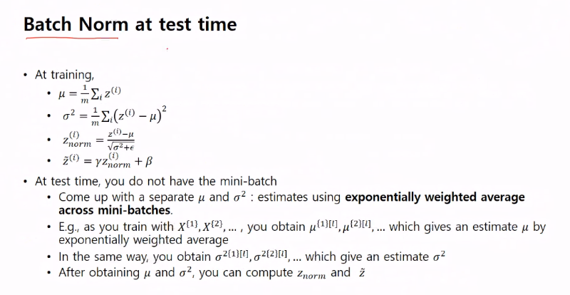

# 200521_W10D2_Tuning(BN,Softmax)

## 하이퍼 파라미터

주요한 요소는 a(알파) 이며, b(베타)는 거의 안바뀜 

그 밖에 레이어 수, 히든 레이어 수, 학습률, 배치사이즈 등등

## 적절한 값 찾기

하이퍼 파라미터의 요소를 조금씩 늘려가며 적절한 값을 찾는 방법

but a(알파값)의 경우에는 작은 값에 더 많이 시도해보는 것이 좋기 때문에

0.0001 부터 시작함

대충 이런 모양, 작은 값들이 훨씬 많이 시도됨.

베타값은 거의 디폴트로 많이 씀.

## 베타 정규화

테스트를 해보면서 적정값을 찾아야함.

처음에 회귀모델을 학습하면서 X값을 구할 때 그냥 넣지 않고 정규화를 통해 값을 변경해준 뒤에 넣었음.

이러한 방식으로 깊은 레이어 일때도 정규화를 하면 좋지 않을까?

각 배치에 대한 평균 값과 분산을 구하고

그 값으로 정규화를 함.

#### 이러한 정규화가 왜 잘 작동되는가?

파라미터의 튜닝을 거치기 때문.

Learnable 파라미터가 많아짐.

## 미니배치에서의 작동

매번 미니배치마다 다른 평균값, 배치정규화를 사용함.

작은 베타는 안 써도 됨, (바이어스 텀이 작은베타 큰 베타가 있기 때문에 큰 베타만 남김)

업데이트 방식, 파라미터만 늘어남

## 배치 정규화는 왜 작동하는가?

covariant shift 덕분임.

러닝 중간 중간에 내가 지정한 값이 변경됨 (w,b)

이러한 값이 없어져서 BN이 잘 작동된다고 사람들이 주장

하지만 위의 주장은 틀린 내용이었고, 다른 사람이 주장한 배치 정규화가 잘 작동하는이유는

코스트 함수 (gradient) 를 조금 더 부드러운 곡선으로 만들어주기 때문이라고 주장

배치 정규화는 트레이닝시 사용됨,

그럼 테스트때는?

## 분류 - Softmax

기존 2가지로 분류하는 것이 아닌 많은 갯수를 분류하는 방식(4개)

마지막 레이어의 낫리니어를 없애고 리니어만 적용

값을 모두 양수로 만듬.

이러한 값은 확률 값 처럼 0과 1사이의 값이 나옴.

그 결과 이런 확률값들이 나오고

이러한 확률값으로 사진을 분류하면

이러한 바운더리가 나옴.

학습 방법

하드맥스는 1 0 0 0 이지만 소프트 맥스는 각각의 값을 지님

## 로스펑션

소프트맥스의 로스펑션은 기존의 로스펑션의 확장임.

Gradient Descent는 softmax에 적용하면 

이런 간단한 식이 나옴.

#### 왜 소프트 맥스인가?

기존 x라는 기술을 사용하고 있다고 가정할 때,

새로 머신러닝의 모델이 나와서 이 모델에 X를 적용하려 했더니 X는 미분이 안되는 식이었다.

그래서 X와 비슷하면서 미분이 되는 soft X라는 식을 만들고 모델에 적용시킴

이러한 경우 새로운 식이 soft X라 불림.