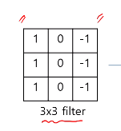
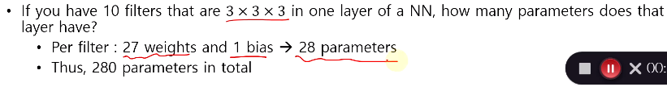
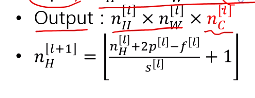

# 200526_W11D1_CNN(Convolution Neural Network)

컴퓨터 비젼 -> 이미지, 사진, 카메라등등

이미지 분류 , 물체 탐색, 뉴럴 스타일 전환 등등 CNN은 다양한 분야에 사용된다.

#### 미리 요약 : CNN은 합성곱 뉴럴 네트워크 이며, 필터와의 합성 곱을 통해 이미지를 분류함.

우리가 이미지를 판별 할 때, 이미지 하나의 RGB는 64 * 64 * 3의 경우 12,228의 디멘젼이 나옴.

unroll하면 12K 정도의 디멘젼 숫자가 나옴.

첫 레이어가 1000개라고 하면 하나의 이미지(디멘젼 12K)와 곱해져서 12M(1200만)의 파라미터가 첫번째 레이어에서 나오게 됨.

여기서 또 FC로 연결되면 레이어가 FC(Fully Connected) 상태가 되면, 파라미터가 엄청나게 많아진다.

1000 * 3M = 3B

#### 이러한 많은 양의 데이터를 처리하기 위해서 CNN이라는 방법이 나오게 됨.

## Edge detection

Edge detection이란?

 사진의 Edge를 구분해내는 방법(왼쪽 -> 오른쪽으로 변함)

이러한 Edge detection을 하기 위해 filter라는 것을 사용한다.	

Sobel method와 Canny method 가 존재한다.(사진은 sobel)

## Filter는 어떤 일을 하는가?

Filter는 convolution을 하게 되는데,

위 사진은 작동 원리는 보여주는 사진이다.

6x6 사진이 있고, 낮은 숫자(0)일수록 검정색, 높은 숫자(9)일수록 하얀색에 가까워지는 이미지파일의 변환 데이터다.

이러한 6x6 사진에 3x3 filter를 convolution을 해주는 것이다.

6x6 사진에 첫번째 줄 부터 시작하는 3x3칸과 3x3 filter를 곱한게 빨간색 네모와 식이며,

이러한 연산 후 값은 새로 만들어지는 4x4 행렬의 첫 칸에 위치하게 된다.

마찬가지로 2번째 칸에 위치하는 건 파란색 네모와 식이다.

파란색은 -4

filter 와 Image를 곱해서 convolution을 구한다.

-> 내적 구하는 공식

내적은 그 두가지가 얼마나 닮았는 지를 측정해준다.

내적 구하는 공식

이 값이 제일 크게 되려면? 세타가 0으로 가면됨 (cos 0)은 1

세타가 0일때 a선과 b선이 포개진다.

반대로 세타가 90이 되면 선이 멀어짐.

즉 저 3x3필터의 역할은 이 필터와 얼마나 닮았는 지를 찾아주는 역할이다.

닮을 수록 값이 크고, 안 닮았을 수록 값이 낮음

## 왼쪽이 하얀 이미지일 경우

위의 convolution을 하면 가운대가 밝게 나오게 된다.

최종 결과값의 이 그림에서 하얀색 부분을 Vertical Edge라고 한다.

## 오른쪽이 하얀색인 이미지 파일의 경우

필터와 정 반대의 결과가 나오기 때문에 오히려 Vertical Edge가 낮게, 검은색으로 나오게 된다.

필터가 위에가 하얀색인 필터를 

왼쪽위, 오른쪽 아래가 하얀 이미지에 적용했을 경우,

왼쪽과 오른쪽 끝이 밝은 결과 값이 나오게 된다.

## 실제 Sobel Filter는 어떤 값을 사용하는가?

중간의 값이 1이 아닌 2로 증가된 Filter를 사용하며, Scharr filter도 많이 사용한다.

우리가 CNN에서 할 것은? convolution을 활용하긴 할 건데, 

filter의 값(coefficient, 계수)을 우리가 설정하진 않음.

-> 우리 모델이 학습을 통해 결정

이러한 필터는 사실 뉴럴네트워크랑 매우 비슷하며, 이러한 NN가 

전체 이미지를 훑고 가는 느낌이다.

여기서 6x6의 경우 앞의 4가지 밖에 가져오지 못하기 때문에 6x6의 원본 이미지가 4x4 사이즈로

줄어들게 된다.

이러한 줄어드는 현상을 막기 위해서는?

## Padding

임의의 데이터를 넣어서 사이즈를 크게 해주면 된다.

(virtual pixel)

#### 아웃풋 사이즈 계산법

n -> 원래 input사이즈

2p = 패딩 사이즈 *2 (왼쪽, 오른쪽 or 위쪽, 아래쪽 이기 때문)

## Stride(보폭,걸음걸이)

한 칸씩 이동을 하는 것이 아니라

한 칸을 건너뛰고 두칸을 이동하는 방식,

Stride 방식을 사용하면 output 사이즈가 줄어들게 된다.

구하는 식을 알아두면 좋음.

결과값이 3x3이 나옴.

@

우리가 convolution 이라고 부르고 있지만, 사실 이 식은 cross-correlation과 비슷하다.

실제 convolution은 뒤집어서 넣는 방식인데 우리는 뒤집지 않고 사용중.

엄밀한 의미에서의 convolution은 아니지만 우리는 통상적으로 이 방법(filter를 사용하는)을 convolution이라고 부른다.

## convolution을 RGB 이미지에 적용하면?

RGB는 7*7에 채널이 3개가 있는 형태

3*3필터를 3번 곱해줘서 나온 결과는 바로 5x5x1사이즈

@output 사이즈 구하는 공식

input +  패딩(여기선 없으니0) - filter 사이즈(3) 

stride는 1이므로, 7-3 + 1 -> 5가 나온다.

채널의 input은 3이므로

0+1 -> 1이 나옴

## filter를 두가지 쓸 경우?

5x5x1 의 아웃풋이 2개가 나오므로

5x5x2 사이즈의 결과가 나온다.

즉filter의 갯수만큼 결과가 나옴.

## Convolution Layer

결과 값에 ReLU를 적용, filter를 내보내기 전에 바이어스를 적용 (b1, b2)

(ReLU의 사이즈는 5x5)

##### 이렇게 convolution 과정에 ReLU를 넣는 경우를  Convolution Layer라고 한다.

#### 파라미터 개수는?

필터의 사이즈가 3x3x3 = 27, bias의 갯수가 1이므로 총 28개의 파라미터가 나오게 된다.

즉 10개의 필터가 있다면 파라미터는 280개가 존재하게 된다.

##### *파라미터와 input 이미지의 크기와는 상관 없다.

파라미터는 필터사이즈에 따라 적용됨.

-> conv.Layer가 계산상에 효과적인 이유

필터가 잘 디자인 되었으면, 파라미터 수가 적어도 잘 작동 된다.

## conv layer의 식 정리

nc는 input 이미지의 깊이와 같아야 한다.

f * f의 필터에 input 사이즈의 깊이만큼(channel) 다시 곱해주는 것,

Activation : 변함없음.(정해진 필터를 곱해주는 것이기 때문)

Weights : 필터의 사이즈 * 깊이

Bias는? 필터당 1개씩 * 필터의 깊이

input 데이터는 전체 길이

@ Input 사이즈의 깊이만큼 필터 사이즈의 깊이가 같아진다.

아웃풋의 깊이는 필터의 깊이와 같다.

(구하는 공식 위에 이미 진행함.)

(input 사이즈 +2p - 필터사이즈 )  / Stride  + 1

output의 첫번째, 4번째 값을 계산할 때 쓰는 필터는 같은가 다른가?

##### -> 같음

이러한 특징을

파라미터 쉐어링 이라고 부른다. (Parameter Sharing)

## CONV.L 예시

input이 39이고 패딩이 0인 데이터의 output 갯수는?

##### 37

CONV를 한번 더 할 경우

필터 사이즈가 5

Stride가 2

input의 갯수는 37이고 패딩0이면 값은?

##### output = 17

CONV 한번더 ,

17 - 5  / 2  = 6

6+1 = 7

CONV를 진행할수록 사이즈는 줄어들고 깊이가 깊어진다.

마지막 CONV 결과에서 벡터를 기준으로 긴 데이터를 볼 수 있음.

이 하나하나의 벡터가 지역정보를 담고있음.

이러한 지역정보를 담고 있는 데이터가 7*7개 가 있는 것이다.

#### CNN의 타입

CONV와 FN은 알고 있으므로 Pooling 만 배우면 됨.

## Pooling (풀링)

맥스 풀링은 매우 간단.

필터 사이즈와 동일한 범위 내에서 가장 큰 값을 추출하는 것

#### Polling은 왜 하는가?

이미지가 클 때 정보를 거의 잃지 않으면서 이미지를 축소하는 방법 

Pooling은 max나 average가 있지만, Max가 가장 좋음.

그 외 output 구하는 식과 파라미터 설명

Pooling의 장점은? 파라미터 학습이 필요없다.

## LeNet5 (르넷5)

레이어는 2개의 레이어를 사용

각 레이어에서는 CONV 한번, MAX Pooling 한번씩을 실행한다.

두 레이어 학습을 마친 결과값에서

데이터를 풀면 400개의 데이터가 나오는데, 이 데이터에서 

Full connected를 두 번 진행한다.

그리고 그 결과값을 10개의 노드와 연결해서 Softmax를 구하는 방법이다.

#### 정리 

왜 Softmax를 사용하는가? 

이 문제 자체가

10가지의 필기체를 구분하는 문제, 그러므로 확률값 계산을 위해 SoftMax로 결과를 10가지로 나누어 분류하였다.

## 왜 CONV는 동작을 잘하는가

왼쪽은 Fully Connected 오른쪽은 CONV

두가지 장점이 있다.

#### 1.Sparse Connection(성긴 연결)

FC의 경우 데이터 하나를 보고 싶을 때에도 Fully 로 연결 되어 있기 때문에, 모든 데이터를 다 확인해야한다.

but CONV는 일부만 봐도 가능

즉 Connection이 부분적으로 연결 되어 있음.

#### 2.파라미터 쉐어링

FC의 경우 두 점이 있을 때,

두 점을 계산하는데 필요한 파라미터가 서로 다르다.

(Weights가 다르기 때문)

반면 CONV는?

같은 필터를 쓰기 때문에 계산하는데 사용되는 파라미터가 동일하다.

즉 Weights를 공유하기 때문에 

파라미터 쉐어링이라고 부른다.

### 예시1

인물을 판단할 때, 해나 나무와 같은 글로벌 정보보다

사람의 얼굴, 즉 로컬 정보가 가장 중요하다.

CONV도 마찬가지, 한 점을 파악하기 위해서는 로컬의 특정 부분만을 본다.

사람의 위치 또한 마찬가지. 인물이 어디에 있든 판단을 할 수 있다.

-> 파라미터 쉐어링(정보가 어디에 있든 판단 가능)

위치가 어디에 있든 같은 필터를 사용한다. 

### 예시2

이미지 분류 및 파악의 경우 로컬 정보가 글로벌 정보보다 매우 중요하지만,

자연어처리(NLP)에서도 같을까?

ex) 옛날옛날에 ~~~~가 잘 살게 될까요?

같이 앞에는 과거문이 나오고, 뒤에는 미래를 암시하는 단어가 나올 수 가 있으므로 서로 의존성이 있다.

(dependency)

즉 NLP에서는 글로벌 정보, 글로벌 디펜덴시가 매우 중요하다.

#### CNN에서는 이미지 처리가 매우 특화되어 있으며(NLP같이 글로벌 정보를 다루는 방법도 있긴 함)

##### NLP와 같은 글로벌 정보를 연계하는게 중요한 데이터를 처리하는 경우는 RNN 수업에서 이어서 함.