# 200528_W11D2_CNN 마무리

### CNN 코딩 실습

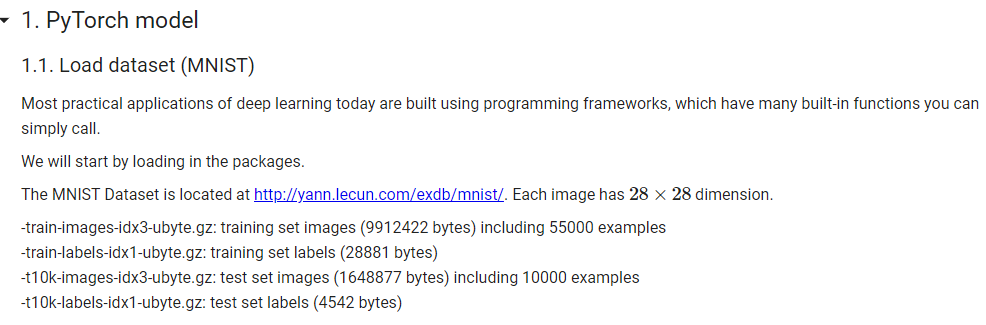

사용하는 데이터는 손글씨 데이터

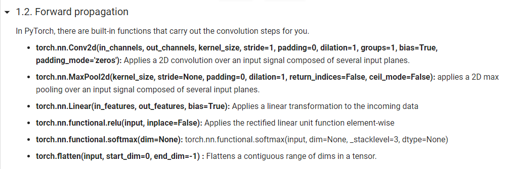

Conv함수의 dilation, groups,는 몰라도 됨

torch.nn.Linear 함수는 Fully connected

output의 결과는?

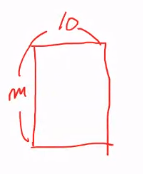

이런 모양이 나와야함

m은 미니배치 사이즈

10은 손글씨 0~9

1.3 build model에서

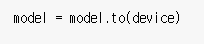

이 문장은 GPU에서 실행시키겠다는 의미

#### train

target과 output을 정해주면 스스로 loss를 구해줌

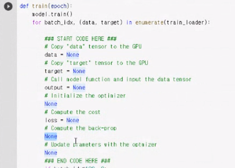

#### back propagation

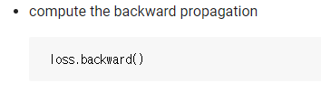

한 줄이지만 매우 많은 계산이 됨.

#### update parameters

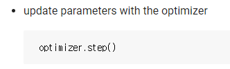

한 스텝 이동

#### test

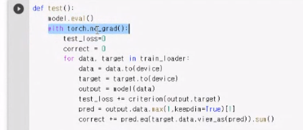

no_grad는

back prop을 하지 않겠다는 의미, 계산이 좀 더 가벼워진다.

test_loss += 는 로스값 누적

#### paperswithcode 

논문 + 코드가 같이 있는 사이트

잘 참고하면 좋음

## 추가 PPT 슬라이드

LeNet 이전에 Alex Net이 있었음

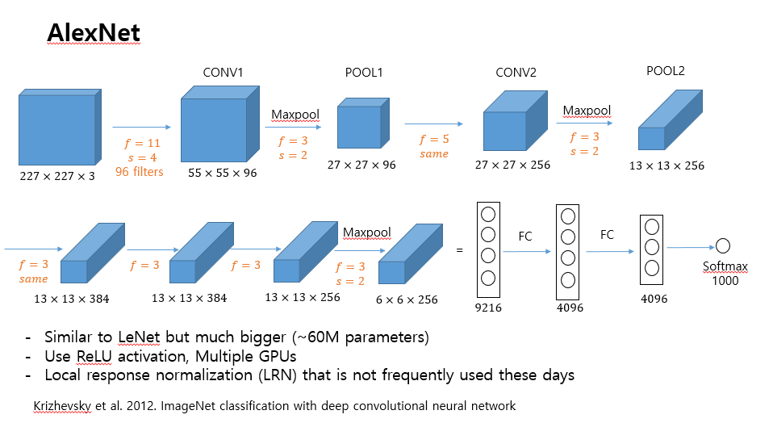

최근 많이 쓰는 레이어

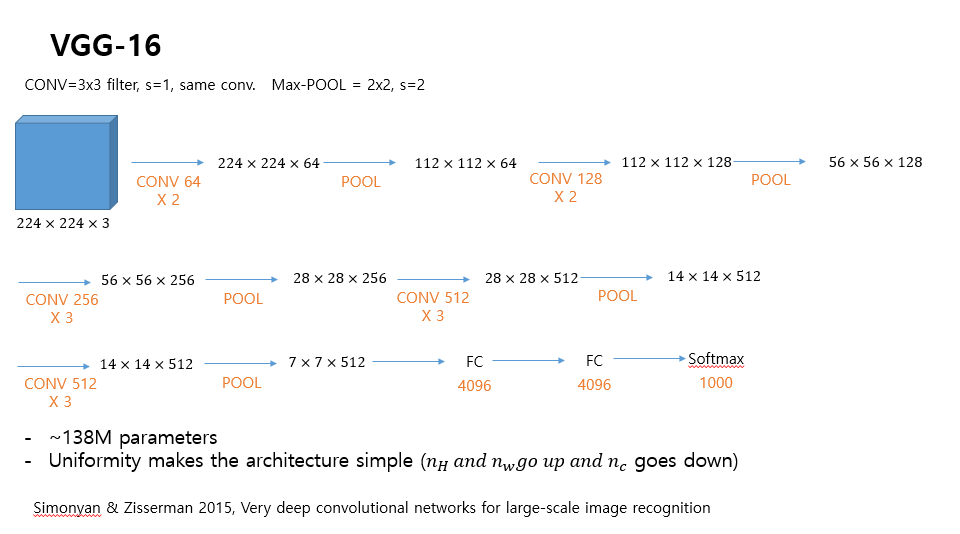

VGG-16

레이어가 16개

## ResNets

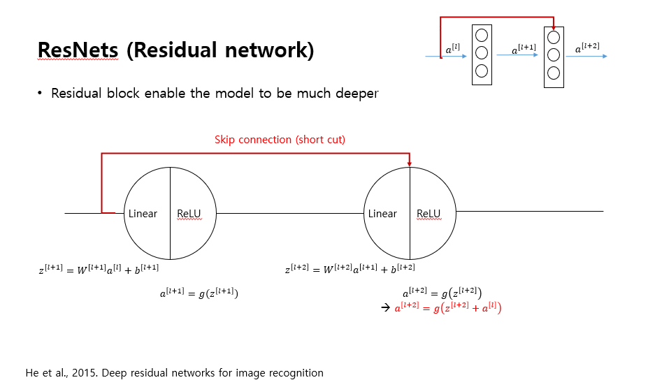

지름길을 이용하여 다음 레이어로 넘어가는 형식

왜 넘어가는가?

->

 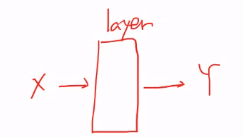

X인풋을 레이어에 넣으면 Y아웃풋이 나온다.

근데 만약 

X를 넣고 X가 나온다면?

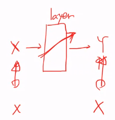

아이덴티 펑션이라고 함.

근데 여기서 Skip connection이 있으면 identy function을 구현하기가 매우 쉬워짐

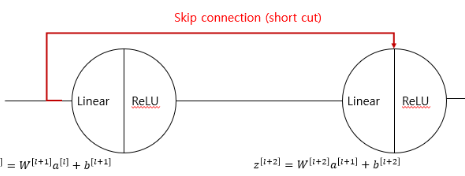

Skip connection이 이 사진

레이어가 함수를 표현할 수 있는 경우를 더 많게 해짐

#### 그러므로 ResNets은 최근 매우 표준이며 많이 사용된다.

-> 레이어, 네트워크를 더 많이 쌓을 수 있게 됨

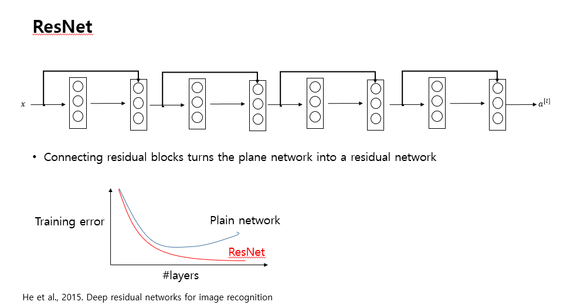

ResNet은 학습을 많이해서 생기는 에러 (Training error)가 줄어든다.

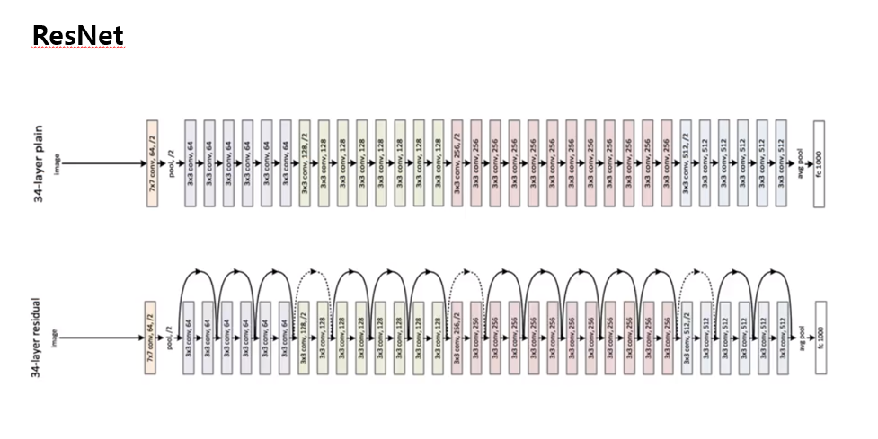

34레이어 까지도 있음