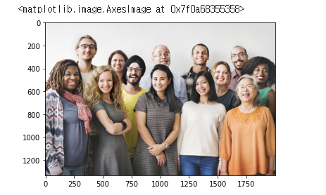
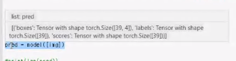
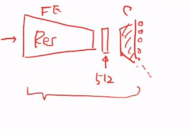

# 200601_W12D1_Pre-trained models, TransferLearning


기말고사는 이론 위주의 시험

범위는 아마 전체일듯


## Pre-trained models

이미 학습된 모델


이미 개발된 데이터들, 모델을 오픈하는형태


## 알렉스넷 이미지 분류 (AlexNet)


1000개의 분류 중 어느 곳에 속하는 지를 파악하는 코드


첫 직사각형 모양에서 이미지가 들어가서 conv를 한번 걸치면 정사각형 모양에서 긴 통나무 모양이 됨.


256개의 Feature를 추출


### 데이터 다운


### 

pretrained이기 때문에 weights도 같이 가져옴


### 모델의 evaluation


각 레이어 항목을 보여줌


Linear는 Fully connected


## Transform


우리가 가지고 온 AlexNet의 모델은 pretrain인데,


그때 학습에 사용한 데이터를 X, 아웃풋을 Y라 할때


X프라임을 새로 넣어서 Y프라임을 구하는 것이 지금 과정의 목표이다.


##### 이때 X와 X프라임의 형태를 같게 해주는 것이 바로 Transform임.


AlexNet의 input데이터와 사이즈를 같게함


0.485, 0.456 , 0.406 세 값은 RGB값임


### 이미지 가져오기


분류 작업을 위해 이미지 파일을 가져옴


### 이미지 변형


위에서 정의한 preprocess 함수를 이용해서 사이즈를 변환함.


unsqueeze(0)을 한 이유는 


### GPU 활용


cuba를 이용하여 GPU로 실행


### F.P


모델의 크기가 너무 크므로 백프롭을 안 하기 위해서 ?


아웃풋의 형태는 Tensor임


이제 이 1000개 중 가장 높은 값을 찾으면 됨.


## Display the predictions (1000개 중 가장 높은 값을 출력)


이름이 들어있는 json 파일을 이용하여 

가장 높은 값을 추출함.


json 파일의 index가 string형태


## 데이터가져오기2 - MNIST


nThreads는 스레드의 갯수, 윈도우에서는 n대신 4같은 숫자를 넣으면 거의 대부분 에러남.


MNIST 데이터 말고도 이런 많은 데이터들이 존재함.


### MNIST 데이터 로드


추출된 손글씨 그림


### 데이터로드 - CIFAR10 (이미지 데이터 6만개)


#### 데이터 로딩 코드


## 그 외 사용할 수 있는 여러가지 모델


## Semantic Segmentation


이미지를 나눠주는 것,


ex) 오토바이와 운전수

전체 코드

```python
import torchvision.models as models
from torchvision import transforms
import torchvision
import torch    
import urllib 
from PIL import Image  
import matplotlib.pyplot as plt

url, filename = ("https://github.com/pytorch/hub/raw/master/dog.jpg", "dog.jpg")
try: urllib.URLopener().retrieve(url, filename)
except: urllib.request.urlretrieve(url, filename)

input_image = Image.open(filename)
preprocess = transforms.Compose([
    transforms.ToTensor(),
    transforms.Normalize(mean=[0.485, 0.456, 0.406], std=[0.229, 0.224, 0.225]),
])

input_tensor = preprocess(input_image)
input_batch = input_tensor.unsqueeze(0) # create a mini-batch as expected by the model

model = models.segmentation.fcn_resnet101(pretrained=True) 
model.eval()
# move the input and model to GPU for speed if available
if torch.cuda.is_available():
    input_batch = input_batch.to('cuda')
    model.to('cuda')

with torch.no_grad():
    output = model(input_batch)['out'][0]
output_predictions = output.argmax(0)
palette = torch.tensor([2 ** 25 - 1, 2 ** 15 - 1, 2 ** 21 - 1])
colors = torch.as_tensor([i for i in range(21)])[:, None] * palette
colors = (colors % 255).numpy().astype("uint8")

# plot the semantic segmentation predictions of 21 classes in each color
r = Image.fromarray(output_predictions.byte().cpu().numpy()).resize(input_image.size)
r.putpalette(colors)  
plt.imshow(r)
```


아까 강아지 사진을 이런 식으로 배경과 분리할 수도 있음.


output.shape로 결과물의 형식을 확인하면


이런 형태가 나온다.


1213 * 1546의 데이터가 21개 있다는 의미.


이 21개가 21개의 Segment를 나타내는 의미일 것임.


아이템1 , 아이템2  등등


0축 방향으로 값이 가장 높은 것을 가져온 뒤, 색깔을 칠해줌


## Object detection


사진 속 물체가 어떤 물체인지를 판별해주는 기능


### Object detection2 - 사람




많은 인물이 담긴 사진에서 Object를 탐지함


가운데는 해당 모델이 탐지할 수 있는 Object들의 이름


```python
import torchvision  
from PIL import Image  
from torchvision import transforms 
import cv2 
import matplotlib.pyplot as plt

# Load pretrained model 
model = torchvision.models.detection.fasterrcnn_resnet50_fpn(pretrained=True) 
model.eval()

# Define the class name
COCO_INSTANCE_CATEGORY_NAMES = [
    '__background__', 'person', 'bicycle', 'car', 'motorcycle', 'airplane', 'bus',
    'train', 'truck', 'boat', 'traffic light', 'fire hydrant', 'N/A', 'stop sign',
    'parking meter', 'bench', 'bird', 'cat', 'dog', 'horse', 'sheep', 'cow',
    'elephant', 'bear', 'zebra', 'giraffe', 'N/A', 'backpack', 'umbrella', 'N/A', 'N/A',
    'handbag', 'tie', 'suitcase', 'frisbee', 'skis', 'snowboard', 'sports ball',
    'kite', 'baseball bat', 'baseball glove', 'skateboard', 'surfboard', 'tennis racket',
    'bottle', 'N/A', 'wine glass', 'cup', 'fork', 'knife', 'spoon', 'bowl',
    'banana', 'apple', 'sandwich', 'orange', 'broccoli', 'carrot', 'hot dog', 'pizza',
    'donut', 'cake', 'chair', 'couch', 'potted plant', 'bed', 'N/A', 'dining table',
    'N/A', 'N/A', 'toilet', 'N/A', 'tv', 'laptop', 'mouse', 'remote', 'keyboard', 'cell phone',
    'microwave', 'oven', 'toaster', 'sink', 'refrigerator', 'N/A', 'book',
    'clock', 'vase', 'scissors', 'teddy bear', 'hair drier', 'toothbrush'
]

# Load image 
img_path = './people.jpg'
img = Image.open(img_path) # Load the image

# Define and perform transformations
transform = transforms.Compose([transforms.ToTensor()]) # Defing PyTorch Transform

# Apply the transform to the image
img = transform(img) 

#Pass the image to the pretrained model 
pred = model([img])

print(len(pred))
print(pred[0]['labels'].size())

# Get the Prediction Score
pred_class = [COCO_INSTANCE_CATEGORY_NAMES[i] for i in list(pred[0]['labels'].numpy())] 

# Bounding boxes
pred_boxes = [[(i[0], i[1]), (i[2], i[3])] for i in list(pred[0]['boxes'].detach().numpy())] 
pred_score = list(pred[0]['scores'].detach().numpy())

# Get list of index with score greater than threshold.
threshold = 0.5
pred_t = [pred_score.index(x) for x in pred_score if x > threshold][-1] 
pred_boxes = pred_boxes[:pred_t+1]
pred_class = pred_class[:pred_t+1]

# Define a pipeline to get the image path and get the output image 
img = cv2.imread(img_path) # Read image with cv2
img = cv2.cvtColor(img, cv2.COLOR_BGR2RGB) # Convert to RGB
for i in range(len(pred_boxes)):
   cv2.rectangle(img, pred_boxes[i][0], pred_boxes[i][1],color=(0, 255, 0), thickness=3) # Draw Rectangle with the coordinates
   cv2.putText(img,pred_class[i], pred_boxes[i][0],  cv2.FONT_HERSHEY_SIMPLEX, 3, (0,255,0),thickness=3) # Write the prediction class

# Display the output image
plt.figure(figsize=(20,30)) 
plt.imshow(img)
plt.xticks([])
plt.yticks([])
plt.show() 


```




pred의 데이터 타입은 List


분석 결과가 정확도 50%이상만 추출하게 코딩


결과 : 


# Transfer_Learning


어린아이는 사자 사진을 보고 만화로 그려진 사자를 봐도 "어 사자다" 라고 알아차린다.


하지만 기계의 경우 비슷한 물체를 탐색하기가 힘든데, 만화 뿐만 아니라 주간 -> 야간 의 경우에도 판단이 힘들다.


#### 


#### 방법1:(feature extractor)


##### Conv 레이어로 input데이터의 Feature Vector를 뽑아낸 뒤,  그 벡터를 이용하여 

##### Fully Connected layer를 통과시켜 Y(아웃풋)을 뽑아낸다.


이때의 Conv 레이어를 Feature Extractor 라 하고

FC레이어를 Classifier라고 한다.


Feature Extractor의 범위는 설정하기 나름,


#### 방법2 : (Fine-Tuning)

#### pre-train 모델을 Initial 모델로 사용(이미 학습된 ALexNet은 아주 좋은 초기값이 됨.)

#### 그리고  그 후 야간 데이터를 가지고 2차로 데이터를 학습시킴


Edge detectors, color blob detectors 와 같은 역할을 Trained 모델에서 해줌.


기존 데이터 셋과 새로운 데이터셋이 비슷하면 그냥 오리지널 데이터셋을 사용


하지만 4번째 경우가 중요

새로운 데이터셋이 매우 크며, 오리지널 데이터와 다르면 새로 학습을 시켜주는 것이 좋음


1번째는 비슷하기에 그냥 기존 것 사용해도 OK


2,3이 애매한 경우


1번의 경우

그대로 냅두거나 적게만 학습시킴


4번의 경우

많은 데이터들을 바탕으로 재 학습시킴


결국 데이터셋이 Very different일 경우 fine-tuning을 하는 것이 좋다.


## 코딩


pre-trained model을 매개변수로 받음. 


train_model(model , criterion.....)

여기서 괄호 안에 model임


기존 모델의 weights를 미리 복사해둠 (튜닝을 하기 위해)

그 후 성능이 좋을 때 마다 덮어 씌우고, 마지막에 가장 결과가 좋은 값을 사용


정확성이 가장 좋은 것을 저장


scheduler는 Learning rate를 조절하기 위함





Res net을 이용해 나온 512개의 Feature를 통해 class가 10개정도 나왔을 때,


필요한 것만 남기고 나머지는 버림


bee와 ant 두 class만 남김


전체를 다 fine tuning을 한 경우라서

initial 값을 사용하고 freeze 하지 않고 다시 train 하는 과정