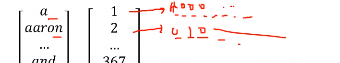
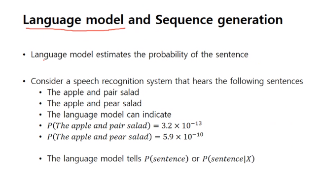

# 200604_W12D2_RNN

## Recurrent Neural Networks

머신러닝의 가장 성공한 분야인

#### 감정분석, 추천시스템

뿐만아니라

##### 음성인식, 기계번역(언어번역), 영상행동인식(CCTV 같은), 자연어처리

등등 많은 분야에서 사용된다.

특징은?
Input 데이터의 Global Dependency가 강함 (맨 앞과 뒤가 서로 연관되어있음)

## 자연어 처리

명사가 나오면 1이 나오도록 설정

먼저 사전을 만든 뒤, 10000개의 단어를 넣어놓고 1~10000의 번호를 각각 부여,

만약 사전에 없는 단어라면 UNK(Unknown)을 부여

우리나라 이름으로는 ''말뭉치'' 로 많이 사용함.

사전 데이터를 벡터로 바꾸는 가장 간단한 방법은? 

-> One hot code

한 부분만 1이 되고 나머지는 0이 되는 코드 

a는 1000000

aaron 은 01000000 

같은 형태로 나타냄

## CNN을 안 쓰는 이유는?

Input 데이터가 가변적이며, Global dependecy를 가진 데이터들, Longterm Dependency를 보유한 데이터들이기 때문

## RNN의 구조

시간이 지남에 따라 (T -> 0, 1, 2 )

그 전의 데이터를 이용해서 a1, y2, a2, y3 등등의 데이터들을 만듬

펼쳐진 데이터가 루프로 표현되면 오른쪽 끝의 [ ] 가 되고

펼쳐서 쓰면 ... 에 생략된 모든 데이터들이 된다.

즉 Teddy Roosevelt를 판단하기 위해 그 전의 단어들을 사용한다는 의미

## 전전파(Forward Propagation)

렐루와 시그모이드를 사용

학습을 통해 우리가 W와 b를 설정

## 역전파(Backward propagation)

역전파는 좀 어려움 

경로가 매우 많기 때문.

그러므로 RNN의 역전파는 매우 어렵다.

하지만 우리는 프레임워크(Pytorch)가 실행해주기 때문에 프레임워크를 사용하면 된다.

## RNN을 사용하는 방법

어떤 방식으로 RNN을 사용하는가

One to many는 generation(Music) 모델임

One to One은 잘 안씀

Many to one은 문장 분류, 판단

Many to Many는 고유명사 판단

Many to Many 2  모든 input을 받고 오른쪽으로 넘기면서 out put이 끝날 때 까지 연계

기계 번역 (문장을 끝까지 듣고 판별)

## RNN의 모델

언어 모델은 내가 '나' 라는 단어를 넣었을 때

'나' 라는 단어와 어울리는 단어를 예측하는 모델

이게 반복되어서 문장이 생성됨

ex -> 나, 나는, 나는 ~,  나는 ~~~

언어 모델은 문장의 적합함과 틀림을 구분할 수 있다.

ex) The apple and pari salad는 어색한 문장이라고 판별.

## 언어 모델은 어떻게 만드는가

트레이닝을 위한 큰 문장 사전이 필요함.

성경을 자주 씀 (번역이 매우 잘 되어 있음)

Cats average 15 hours of sleep a day 라는 문장을 주고, one-hot code의 벡터로 연계

UNK도 코드로 바꿔주어야함.