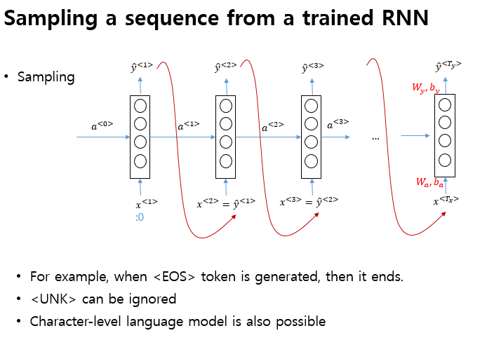

# 200611_W13D1_RNN 이어서

딥러닝은 크게 이미지 분류와 NLP 두가지 분야로 나뉘어지는데

NLP는 기업쪽이 고객 데이터 분석을 하기 위해서 많이 연구 되고 있다.

## RNN의 종류

감정분석의 경우는 Many to  one

기계 번역의 경우는 Many to Many 모델을 사용한다.

언어 관련 RNN은 Language model, 사전 을 만들어서 단어를 분석한다.

학습 역시 많은 양의 영어 text 데이터를 활용.

softmax를 사용하여 각 단어 다음에 맞는 어울리는 단어를 찾아준다.

RNN을 통한 언어학습의 최종 목표는 문장을 생성할 수 있게 학습시켜주는 것

단어 단위가 아니라 알파벳 단위(Character-level)도 가능은 하지만 보통은 단어 단위로 함

생성된 문장들 예시

문제 : vanishing gradient problem 해결하기

해결 방법은 GRU, LSTM 두가지가 있음

GRU 모델, 간단한 방식임

GRU의 확장 버전

GRU와 LSTM의 비교

I - u 는 update 밸브

I - f 는 forget 밸브

I - o 는 output 밸브

GRU가 더 간단하고 성능은 LSTM이 더 좋음.

그러므로 GRU를 먼저 써보고 성능이 잘 안나오면 LSTM으로

#### RNN을 Deep 하게 쌓을 수 있는가?

쌓을 수 있음

## 코드 실습

각 나라에 맞는 사람 이름을 학습, 출력시키는 모델

단어 단위로 하면 너무 커지므로 Character-level로 함 

카테고리별로 각 나라 사람의 이름들을 넣어주면서 학습

코드의 전체 구조

