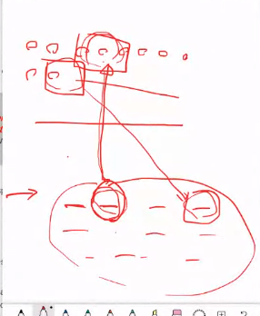
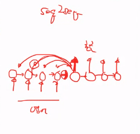
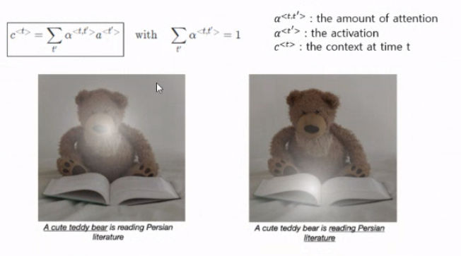
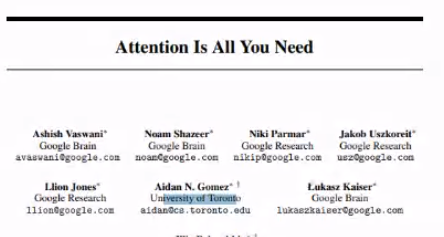
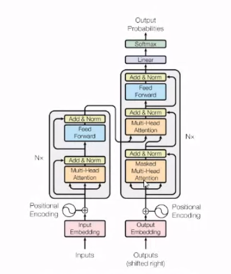
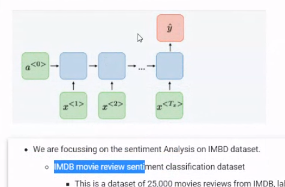

# 200615_W14D1_Attention

이번 수업이 마지막

이번주 목요일 휴강

NLP 녹강 1시간 있음

금요일에 시험

Attention이란?

주목, 집중의 의미로

전체 문장을 다 읽고 번역을 하기 보단

특정 단어를 집중해서 매칭되게 번역을 해주는 방식

Seq2Seq 방식과 비슷

Attention은 자연어처리, 인지과학에서 온 개념

영상처리에서 사용되는 Attention (image to text)

Attention은 매우 활성화된 분야로 구글에서 관련 논문을 내기도 함.

자연어처리에 Attention만 있으면 된다는 논문

이 논문에서는 모든 Structure가 Attention임.

## 실습

영화 리뷰 데이터를 긍,부정 분류하는 과정

IMDB가 리뷰 데이터

