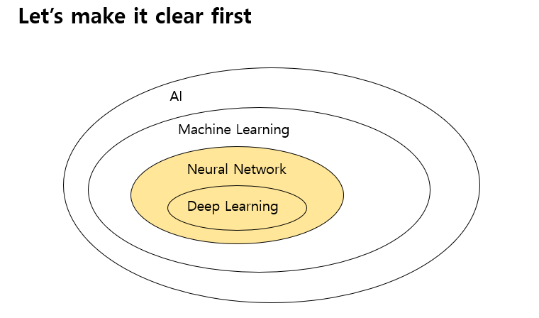
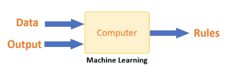
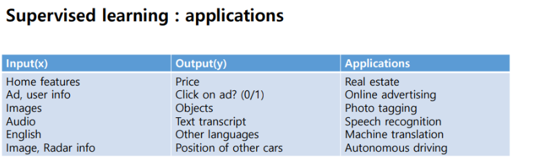

## 필기

## 딥러닝의 범위는?

AI>ML>NN>DL

실제 **AI**는 매우 큰 범위고, 

**머신 러닝**은 AI를 이루기 위한 하나의 방편

**머신 러닝**은 기계에 무언가를 학습 시키는것.

**신경망**은 머신 러닝을 이루는 하나의 방편 중 하나로, 신경망 말고도 머신러닝을 구성하는 것들이 있다.

**딥러닝** 역시 신경망을 구축하기 위한 방법 중 하나

우리가 수업에서 다루는 범위는 신경망과 딥러닝.

## 머신러닝이란?

로직을 만들기 위해 사람이 개입하지 않고 데이터와 Output만을 가지고 Task를 수행하기 위한 Loigc을 모델 스스로 생성 -> **머신러닝** 

#### 정리하면, 사람이 개입하지 않고 컴퓨터 스스로 데이터와 결과값을 이용하여 새로운 Logic을 도출해 내는 것.

## 머신러닝이 왜 필요한가?

#### 사진을 구분하거나 음악, 자연어처리 등 알고리즘을 구현하기 힘든 문제를 기계에 학습시킴으로써 적합한 모델을 찾을 수 있게 된다.

## 머신러닝의 흐름

#### ML의 플로우 : 문제정의 -> 데이터 수집 -> 알고리즘 정의

## 머신러닝의 역할-2가지

#### 머신러닝이 잘해야 하는 부분

##### 1.우리가 가지고 있는 데이터를 잘 설명할 수 있어야한다.

##### 2.우리가 가지고 있지 않은 (새로운 데이터) 도 잘 설명할 수 있어야 한다.

## 머신러닝-스팸처리

##### 일반 알고리즘 구현시

문제를 분석 -> 알고리즘을 작성 -> 테스트 -> 성공시 끝, 실패시 문제분석부터 다시 

##### 머신러닝시

문제를 분석 -> 데이터를 학습 -> 솔루션 평가 -> 성공시 끝, 실패시 데이터 학습 방식을 바꿈 

## ML의 종류 (시험 안나올수도?)

- 지도학습

특정 데이터를 어떤식으로 다루도록 지도해주는 학습.

주로 **분류** 문제를 해결하는데 사용. ex) 영어 input, 다른 언어 output = 기계번역

- 비지도학습

스스로 주로 Clustering에 사용

기존 데이터를 그룹으로 나눠서 그 범위를 벗어나면 고장으로 탐지하는 방법

- 강화학습

시행착오를 통해 학습하는 경우 : 로봇,게임 등에 많이 사용 ex)알파고

특정 행동을 하고 리워드를 받는 식, 그 리워드를 바탕으로 **policy**(규칙)을 스스로 수정한다.

- 배치러닝

많은 데이터들을 한번에 학습 시키는 학습 방법

- 온라인러닝

데이터를 나눠서 단계별로 학습시키는 방법, 미니배치라고도 불리며 배치학습보다 많이쓰임.

## 데이터의 양과 성능

데이터 양이 많으면 많을수록 결과 값(성능)이 좋아진다.

#### 즉 머신러닝은 좋은 알고리즘과 많은 양의 데이터가 필요하다.

알고리즘 = 학습데이터를 의미

#### 오버피팅 : 너무 많은 학습데이터를 받아서 새로운 데이터를 받을 때 정확하게 인식을 하지 못하는 경우.

## 일반화

표본 데이터가 새로 들어온 데이터와 다를 때 이를 맞춰주는게 일반화(generalization)

## UnderFitting

##### 가지고 있는 데이터 (표본데이터)를 설명하지 못 할때

## 엔트로피, 크로스엔트로피

##### Entropy는 불확실성을 의미

##### cross-entropy 는 예측 확률과 실제 확률의 차이를 의미한다.(확률 분포의 거리이다.)

예측확률과 실제 확률이 같아지면? -> Cross-entropy값이 entropy 값이 된다.

만약 예측 entropy가 더 크면 값의 차이가 있다는 뜻. (클수록 차이도 큼)

## 크로스 엔트로피를 사용하는 이유?

##### 왜 크로스 엔트로피를 쓰느냐?

-> 크로스 엔트로피를 쓰는 이유는 Convex(항상 장애물이 X)하기 때문이다.

## gradient-descent

최적값을 찾아갈 때 흔히 사용하는 방법.

가중치(w)와 바이어스(b)값들을 조절하여 cost function이 최소가 되도록 하는 값을 찾는 방법이다.

## back propagation

**역전파**(Backpropagation)는 먼저 계산 결과와 정답**의** 오차를 구해 이 오차에 관여하는 값들의 가중치를 수정하여 오차가 작아지는 방향으로 일정 횟수를 반복해 수정하는 방법이다.

전전파와 달리 계산 결과를 미리 알고 오차를 구하는 것?

전전파는 입력층 -> 은닉층 -> 최종 결과 출력인데

역전파는 input과 output값을 알고 있는 상태에서 신경망을 학습 시키는 방법이다.

(= Supervised learning, 지도학습)

## loss function = cost function

오차를 줄여주는 함수

## Shallow NNs

Shallow는 '얕은' 이라는 의미

Deep learning의 Deep NNs와 반대의미

얕은 뉴럴 네트워크를 뜻함, 레이어의 숫자가 적다.

layer가 2개정도를 Shallow NNs라 함.

## Deep NNs

역전파 사용 X , 점화식으로 구할 수 있기 때문

히든레이어의 갯수를 무한히 늘리지 않고 딥러닝을 사용하는 이유는?

왼쪽(딥러닝)과 오른쪽(셀로우러닝)의 역할은 같음.

but 적은 게이트 수로 실행을 할 수 있는 건 레이어가 깊은 쪽.

## Sigmoid (=Activation 함수 중 하나)

가중치(w)와 바이어스(b)값이 각각 평면의 기울기와 이동거리를 의미한다고 할 때,

그 평면 선의 왼쪽에 있는 데이터를 0 , 오른쪽을 1

이런 식으로 데이터를 구분하게 해주는 함수임

## hidden layer

hidden layer에서 하는 일은? 선형변환, 비선형변환 한번씩

 hyper plane 하나로 구분하기 힘든 문제일 경우 hyper plane을 확대, 회전, 변형 등의 과정을 통해 정확도를 높여준다.

## ReLu(=Activation 함수 중 하나)

0보다 작으면 0값,

0보다 크면 y=x값을 가지는 것이 ReLU 이다.

##### sigmoid와 tanh보다 결과값이 훨씬 잘나오는데 그 이유는  

0보다 큰 양수값의 미분이 항상 1이기 때문.

## L2 정규화

가장 보편적으로 사용되며, 가중치가 클 수록 큰 페널티를 부과함으로써 과적합을 막는 정규화 방법임

## Drop out 정규화

훈련 중 특정 레이어를 없애는 방식의 정규화

끊어지지 않은, 연결된 애들만 업데이트를하고 전전파를 할 때 또 다시 연결을 만든다.

트레이닝 할 때 마다 연결 상태가 달라짐.

그러나 의외로 매우 잘 작동하며, 요즘에는 매우 많이 쓰이는 정규화 방식이다.

## 그 외 정규화 방법들

data augmentation - 사진을 뒤집어서 2배의 데이터를 학습시키는 것

(고양이 사진은 좌우 반전해도 고양이사진)

Early Stopping - 과적합을 막기 위해 에러율이 줄어들다가 다시 증가하려고 하는 지점에서 멈추는 방법

## Vanishing gradient

학습을 해도 학습이 되지 않는 현상

이유는 ?

##### 1.레이어가 너무 길다.(웨이트가 계속 곱해짐)

##### 2.활성화 함수(sigmod, tanh) -> 신호(gradient)가 사라져버림

-> 미분 값이 0이기 때문.

unstable 한 gradient라고도 함.

## 미니배치 - 최적화

많은 데이터들을 특정 사이즈로 쪼개서 epoch을 돌리는 것

미니배치의 사이즈가 1인 경우 (=배치와 같음)

##### 이를 stochastic gradiant라 부름.

곡선이 이도 저도 아닌 shape가 생김.

그래서 mini batch를 가장 많이 쓴다. (보통 2의 배수로 잡고 )

## 탐험 vs 재사용 - 최적화

#### Exploration =탐험

내가 가진 지식이 불충분 하다고 가정 

Global optimal을 Searching 하는 과정

(=미니배치, stochastic )

#### Exploitation = 재사용 , 사용

내가 가진 데이터를 가지고 잘 활용을 하여 더 좋은 성능을 내겠다.

(=배치)

둘 다 optimization을 찾는데 매우 중요함.

but 검색의 초반에는 stochastic 가 유리,

데이터가 쌓이면 쌓일수록 batch가 유리.

running epoch에 따라 다르게 최적화 전략을 택하는 것도 좋음,

어떤 것에 비중을 두느냐에 따라 테크닉이 달라짐.

## exponentially weighted average - 최적화

##### exponentially weighted average를 쓰는 이유는?

-> 메모리가 적게 든다.

## momentum 방식 - 최적화

과거의 데이터들을 통해 스스로가 -> 방향으로 가는 것을 깨닫게 하여(그때그때의 Gradient를 이용하는 것이 아닌 평균적인 움직임을 이용함) 학습시키는 방식

## RMSprop 방식 - 최적화

Gradient가 급하면 천천히 내려오고 완만하면 빠르게 내려오도록 설정해주는 방식

## Adam optimization - 최적화

RMSprop이랑 momentum방식을 합친 것

## Learning rate decay(부식) - 최적화

위에서 설명한 **Exploration(확장)** **Exploitation(사용)** 개념이

초기에는 확장, 후반에는 사용 개념이 더 중요해야함.

(초반에 Learning rate가 높으면 그 값에 따라 그래프가 요동을 침 -> Exploration, 확장)

(후반에는 그래프가 일정하게 됨 -> Exploitation, 사용)

그래서 Epoch이 진행될 때 마다 Learning rate를 감소시켜줌 

## 배치 정규화

각 배치에 대한 평균 값과 분산을 구하고

그 값으로 정규화를 함.

배치 정규화가 잘 작동되는 이유는?

코스트 함수 (gradient) 를 조금 더 부드러운 곡선으로 만들어주기 때문

## 소프트맥스

Softmax(소프트맥스)는 입력받은 값을 출력으로 0~1사이의 값으로 모두 정규화하며 출력 값들의 총합은 항상 1이 되는 특성을 가진 함수이다.

이미지 구별 등에 활용됨, 0.7 등 가장 높은 숫자가 나온 항목으로 사진 분류

## CNN(Convolution Neural Network)

컴퓨터 비젼 -> 이미지, 사진, 카메라등등

이미지 분류 , 물체 탐색, 뉴럴 스타일 전환 등등 CNN은 다양한 분야에 사용된다.

 CNN은 합성곱 뉴럴 네트워크 이며, 필터와의 합성 곱을 통해 이미지를 분류함.

## Edge detection

filter를 사용하여 사진의 Edge를 구분해내는 방법

필터는 높을수록 하얀색, 낮을수록 검정색에 가까움.

## Padding과 Stride

필터를 사용하게되면 원본 이미지에서 2x2정도가 짤려나가게 되는데 이를 방지하기 위해서 더미데이터로 바깥을 확장하는게 padding

Stirde는 걸음걸이

두칸씩 이동하게되면 output이 줄어듬

filter를 사용한 갯수만큼 결과값이나옴

## Convolution output 갯수 구하기

(input 사이즈 +2p - 필터사이즈 )  / Stride  + 1

ex) 필터사이즈5, stride 2, input 39, 패딩0, 

39 + 0 - 5 / = 34

34 / 2 

17임

## max Pooling

필터 사이즈와 동일한 범위 내에서 가장 큰 값을 추출하는 것

#### Polling은 왜 하는가?

이미지가 클 때 정보를 거의 잃지 않으면서 이미지를 축소하는 방법 

## LeNet5 (르넷5)

레이어는 2개의 레이어를 사용

각 레이어에서는 CONV 한번, MAX Pooling 한번씩을 실행한다.

## Conv는 왜 잘 작동하는가

#### Sparse Connection(성긴 연결)

-일부만 봐도 데이터를 파악 가능, 즉 Connection이 부분적으로 연결 되어 있음.

#### 파라미터 쉐어링

-FC(Fully Connected)와 달리 ConV는 같은 필터를 쓰기 때문에 계산하는데 사용되는 파라미터가 동일하다.

즉 Weights를 공유하기 때문에 , 파라미터를 공유함

## RNN(Recurrent Neural Networks)

머신러닝의 가장 성공한 분야인

#### 감정분석, 추천시스템

뿐만아니라

##### 음성인식, 기계번역(언어번역), 영상행동인식(CCTV 같은), 자연어처리

등등 많은 분야에서 사용된다.

특징은?
Input 데이터의 Global Dependency가 강함 (맨 앞과 뒤가 서로 연관되어있음)

## CNN을 안 쓰는 이유는?

Input 데이터가 가변적이며, Global dependecy를 가진 데이터들, Longterm Dependency를 보유한 데이터들이기 때문

## RNN의 종류

 one to many = 음악 생성

many to one 감정분석

many to many 기계번역, 이름 인식