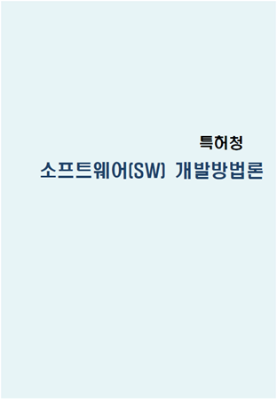
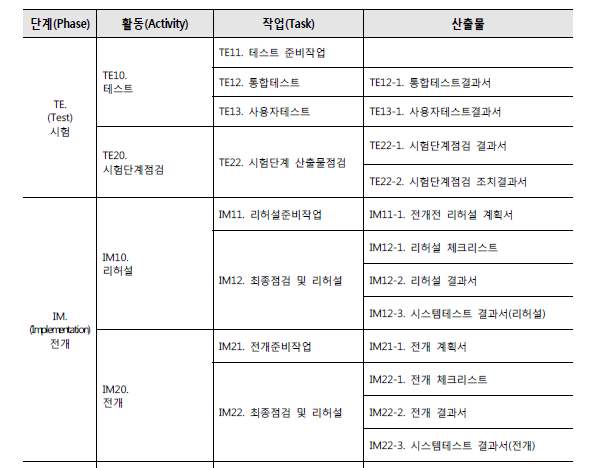
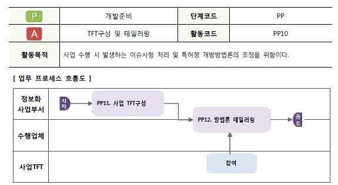

# 200401_W1D1_전자정부프레임워크,개발준비와분석단계

교재는 2가지를 사용

PPT, PDF

## 이 과목은?

#### 소프트웨어 개발에 관련된 규정, 법률을 배움.

#### 개발방법론 -> 개발방법절차

소프트웨어 유지방법론, 폐기방법론 등도 있는데 우리는 개발방법론만 다룸.

이 PDF를 주로 사용. 

특허청이라는 단어에 의미를 두지 말고 그냥

'전자정부 소프트웨어 개발방법론' 이라고 생각하면 됨.

즉 주요 관심사는 프로그래밍이 아니라 문서.

##### - 관련 규정을 다룬다.

##### - 프로그램이 아닌 **문서**가 주요 관심사항이다. 그 문서가 엄청나게 많다. **양식**은 더 많다.

##### - 시계열적(Time Series)인 업무를 다룬다.

시계열적 업무를 다룸 -> 시간의 흐름에 따라 다루는 업무가 다르다.

##### - 정보보안, 전자정부 프레임워크, EA, 웹 접근성, 웹 호환성 등과 밀접한 관계가 있다.

##### - 상식적인 내용을 다룬다.

##### - 처음 접하는 용어가 많이 출현한다.

## 용어의 중요성 - (알아야 다음 단계로 갈 수 있다.)

**전자정부법** **(****조** **–** **항** **–** **호** **–** **목****)                                                                                                www.law.go.kr**

**제2조(정의)** 이 법에서 사용하는 용어의 뜻은 다음과 같다.

1. "전자정부"란 정보기술을 활용하여 **행정기관 및 공공기관(이하 "행정기관등"이라 한다)**의 업무를 전자화하여 행정기관등의 상호 간의 행정업무 및 국민에 대한 행정업무를 효율적으로 수행하는 정부를 말한다.

2. "행정기관"이란 **국회**ㆍ**법원**ㆍ**헌법재판소**ㆍ**중앙선거관리위원회의 행정사무를 처리하는 기관**, **중앙행정기관**(대통령 소속 기관과 국무총리 소속 기관을 포함한다. 이하 같다) 및 그 **소속 기관**, **지방자치단체**를 말한다.

3. "공공기관"이란 다음 각 목의 기관을 말한다.

   가. 「공공기관의 운영에 관한 법률」 제4조에 따른 법인ㆍ단체 또는 기관

   나. 「지방공기업법」에 따른 지방공사 및 지방공단

   다. 특별법에 따라 설립된 특수법인

   라. 「초ㆍ중등교육법」, 「고등교육법」 및 그 밖의 다른 법률에 따라 설치된 각급 학교

   마. 그 밖에 대통령령으로 정하는 법인ㆍ단체 또는 기관

12. "정보기술아키텍처"란 일정한 기준과 절차에 따라 업무, 응용, 데이터, 기술, 보안 등 조직 전체의 구성요소들을 통합적으로 분석한 뒤 이들 간의 관계를 구조적으로 정리한 체제 및 이를 바탕으로 정보화 등을 통하여 구성요소들을 최적화하기 위한 방법을 말한다.

##### Point

- 행정기관, 공공기관 등을 합쳐서 행정기관이라고 한다.

  - 아래 5가지를 **5부**라 한다.

  - 행정부 = 중앙행정기관,  

  - 국회 = 입법부 

  - 법원 = 사법부 

  - 한법재판소 = 제 4의 권력기관

  - 중앙선거관리기관 

    

- 대통령, 국무총리의 소속기관은 다르다. 

  - 대통령 - 국가정보원, 감사원 , 교육부, 국방부 (공수처는 현재 진행중) 

    - 뒤에 '부'나 '원' 이 들어가있는 기관

    - 대통령의 소속기관의 소속기관은 '청'이 들어간다.

      

  - 국무총리 - 보훈처, 법제처 등 뒤에 '처' 가 들어가는 기관

- 지방자치단제 : 서울특별시, 부산광역시 같은 '시'나 충청남도, 전라남도 같은 '도'

- 공공기관 : 위의 가,나,다,라 에 속한 모든 기관. 

  - ##### 전자정부의 대상은 행정기관과 공공기관의 주 수요층이므로 알아둘 필요가 있다.

    - ex) 대학교는 고등교육법에 의해 설치된 학교이므로 전자정부의 대상이 된다.

# 1장 개요 (pdf로 이동) 

### 1.목적

특허청 -> 전자정부

구축사업자란 ? 삼성SDS 나 중소 SI 기업 등의 소프트웨어 개발 업체

##### 이러한 개발업체들의 방향을 '소프트웨어 개발방법론'을 통해 개발생산성을 향상시키고 개발시스템 품질을 향상시키는 것에 목적이 있다.

@품질이 향상되는 이유? 

-> 문서에서 요구하는 산출물들을 만들면 품질이 자연스럽게 향상되기 때문.

-> 개발방법론에 의해 체계적 관리가 된다.

##### 공공시스템의 개발을 할 때에는 '관련규정'의 2가지를 반드시 따라야 한다.

### 2.적용대상 및 범위

##### 1.전자정부 프레임워크가 필요한 공공시스템

##### 2.웹기반 시스템

에 한해서 사용한다.

 '소프트웨어개발방법론'의 범위 : 개발 프로세스를 정의해놓음. 

##### 사업 관리 부분은 이 개발방법론이 아니라 '특허청정보화사업 표준가이드' 를 따른다.

##### 구축담당자와 사업담당자가 협의를 통해 수정,추가,삭제 등등이 가능하다.

(사업의 특성에 따라)

### 3.구성개념

가볍게 읽고 넘어가셈

### 4.방법론 특징

개발프로세스 = 분석,설계,시험,구현 이 주요 프로세스이며

전체는 7가지가 있다. (개발준비,분석,설계,구현,시험,전개,인도)

### 5.문서 구성체계

### 6.방법론 구조

### 7.코드 체계

정리 : 각 프로세스에 따른 코드가 부여되어있음.

ex)

작업코드 PP21 = 개발준비의 2단계의 1번째 작업.

# 2장 개발프로세스

### 1.개발방법론 표준 프로세스

 분석,설계,시험,구현 이 주요 프로세스이다.

**- Phase  :  7** **단계** 

**–  Activity : 23** **활동**

 **– Task    : 52** **작업**

### 2. 표준 프로세스별 산출물

TO12. EA 현행화 : Enterprise = 기업,조직

조직이 가지고 있는 자원에 대한 Architecture을 제공하는 것.

우리 조직에 소프트웨어 전개가 끝난 상황이므로, 조직의 IT 역량이 늘어난 것에 대하여 현행화를 해주어야 한다.

### 3.사업규모별 표준 프로세스

10억이상, 6개월 이상일 경우 대규모로 구분

아니면 소규모로 구분

이 구분은 담당 공무원의 재량으로 구분을 한다.

사업에 필요한가 아닌가로 특정 프로세스를 스킵할 때, 사업 규모로 구분을 한다.

해당 표는 절대적인 바이블이 아니고, 사업 담당자간의 합의가 중요하다.

### 다시 PPT로

**행정안전부** **엔터프라이즈아키텍처**  **(EA)** **관리 운영 지침**

**제2조(용어정의)** 이 지침에서 사용하는 용어의 정의는 다음 각 호와 같다.

1. "행정안전부 엔터프라이즈아키텍처(Enterprise Architecture)(이하 "행정안전부 EA" 라 한다)"라 함은 일정한 기준과 절차에 따라 업무, 데이터, 응용, 기술, 보안 등 행정안전부 전체의 정보화 구성요소들을 통합적으로 분석한 뒤 이들 간의 관계를 구조적으로 정리한 체계를 말한다.

##### 우리 조직이 가지고 있는 IT 능력을 정리해놓은 것.

### 4.범정부 EA메타정보와 연관관계

나중에 다시 확인

# 3장 단계별 개발 가이드 

## 1.개발준비단계(PP)

#### PP10-TFT구성 및 테일러링

테일러링? 양복을 갖춰입는 것,

사업 담당자와 합의를 통해 어떤 프로세스를 뺄지 넣을지 에 대한 상의를 하는 것을 의미함

TFT란. **태스크 포스 팀**(Task Force Team) 으로

사업을 위한 임시 팀을 구성하는 것을 말함.

부서 이기주의 때문에 보통 맡기 싫어함.

TFT 구성 - PP11

테일러링 - PP12

제안요청서는 제안서를 쓰기 위해 작성. 

제안서를 잘 작성하는 것이 중요함.

사업자(개발업체) 입장에서는 제안서를 잘 작성하여 경쟁으로 입찰되는 것이 매우 중요함.

계약 후에는 사업수행계획서를 작성하여 사업 수행 계획을 알려주어야 한다.

131페이지에 해당 보고서 양식이 존재. (안중요한듯, 연락처 입력란이 빠져있음.)

### PP11 - 사업TFT구성

관련 부서의 핵심 담당자를 중심으로 해야하는데, 그러한 핵심 담당자는 TFT팀에 잘 오려고 하지 않는다. (보통 막내나 신입사원을 보냄, 일이 힘들기 때문)

구성 계획서에 TFT 운영에 관한 규칙 등을 작성해야함.

#### 고려사항 3가지 참고!

정보화품질관리 담당자?

- 일반 공무원이 판정하기 힘들기 때문에 

  정보 감리 통신 같은 전문가(감리인)들에게 용역을 줘서 

  그러한 전문가들이 사업자가 구축한 사업들의 품질을 검증해주는 경우가 있다.

참조의 관련 부서는 

특허청 기준의 부서, 다른 부서도 가능

### PP12 - 테일러링

이 과정이 끝나면 테일러링 결과서를 제출해야함.

제안서에 있는 것과 내용이 똑같을 경우 제출 안해도 됨. but 그 이후 변경사항이 있거나 테일러링이 필요할 것 같으면 수행.

#### 위의 고려사항 3가지 참고

특정 프로세스를 제거한다면 그 제거를 하는 합당한 사유, 이유가 필요하다.

합리적인 이유 없이 특정 프로세스를 빼면 봐주기 등의 논란이 일어날 수도 있다.

### P20 - 개발 사전 준비

PC 반입 절차, 해당 부처에 시스템, DB등을 사용해야 하므로 행정절차를 수행해야한다.

사용요청, 승인 등의 과정

### PP21 - 특허청 정보화 개발준비

MS는 대부분 관리 시스템.

DQMS = 상시 품질 관리 시스템 (Q가 들어가면 거의 품질)

자원 사용 신청을 한 뒤, 표준 교육을 받고 개발에 들어가면 된다.

## 2. 분석단계 (AN)

사용자들의 요구사항을 분석하는 단계.

### AN10 - 요구사항 분석

이러한 요구사항이 맞는지 계속해서 사업 담당자와 회의를 하는 과정

시간적인 한계를 둘 필요가 있다.

그렇게 분석한 요구사항을 액터나 유스케이스 등으로 나타낸다.

### AN11 - 요구사항 수집

인터뷰를 통해 담당자에게 요구사항을 알아내는 과정.

- 인터뷰계획서 예시.

기타에는 인터뷰가 늦어진 이력, 이유 등을 기록해두는 것이 좋음.

- 인터뷰 결과서 예시 (인터뷰 결과서는 중요함.)

  

질문, 답변을 기록함.

### AN12 - 요구사항 정의

인터뷰 결과를 정리하고 정의하는 과정.

- 요구사항 정의서 예시

  

  

요구사항 ID를 잘 설정해두어야 나중에 찾아볼 때 헷갈리지 않는다.

제안서에는 없는데 추가적으로 요구할 경우 제한이 있어서 불가능 할 것 같을 경우는 일부만 수용하거나 미수용 할 수 있다.

### AN13 - 유스케이스기술

액터를 도출하고 역할을 정의하는 것이 중요.

자세하게 관계를 기록해놓아야한다.

#### 고려사항 참고.

##### 유스케이스?

​		액터들이 서로 상호작용 하는 것을 알기 쉽게 그림으로 표현하는 것.

##### 요구사항정의서를 기반으로 나오는 아웃풋이다.

비기능적 요구사항도 포함해야함.

### @ 유스케이스 작성 방법

### AN14 - 요구사항추적표

나중에 요구사항을 빠뜨려서 과정을 되돌릴 경우 엄청난 자원 손해이기 때문에 그것을 방지하기 위해서 작성

- 요구사항 추적표 예시

  

  

전체 과정을 일일이 체크해서 요구사항이 제대로 들어가 있는 지를 체크하는 추적표.

설계단계까지 완성이 되면 거의 대부분 성공이라 보면 된다.

## 정리

분석 설계 시험 구현 

4단계가 중요하다.

오늘 한 것  계획,분석 단계

요구사항 추적표까지

## 과제 

##### EBS 다큐멘터리 4부작 - 자본주의

유튜브 or 책으로

리포트 4페이지 이상, 제출