# 200408_W2D1_요구사항정의서

## 전 시간 복습

개발프로세스 = 분석,설계,시험,구현 이 주요 프로세스이며

전체는 7가지가 있다. (개발준비,분석,설계,구현,시험,전개,인도)

특히 주요 4단계 프로세스 중에서도 분석, 설계 2가지 프로세스가 가장 중요함.

분석 - Analyst

설계 - 시스템 디자이너

구현 - 개발자

시현 - 시험자. 시현자, (tester)

## 각 분야에서 가장 중요한 문서

### 분석 - 요구사항 정의서

#####  - 분석단계에서 가장 중요한 문서

그 다음 중요한 문서는 유스케이스 명세서.

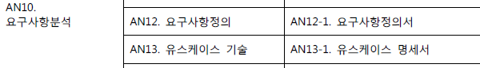

### 설계 - ERD

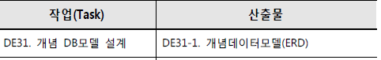

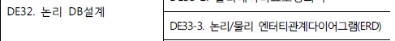

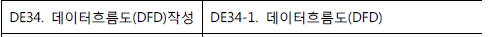

##### ERD가 가장 중요하며  , 그 다음으로 DFD가 중요하다.

### 구현 - 개발, 소스

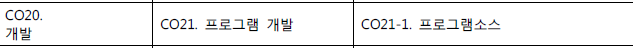

당연하게 가장 중요한 것,

### 시험 - 통합테스트결과서

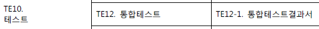

통테 라는 축약어로 사용되기도 함.

시험 단계에서 가장 중요한 문서

## 사업규모 구분 및 프로세스

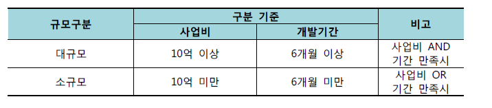

대규모, 소규모에 따라 프로세스가 달라진다.

시스템 발주자는 낮은 금액을 원하고

사업자(사업을 실행하는 사람)은 높은 금액을 원한다.

소프트웨어 원가 산정법이 별도로 있음.

## 범정부 EA 메타정보

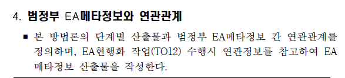

EA는 Enterprise Architecture로 

정부의 인터넷 자산 관리 시스템이라 이해하면 됨.

새로운 전자정부 프로그램을 만들게 되면 

새롭게 개발된 시스템의 자산을 관리하는 관리 시스템 - EA에 등록해야 된다.

정부시스템과 연관되어있는 연관정보를 시스템 산출물로 만들어야 하는 경우가 많다.

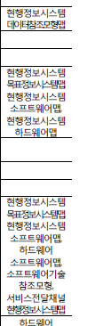

### 1. 개발준비단계

#### TFT 구성, 테일러링

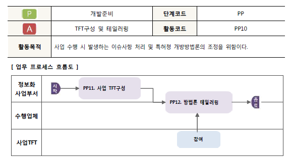

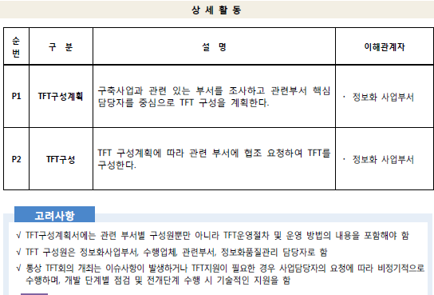

각 부서의 핵심 담당자가 와야하는데 보통은 다들 TFT팀에 배치되기 싫어함으로, 잉여인원들이 오게 된다.

그래서 구성 계획서를 짤 때 핵심 인력을 포함할 수 있도록 짜야함.

테일러링은 기존 시스템에 필요한지 안한지를 따지고, 불필요한 프로세스를 제거하는 협의서.

특정 프로세스를 삭제하기 위해서는 발주자와 사업 담당자와의 적절한 협의가 필요하다.

또한 문서를 남겨놓아야 나중에 어떤 과정을 생략하는데 협의를 받았다는 것을 증명할 수 있음.

### 2. 분석단계

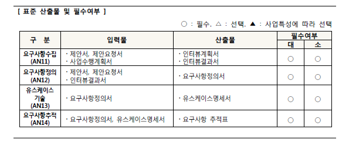

연속사업이라면 전차 산업 결과물도 작성해야 한다.

분석단계에서 가장 중요한 산출물은 요구사항 정의서고,

요구사항 정의서를 만들기 위해서는 제안서,제안요청서,계획서 등등이 필요하다.

정련 -> 확정

계획을 다 짰는데 추후에 발주자, 정보 담당부서에서 요구사항이 계속 늘어나면?

어느 순간에 제대로 끊어주는 것이 중요. (but 을의 입장에서는 끊기 어려우므로 정보사업 관리부에서 다른 부서의 요구사항을 끊어주는 역할을 해야한다.)

주요 요구사항 4가지 - 기능,데이터,보안,성능 만 나와있지만

사실 이 4가지 보다 훨씬 많은 경우가 많다 

but 이 4가지가 가장 중요하기 때문에 정의서에서는 4가지를 반드시 다 명시해야한다.

### AN14 - 요구사항추적표

나중에 요구사항을 빠뜨려서 과정을 되돌릴 경우 엄청난 자원 손해이기 때문에 그것을 방지하기 위해서 작성

# 요구사항정의서

엑셀 - 실제 사용되는 정의서

2015년 예시

PDF - 교과서 적인 표본

엑셀 - 

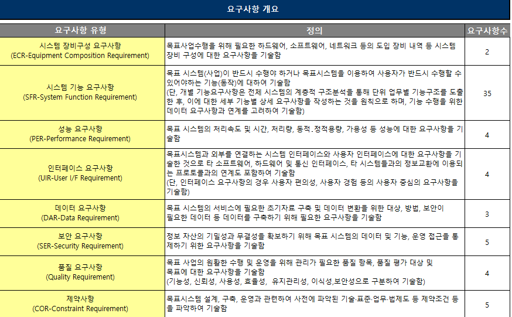

실제 요구사항이 매우 많음.

PDF - 

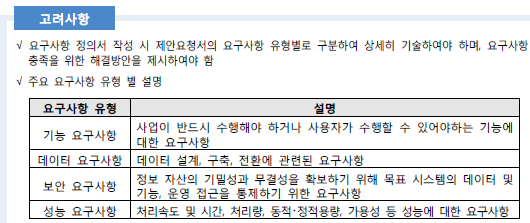

주요 요구사항으로 정리.

#### 1..시스템 장비구성 요구사항

하드웨어 뿐만 아니라 네트워크나 소프트웨어도 시스템 장비구성 요구사항으로 구분한다.

일명 TPMC (Transaction Processing Performance Council), 서버가 어느정도 데이터를 처리 하는 지를 측정하는 단위,

네트워크 장비에 대한 요구를 할때 TPMC를 따진다.

ex)

관제장비나 SSO 솔루션은 프로젝트의 납부 대상이 아니므로 구성이나 설치 지원 등의 업무만 담당하면 됨.

이 정의서는 소프트웨어 시스템을 만드는 것므로, 다른 기업에서 SSO 설치를 하러 오면 도와주는 역할만 하면 된다.

SSO 는 SSO(Single Sign-On)의 약자로, 보안 로그인 솔루션을 의미한다.

#### 2.시스템 기능 요구사항 ☆

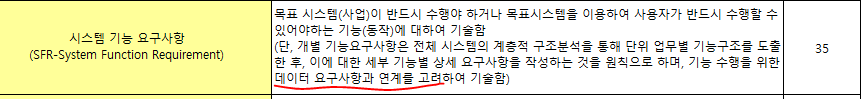

시스템 기능 요구사항은 데이터 요구사항과의 연계를 고려해야함.

기능 요구사항은 가장 중요한 사항이다.

 주로 어떤 식으로 구현하라 라는 요구사항들을 적어놓음.

ex)

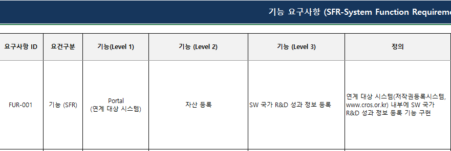

##### 기능 요구사항 1번 : 자산등록, 다른 시스템 (저작권 등록 시스템) 과 연계가 가능해야한다.

보통 1번이 가장 난이도가 높음.

여기서의 1번은 내부 시스템 개발 + 다른 시스템 연계가 필요하다.

1번- 기능상세:

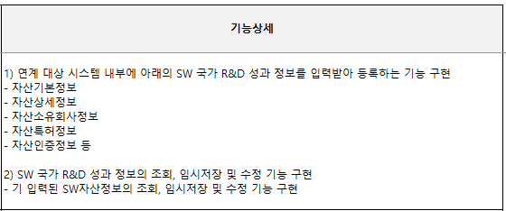

기능 상세의 항목들은 추후 데이터 요구사항에 그대로 설계 될 가능성이 높음.

##### 기능 요구사항 2번: 자산검색기능

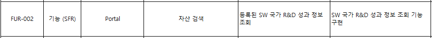

2번- 기능상세 :

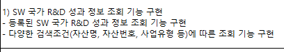

##### 기능 요구사항 3번 : 저작권 등록 시스템 연계

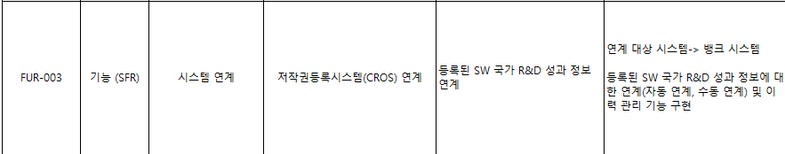

R&D 성과 정보 등록을 저작권 등록 시스템과 연계하라. 

3번- 기능상세 :

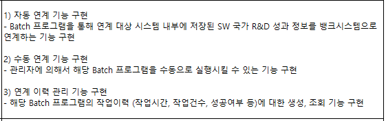

batch의 반댓말은 real time , 즉 실시간.

batch의 연계 시간을 기다리기 힘든 경우에 수동으로 연계하는 기능 -> 수동 연계 기능

이력관리를 계속해서 가지고 가는 이유는 내부자들의 해킹이나, 고장 등의 이유를 확인하기 위해서이다.

그러므로 이력관리는 정말 핵심 인력들만 접근할 수 있게 권한을 주어야 한다.

#### 외부와의 연결은 인터페이스 요구사항에서 담당하는 것이 맞다.

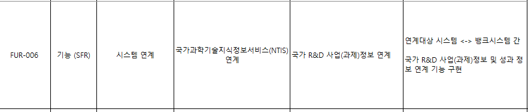

저작권 등록 시스템이나 NTIS 시스템과의 연계, 이러한 것들은 사실 인터페이스 요구사항에서 요구를 해야한다.

4번- 5번 기능 : 회원정보 연계, 시스템 연계

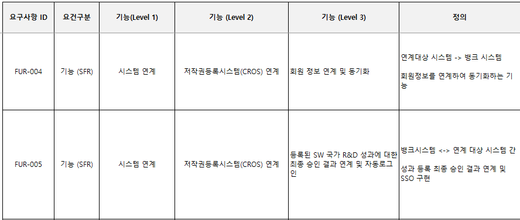

기능 상세 :

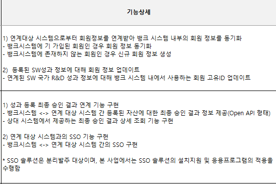

5번의 기능상세의 경우에는 OpenAPI라고 연계 방법을 명시해놓았다.

#### 3.성능 요구사항

동적 용량은 자유롭게 용량을 줄이고 늘릴 수 있는 것이고, 정적은 한계를 정해놓는 것이다.

처리량 - 동시접속, 데이터 처리 양 

가용성 - 어느정도 사용 되는지,

ex)

명확하게 숫자를 명시한 경우에는 반드시 그 숫자 안으로 맞춰줘야함.

장애복구가 빠르고 -> 장애 발생시 0시간 이내에 복구가 되어야 한다.

는 식으로 개선해야함.

4번의 응용시스템 튜닝 성능 요구사항은 정확한 숫자로 나타내는 것이중요하다.

개발하는 단계가 아니라 운영 단계의 항목들.

#### 4.인터페이스 요구사항

인터페이스 요구사항은

목표 시스템과 외부를 연결하는 것이 1번, 

목표 시스템과 사용자를 연결하는 것이 2번이다.

즉 두 가지로 나누어져있음,

요즘은 오픈API를 이용하여 외부와 연결을 하는 추세이다.

ex) data.go.kr 에서 정부가 오픈API 형식으로 제공되는 데이터들을 활용할 수 있음. 

이는 1번의 시스템과 외부의 연결 인터페이스이다.

ex) 기능 요구사항의 시스템 연계는 여기에서 요구하는 것이 맞음. (목표 시스템과 외부를 연결하는 것 이기 때문)

1번 같이 구체적인 목표가 없는 경우 개발자가 그냥 "용이하다" 라고 주장할 수 있기에 수정이 필요함.

##### 웹접근성?

고령자나 장애인 등을 배려하는 웹 디자인을 뜻함. -> 법적의무사항임.

##### 웹페이지 디자인 재설계?

웹페이지 디자인은 전문 웹 디자이너가 디자인을 하는데, 디자인의 경우 정확한 요구사항이 없어서 결정권자의 선호에 따라 결과가 자주 바뀌게 된다.

-> 프로젝트 지연의 이유중 하나.

#### 5.데이터 요구사항

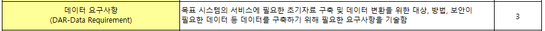

데이터 요구사항은 만약 사업이 초기사업 이라면 (2차,3차 가 아님,)

초기 데이터를 만들어서 구축을 할 필요가 있다.

만약 구세대 시스템에서 데이터가 남아있다면 그 데이터를 기반으로 시스템을 전환시켜주는 것이 중요하다.

보안이 필요한 데이터(=개인정보,예산정보,회사정보) 등은 따로 특별히 관리를 해 주어야 한다.

ex)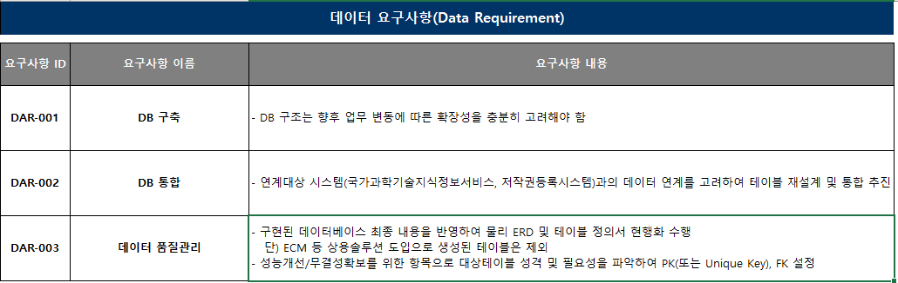

2번의 경우에는 과학기술정보서비스와 저작권등록시스템 과의 연계를 통한 DB통합이 필요한데, 이는 매우 힘든 과정이다.

1번이나 3번같은 경우는 명확한 조건을 제시하는 것이 중요함.

ex) 오류율은 n%이내, 테이블 정의서를 먼저 작성한 뒤, 데이터베이스 구현 등등

#### 이 나머지 5가지는 다음 수업에서 다룸.

질의응답 : 중간고사는 어떤방식?

아직 미결정, 

가능하면 필기고사로 시험을 보려고 함.

작년의 중간고사는 미리10문제를 알려주고 그 중에서 5문제를 출시했는데, 

학교에서 오프라인 시험을 금지하면 다른 방식을 알려줌.

## 레포트2

#### 대한민국 헌법을 읽어보고 3페이지 이상의 보고서, 소감문을 작성.

다음 주 수요일 낮 12시까지 제출.