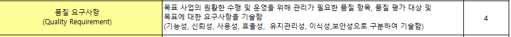
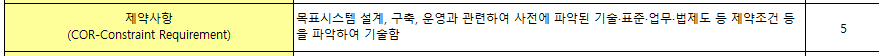
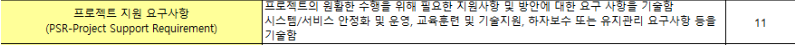

# 200416_W3D1_요구사항정의서

## 전 시간 복습

개발프로세스 = 분석,설계,시험,구현 이 주요 프로세스이며

전체는 7가지가 있다. (개발준비,분석,설계,구현,시험,전개,인도)

특히 주요 4단계 프로세스 중에서도 분석, 설계 2가지 프로세스가 가장 중요함.

분석,설계 쪽에 좀 더 중점을 둠

## 각 분야에서 가장 중요한 문서

### 분석 - 요구사항 정의서, 요구사항 추적표

#####  - 분석단계에서 가장 중요한 문서

그 다음 중요한 문서는 유스케이스 명세서.

### 설계 - 소프트웨어 아키텍쳐 설계(설계서) , 사용자 인터페이스 설계,  ERD

## 요구사항 정의서 이어서

정련 -> 확정

주요 요구사항 4가지 - 기능,데이터,보안,성능 만 나와있지만

사실 이 4가지 보다 훨씬 많은 경우가 많다 

but 이 4가지가 가장 중요하기 때문에 정의서에서는 4가지를 반드시 다 명시해야한다.

## 요구사항 정의서

2015년 예시

PDF - 교과서 적인 표본

엑셀 - 

#### 5.보안 요구사항

보안 요구사항은 

목표시스템의 데이터가 1번

기능이 2번

운영 접근이 3번이다.

데이터는 암호화 등으로 데이터 보안을 강화하는 것을 의미하며, 

기능과 운영접근은 사용자들을 분류하는 것을 의미함.

#### 6.품질 요구사항

소프트웨어의 품질이 좋으냐 나쁘냐를 가르는 요구사항.

#### 7.제약사항

사전에 파악된 하면 안되는 제약 사항들,

업무나 법률, 기술 등으로 지켜야 하는 제약조건들을 명시하면서 제한을 한다.

#### 8. 프로젝트 관리 요구사항

#### 9.  프로젝트 지원 요구사항

관리요구사항은 보통 한국정보화진흥원의 사업정보관리방법론에 잘 나와있다.

ㅡㅡㅡ 

지원요구사항 : 메인은 아닌데 서브로 필요한 요구사항들을 제시하는 항목,

교육훈련이나 운영, 보수 등등을 요구사항 정의서에 기술한다.

하자보수는 보통 프로젝트 완료일로부터 1년 정도 사업 담당 회사가 담당한다.

1년 내에 결점이 발견되면 사업자가 보상을 해야한다.

유지보수는 오늘 날 별도의 유지보수 계약을 맺는 형태로 바뀌었다.

